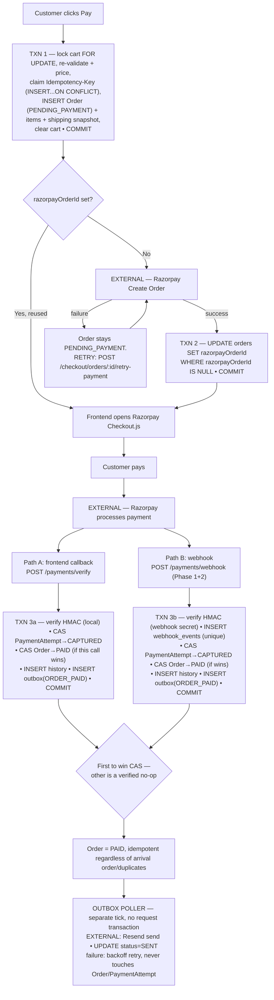
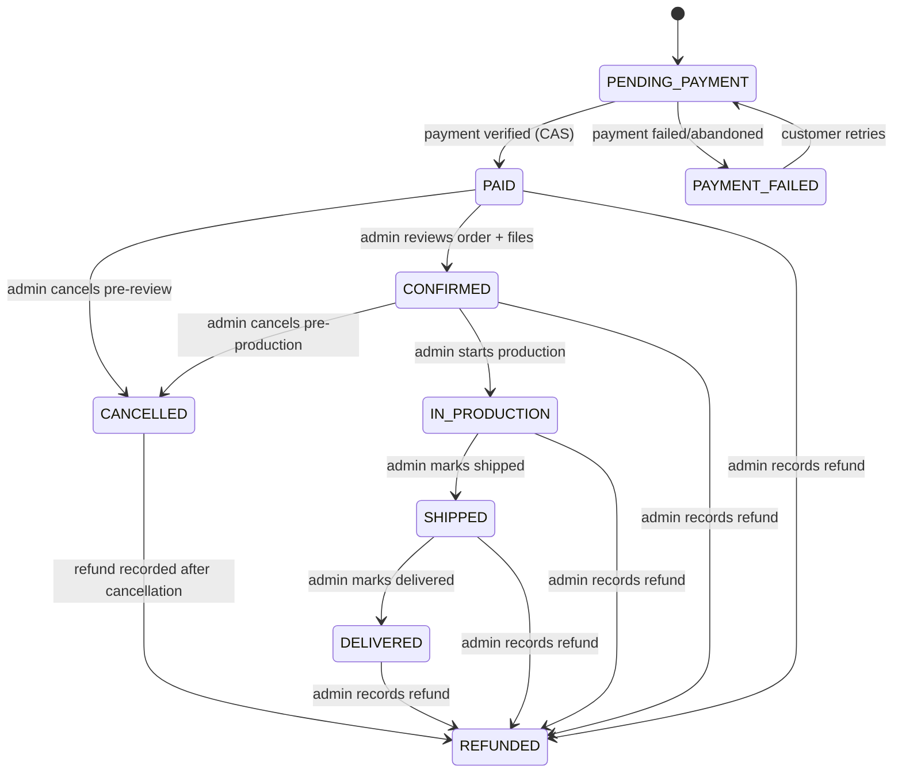
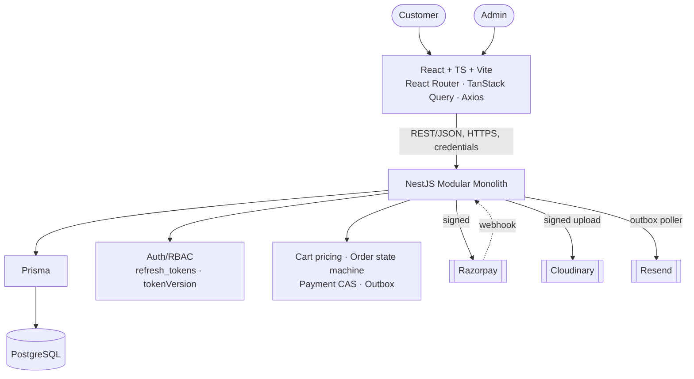

# AB Creations — Architecture Blueprint v1.2

**STATUS: FROZEN**
**FREEZE DATE: 25 August 2026**
**AUTHORITY: SINGLE SOURCE OF TRUTH**

> This architecture is frozen.
> Implementation must follow this blueprint.
> Architectural changes require an explicit Architecture Change Request and approval. Developers must not silently alter architectural decisions during implementation.

This document supersedes and consolidates three prior working drafts (`BLUEPRINT.md` v1.0, `REVIEW_v1.1.md`, `BLUEPRINT_v1.2_HARDENING.md`) into one internally-consistent specification. Where those drafts disagreed with each other, this document states the resolved, authoritative decision — see the freeze-audit reconciliation notes marked **[RECONCILED]** below. The prior drafts remain in `docs/architecture/history/` as design-rationale record; they are not authoritative where this document differs from them.

**Owners:** Atharva Vavhal (Backend Lead, owns `backend/`), Harshad Gat (Frontend Lead, owns `frontend/`).

---

## Table of Contents

1. Project Context & Constraints
2. Technology Stack — Frozen
3. Reference System Analysis (scope classification)
4. Product Requirements Summary
5. Feature Inventory
6. User Roles & RBAC
7. Customer Journey
8. Product Architecture
9. Product Customization System
10. Cart Architecture
11. Checkout Architecture
12. Payment Architecture (Razorpay, PaymentAttempt, Outbox, Webhooks)
13. Database Transaction Boundaries
14. Order Management (State Machine)
15. Database Architecture (Complete Schema)
16. Prisma Architecture
17. Backend Architecture (NestJS)
18. Frontend Architecture (React)
19. Admin System
20. REST API Contract
21. API Response Standard
22. Cloudinary / File Upload Architecture
23. Security Architecture
24. Business Rules (Invariants)
25. Error / Edge Case Matrix
26. UI/UX, Responsive, SEO, Performance (summary)
27. Testing Strategy
28. Git Workflow
29. Development Roadmap
30. Deployment Architecture & Topology
31. Environment Strategy
32. MVP Scope Freeze
33. Future Roadmap (Phase 2+)
34. Architecture Decision Records
35. Final System Diagrams
36. Ownership Matrix
37. Known Implementation-Level TODOs
38. Architecture Change Procedure

---

## 1. Project Context & Constraints

Two-developer, budget-constrained custom-printing e-commerce platform. Customers browse, customize, and pay for printed products online; the business fulfils orders through a simple production pipeline. Constraints: exactly two developers with a hard backend/frontend ownership split; limited infrastructure budget; must be production-ready and secure from day one; MVP is deliberately narrow but the data model must not block Phase 2/3 extension. Guiding principle: when in doubt, cut scope, not quality.

## 2. Technology Stack — Frozen

| Layer | Technology |
|---|---|
| Frontend | React + TypeScript (TSX), Vite, React Router, TanStack Query, Axios, React Hook Form, Zod, CSS Modules + CSS Variables, Lucide React |
| Backend | Node.js, TypeScript, NestJS, REST, JWT, Passport (JWT strategy), class-validator, Prisma, `@nestjs/schedule` |
| Database | PostgreSQL (sole persistence mechanism) |
| Payments | Razorpay |
| Media storage | Cloudinary |
| Transactional email | Resend |
| Architecture | Modular monolith, REST/JSON, JWT auth, RBAC (two roles), domain-oriented modules, PostgreSQL-backed transactional outbox processed via `@nestjs/schedule` polling |

**Explicitly prohibited, permanently, absent a formal Architecture Change Request:** Redis, Kafka, RabbitMQ, microservices, Kubernetes, GraphQL, event buses, background queue infrastructure (Bull/BullMQ/etc.), additional frameworks (no Next.js, no Express-standalone), unnecessary additional databases, unnecessary third-party services, MongoDB, Java/Spring Boot, Elasticsearch, Redux or any global state library beyond React Context + TanStack Query.

## 3. Reference System Analysis (Scope Classification)

Feature classification against the printdeer360.com conceptual reference (workflow analysis only — no branding, copy, imagery, or code reused):

**MUST HAVE (MVP):** homepage, category browsing, product listing/filters, basic search, product detail, customization, cart, checkout, customer account (profile/orders), order tracking, static content pages (About/Contact/Privacy/Terms/Refund policy), admin catalog/order/customer management, transactional email, error tracking, health check, payment reconciliation.

**SHOULD HAVE (Phase 2):** password-reset-adjacent hardening already pulled into MVP (see §32); reviews; coupons (CRUD + application, shipped together, never split); inventory stock-count tracking; formal design-approval/proofing workflow; multi-address book; SEO meta-tag injection at the serving layer; staging environment.

**COULD HAVE (Future):** blog/content management, wishlist, shipping-carrier integration, B2B/bulk pricing, WhatsApp automation, formal GST invoice generation (conditional — see §4), advanced analytics, loyalty/rewards.

**NOT REQUIRED:** microservice split, generic multi-role RBAC engine, live chat, guest checkout.

## 4. Product Requirements Summary

**Vision:** a focused, fast, trustworthy platform where a customer designs and orders custom-printed products end-to-end online, and the business runs its entire order-to-fulfilment workflow from one admin panel. **Users:** retail/small-business customers; one internal admin role. **Business model:** pay-first, per-order e-commerce. **Success criteria:** unassisted browse→pay→confirm flow; zero orders exist without a verified payment or a clearly-marked failed/pending state; admin can fulfil every order using only the admin panel (no side-channel needed for design files/instructions).

**Tax/GST — classified, not left open [per v1.2 hardening pass §11]:**

| Question | Classification |
|---|---|
| Whether GST applies and at what rate | Legal/client decision |
| Whether GST-compliant invoices are required at MVP launch | Business decision, gated on the legal answer |
| Whether/how the pricing engine displays a tax line | Engineering decision, gated on both above — currently: no tax line, `total` is tax-inclusive display-only |

**Launch-blocker status: conditional.** If the client is legally required to issue GST-compliant invoices for these sales and has no separate external process to do so, this blocks a compliant production launch and must be resolved before implementation of the admin/order-export surface is finalized. If an external accounting process covers it, it does not block platform launch. **This does not block Phase 0/1 engineering start** — nothing in the pricing engine, schema, or API depends on the answer; it must be confirmed before the invoicing/export feature surface is finalized (§37).

## 5. Feature Inventory

Full ID-level feature table maintained in `docs/architecture/history/BLUEPRINT.md` §7, as corrected by the MVP freeze in §32 of this document (coupons removed; password reset, reconciliation, error tracking, health check, and search promoted to MVP; address book reduced to a single address). §32 is authoritative on MVP/Phase membership; §7's original priority tags are historical.

## 6. User Roles & RBAC

**Two roles only: `CUSTOMER`, `ADMIN`**, via a `users.role` enum column and a NestJS `RolesGuard` reading the validated JWT — no generic roles/permissions join-table engine (rejected as speculative complexity; cheaply migratable later if a real second internal role emerges).

| Permission | Customer | Admin |
|---|---|---|
| Browse/search/filter catalog | ✅ | ✅ |
| Manage own cart (requires login — §10) | ✅ | — |
| Place order / pay | ✅ | — |
| View own orders | ✅ (own only) | — |
| View/manage all orders, change status | ❌ | ✅ |
| Manage products/categories/variants/customization fields | ❌ | ✅ |
| Manage own profile/address | ✅ | ✅ (own) |
| View customer list | ❌ | ✅ (read) |
| Upload files (own cart items) | ✅ | ✅ (on behalf of customer) |
| Record a refund | ❌ | ✅ |
| View admin dashboard | ❌ | ✅ |

Every protected endpoint enforces authentication **and**, for owned resources, an explicit ownership check in the service layer (never inferred from role alone) — restated as Business Rule 12, §24.

## 7. Customer Journey

```text
Landing → Browse (public) → Search (public) → Category (public) → Product (public)
  → Login/Register required at Add-to-Cart → Customize → Cart
  → Checkout → Razorpay → Payment Verification → Order Confirmation
  → Order Tracking → Delivery → Review (Phase 2)
```

Full per-stage UI/API/validation/error table: `docs/architecture/history/BLUEPRINT.md` §9, with one correction — the login boundary moved from "checkout" to "add to cart" (§10), and all guest-cart/guest-session references in that table are superseded and void.

## 8. Product Architecture

Unchanged from the original design. Entities: `Category` (flat, one nesting level), `Product` (belongs to one Category; `basePrice`, `minQuantity`, `maxQuantity`), `ProductImage`, `ProductVariant` (flat list of concrete combinations, each with its own `priceDelta`/`isAvailable` — not a generated attribute matrix), `CustomizationField` (per-product field definitions, §9). A `Product` is never hard-deleted once it appears in any `OrderItem` (`isActive=false` instead); this propagates transitively to its images/variants/fields.

## 9. Product Customization System

Field types: `TEXT`, `LOGO_UPLOAD`, `IMAGE_UPLOAD`, `DESIGN_FILE_UPLOAD`, `COLOR_SELECT`, `INSTRUCTIONS`. Each field carries `isRequired`, `sortOrder`, `helpText`, descriptive `constraints` (jsonb: `maxLength`, `allowedFormats`, `maxFileSizeMb`, `options[]`), and **typed pricing columns** `surchargeType` (`NONE`\|`FLAT`\|`PER_CHARACTER`) and `surchargeAmount` (decimal) — pricing-critical values are never buried in JSONB (§8 of the hardening pass).

**Upload flow:** `Product → CustomizationField (admin-authored) → customer fills form → file fields POST /uploads (auth required, no guest path — §10) → Cloudinary → uploaded_files row → cart_item_customization → order_item_customization (snapshotted)`.

**File validation (server-side, authoritative):** allowed formats for customer uploads are **PNG, JPEG, PDF only — no SVG, no archive formats, ever**; magic-byte/file-signature validation regardless of declared MIME type; 10MB hard limit enforced at the stream level (aborted before full buffering); no server-side parsing/decompression of uploaded content by our own code at any point (raw bytes stream straight to Cloudinary, which performs all decoding on its own isolated infrastructure); server-generated `public_id` (never derived from the client filename); EXIF stripped on upload. Full threat-to-control mapping: §22.

**File ownership:** every write that accepts a client-supplied `uploadedFileId` (cart-add, order-creation) verifies `uploadedFiles.uploadedByUserId === requestingUserId` server-side, unconditionally — Business Rule 12 (§24). Since login now precedes upload (§10), every `uploaded_files` row has a non-nullable owner from creation; there is no guest-identity special case.

**Delivery:** customer-uploaded customization files use Cloudinary's **authenticated delivery type** with short-lived (1 hour) server-generated **signed URLs**, issued only to the file's owner or an admin via the normal orders/cart API responses — never a permanent public link. Admin-curated product images remain public.

## 10. Cart Architecture

**Login is required starting at "Add to Cart," not at checkout.** Browsing, search, and full product detail (including viewing available customization options) remain entirely public. The moment a customer adds an item to their cart, they must register/login. **There is no guest cart, no guest-session token, and no cart-merge logic anywhere in the system.** Cart is a single, always-authenticated, always-server-side concept: one open `Cart` per user, `CartItem`, `CartItemCustomization`.

This supersedes the original checkout-only login wall. The original design required four coordinated subsystems (a scoped guest JWT, guest-owned uploads, an ownership-transfer-on-merge flow, and a second client-side cart implementation) to support letting a visitor customize/upload before creating an account — the single most complex, most audit-flagged subsystem across the design's review history. Moving the wall one step earlier removes all of it while leaving discovery/browsing (and therefore SEO/top-of-funnel traffic) untouched. Stated trade-off: a small amount of added friction one step earlier in the funnel, in exchange for one cart code path instead of two. A scoped guest-cart reintroduction (never guest uploads) is a contained Phase 2 option if conversion data justifies it — not the MVP default.

Price is recomputed server-side on every cart read/mutation (canonical algorithm, §11); quantity validated against `minQuantity`/`maxQuantity`; every mutation re-validates product/variant/customization-field state and file ownership. Coupons are out of MVP scope (§32); the total-computation formula reserves the discount step for a clean Phase 2 addition. No line-merging on duplicate add — each add creates its own line; price is always correct regardless of line count.

**Transaction boundary (F, `docs/architecture/BLUEPRINT_v1.2_HARDENING.md` §3):** `SELECT cart FOR UPDATE` → re-validate target + file ownership → write `cart_item`(+customizations) → COMMIT. No external calls. No idempotency key required — the row lock is sufficient; a double-click just creates a UX-visible duplicate line, not a correctness bug.

## 11. Checkout Architecture

**Canonical pricing algorithm** (all arithmetic server-side, decimal-safe library, never native floating point, rounded to 2 places at every step):

```text
unitBasePrice = product.basePrice + (variant?.priceDelta ?? 0)
customizationSurcharge = Σ over submitted fields:
    NONE → 0 | FLAT → surchargeAmount (once/unit) | PER_CHARACTER → surchargeAmount × length(textValue)
unitPrice   = round2(unitBasePrice + customizationSurcharge)
lineTotal   = unitPrice × quantity          [surcharge is embedded in unitPrice — never re-added at line/cart level]
subtotal    = Σ lineTotal
discountAmount = 0 in MVP (coupons out of scope; formula slot reserved for Phase 2, applied to subtotal before shipping)
shippingFee = flat, admin-configurable (app_settings.shippingFeeFlat) — no per-item/weight calculation in MVP
taxAmount   = not computed/itemized in MVP — total is tax-inclusive display-only (§4)
total       = round2(subtotal − discountAmount + shippingFee)
```

Quantity bounds: `product.minQuantity ≤ quantity ≤ (product.maxQuantity ?? PLATFORM_DEFAULT_MAX)`, validated on every cart mutation and again at checkout. The frontend may render a cosmetic instant estimate for responsiveness but must always defer to and display the next server response as authoritative; price is never optimistically rendered as if final.

**Order creation is transactional, row-locked, idempotency-keyed, and re-validated in place — not a naive create-then-charge flow.** Full transaction boundary in §13.G/H. Razorpay order creation is a separate, non-transactional, retryable second phase (§12) — the local Order and the Razorpay order are never assumed atomic with each other.

**Immutable shipping snapshot [RESOLVED per hardening pass §10]:** at order-creation time, the customer's current address (§10 profile fields, single-address MVP — see §15) is copied into flat, denormalized columns directly on `orders` (`shippingRecipientName`, `shippingPhone`, `shippingAddressLine1/2`, `shippingCity`, `shippingState`, `shippingPostalCode`, `shippingCountry`). No FK to `users` for shipping purposes after creation. A later profile address edit cannot affect any existing order — provably, by construction, since the address-update transaction (§13.N) never writes to `orders`.

## 12. Payment Architecture (Razorpay, PaymentAttempt, Outbox, Webhooks)

### 12.1 Payment model — finalized

**`payments` is replaced by `payment_attempts`. One `Order` has 1 → N `PaymentAttempt` rows (chosen explicitly, not ambiguous).** A customer can fail once and succeed on retry; every attempt is durably recorded for support/dispute purposes, not just the winning one.

| Column | Type | Notes |
|---|---|---|
| `id` | uuid PK | |
| `orderId` | FK → orders, `RESTRICT` | |
| `razorpayOrderId` | string, not null | Denormalized copy of `orders.razorpayOrderId` at attempt-initiation time; the source of truth for "what Razorpay order to use next" is always the `Order` row, not this column. |
| `razorpayPaymentId` | string, nullable, **globally unique** (nullable-unique) | Populated once Razorpay assigns a payment id to this attempt. |
| `amountPaise` | bigint | Razorpay's native integer unit — deliberately distinct from `orders.total` (decimal, major units, display/business unit). |
| `currency` | char(3), default `'INR'` | |
| `status` | enum: `INITIATED`, `CAPTURED`, `FAILED`, `ABANDONED` | See below. |
| `failureCode`, `failureReason` | string, nullable | |
| `method` | string, nullable | Populated on capture. |
| `rawPayload` | jsonb, nullable | |
| `createdAt`, `capturedAt` (nullable), `updatedAt` | timestamp | |

Status set is deliberately minimal: `INITIATED` (modal opened, no outcome yet) → `CAPTURED` \| `FAILED` (terminal) \| `ABANDONED` (customer dismissed the modal, best-effort/optional). No separate `CREATING_RAZORPAY_ORDER`/`RAZORPAY_ORDER_CREATED`/`PAYMENT_PENDING` states — the first two describe the **Order's** Razorpay order (shared across attempts, represented once by `orders.razorpayOrderId`'s nullability, not per attempt); the third has no independently-actionable behavior.

**Partial unique index:** `CREATE UNIQUE INDEX ON payment_attempts (orderId) WHERE status = 'CAPTURED'` — an order can never have more than one captured attempt, enforced by Postgres, not application logic alone.

**Exactly what causes `PaymentAttempt → CAPTURED`:** a signature-verified event (frontend-callback HMAC or webhook HMAC) reporting success for a specific `razorpayPaymentId`, applied via `UPDATE payment_attempts SET status='CAPTURED', capturedAt=now() WHERE razorpayPaymentId=$id AND status != 'CAPTURED'` (upserting the row first if the webhook arrived before any local row existed — handled, not assumed away).

**Exactly what causes `Order → PAID`:** only as a same-transaction side effect of the update above, only when that specific call's conditional update actually affected a row **and** it's the order's first captured attempt (guaranteed by the partial unique index). Whichever path — frontend callback or webhook — gets there first performs the transition; the other is a verified no-op.

**Business state vs. payment infrastructure state, kept separate, minimally:**
- `Order.status` — pure business state (§14's 9-value graph). Customer/admin-facing.
- `Order.razorpayOrderId` — not a status, an identifier; its nullability alone represents "has a Razorpay order been created."
- `PaymentAttempt.status` — payment-infrastructure/technical state, correctly per-attempt.

**Defense-in-depth note [implementation-level, non-blocking]:** when processing a `CAPTURED` event, assert `payment_attempts.amountPaise` equals the order's expected total (converted to paise); log/alert on mismatch. Not a normal-flow security gap — Razorpay ties a captured payment to its Order's configured amount — but a cheap integration-bug guard.

### 12.2 Transactional outbox

**Why:** payment confirmation must durably change business state and must also, eventually, cause an email to be sent — two things that cannot be one atomic operation, since the email provider is an external HTTP API outside any Postgres transaction. The outbox pattern makes "this event needs to be published" exactly as durable and atomic as the state change (same transaction), while the actual external call happens later, out-of-process, retryable, and structurally unable to affect business state.

| Column | Type | Notes |
|---|---|---|
| `id` | uuid PK | |
| `eventType` | enum: `ORDER_PAID`, `ORDER_STATUS_CHANGED`, `PASSWORD_RESET_REQUESTED` | Exactly three MVP triggers. |
| `aggregateType` / `aggregateId` | string / uuid | `Order` or `User`. |
| `eventKey` | string, **UNIQUE** | `ORDER_PAID:{orderId}` · `ORDER_STATUS_CHANGED:{orderId}:{toStatus}` · `PASSWORD_RESET_REQUESTED:{userId}:{requestNonce}` — dedup mechanism. `requestNonce` is a random value generated alongside the reset token at request time [implementation-level, non-blocking: exact derivation decided during `auth` module build]. |
| `payload` | jsonb | Denormalized snapshot (recipient, order number, status, reset link, etc.) captured at insert time — the processor never re-queries business tables. |
| `status` | enum: `PENDING`, `PROCESSING`, `SENT`, `FAILED` | |
| `attempts`, `availableAt`, `lastError`, `processedAt`, `createdAt` | | Exponential backoff on failure (~1min/5min/30min/2h, capped); terminal `FAILED` after 5 attempts, surfaced via Sentry/admin for manual follow-up — never retried indefinitely, never escalated into touching order/payment state. |

Insert only happens on the branch of a CAS update that actually performed the transition (primary dedup mechanism); `eventKey` uniqueness is the backstop. A `@nestjs/schedule` cron tick (10–30s) claims due `PENDING` rows (`FOR UPDATE SKIP LOCKED`), calls Resend, updates status. **Email failure can never roll back an order — architecturally enforced:** the poller's only writes are to `outbox_events`; no code path feeds email outcome back into `orders`/`payment_attempts`.

### 12.3 Webhook lifecycle

Two-phase design separating "durably received" from "fully processed":

```text
POST /payments/webhook
 → capture raw body (before body-parsing middleware) → verify X-Razorpay-Signature (webhook secret)
 → invalid signature: 400, no DB write, structured log only (unauthenticated endpoint must not fill a table with garbage)
 → valid signature:
    PHASE 1: TXN → INSERT webhook_events (razorpayEventId, payload, status='RECEIVED') ON CONFLICT DO NOTHING
             → COMMIT → respond 200 immediately, regardless of Phase 2 outcome
    PHASE 2 (always performed by the scheduled poller — never inline in the request handler; a single
             code path, since CAS idempotency makes the choice a simplification, not a correctness issue):
             TXN → SELECT webhook_events FOR UPDATE WHERE status IN ('RECEIVED','PROCESSING_FAILED')
             → upsert payment_attempts, CAS orders, INSERT order_status_history, INSERT outbox_events
             → UPDATE webhook_events SET status='PROCESSED' → COMMIT
             → on throw: row stays RECEIVED/PROCESSING_FAILED, retried next tick (not reliant on
               Razorpay's own retry schedule, since Razorpay already got its 200 in Phase 1)
```
`webhook_events.status`: `RECEIVED`, `PROCESSED`, `PROCESSING_FAILED`, `IGNORED` (valid event, not acted on).

**Precise, non-overclaiming behavior:** duplicate delivery → `ON CONFLICT DO NOTHING`, every redelivery gets 200, no reprocessing. Mid-processing DB failure → row survives Phase 1, poller recovers. Out-of-order delivery → safe, because every event asserts the same idempotent fact ("this payment id is CAPTURED") rather than advancing an order-dependent sequence — asserting it twice in either order converges identically. **Named, honest limitation:** no explicit mechanism exists for a hypothetical event that should *reverse* an earlier one arriving out of order; this doesn't occur in Razorpay's normal capture flow and MVP refunds are recorded manually (§14), not via a reversing webhook — the limitation is real but not currently reachable.

### 12.4 Full lifecycle diagram



### 12.5 Refunds & reconciliation

Refunds are processed manually in the Razorpay dashboard by the admin; the platform only **records** the resulting state (§13.L) — no in-app refund-initiation API in MVP. A scheduled reconciliation job (`@nestjs/schedule`, same mechanism as the outbox/webhook pollers) queries Razorpay for any `PENDING_PAYMENT` order older than ~1 hour and flags mismatches for admin review — promoted from a manual button (v1.0) to an automated job, no new infrastructure.

## 13. Database Transaction Boundaries

Implementation-ready, per operation. "Lock" = `SELECT ... FOR UPDATE`. Every external API call is explicitly outside any Postgres transaction.

| Op | Transaction | External call | Idempotency |
|---|---|---|---|
| **A. Register** | `INSERT users` (normalized-lowercase email) + `INSERT refresh_tokens`, one TXN | None | Unique-email constraint |
| **B. Login** | `SELECT users FOR UPDATE` → verify password → success: reset `failedLoginAttempts`, `INSERT refresh_tokens`; failure: increment counter (drives progressive delay, §23) | None | N/A |
| **C. Refresh rotation** | `SELECT refresh_tokens FOR UPDATE` → if already revoked: revoke entire chain, 401 (reuse detection); else: insert new row, revoke old (`replacedByTokenId`) | None | Deliberately NOT idempotent — reuse detection depends on strictness |
| **D. Logout / logout-all** | Revoke token row, or bump `tokenVersion` + revoke all rows | None | Idempotent |
| **E. Password reset** | Request: update reset-token fields + `INSERT outbox_events`, one TXN, generic response regardless of match. Confirm: `SELECT FOR UPDATE` by token hash + expiry → update password, clear token, bump `tokenVersion`, revoke all refresh tokens | None (email is outbox-poller's job) | Token single-use by construction |
| **F. Cart mutation** | `SELECT cart FOR UPDATE` → re-validate + file-ownership check → write item | None | Row lock; no key needed |
| **G. Checkout order creation** | `SELECT cart FOR UPDATE` → claim `idempotency_keys` (`INSERT...ON CONFLICT...RETURNING`, race-safe, not check-then-insert) → re-validate + price → `INSERT orders(PENDING_PAYMENT)` + items + shipping snapshot → clear cart | Razorpay order creation happens **after** this commits (H) | `Idempotency-Key` header, claimed race-safely |
| **H. Razorpay association** | `UPDATE orders SET razorpayOrderId=$x WHERE razorpayOrderId IS NULL` | Razorpay Create Order (before this TXN) | Guard makes concurrent double-association safe; loser's Razorpay order is a harmless orphan |
| **I. Payment verification** | Verify HMAC (local) → `SELECT orders FOR UPDATE` → CAS `payment_attempts`→CAPTURED → if won + first capture: CAS `orders`→PAID + history + outbox | None (signature check is local) | CAS |
| **J. Webhook processing** | Two-phase, §12.3 | Signature verification is local; no external call | `webhook_events` unique constraint + CAS |
| **K. Admin status transition** | CAS `UPDATE orders SET status=$to WHERE status IN (allowed_from)` → history + outbox on rows-affected=1; already-`$to` → idempotent 200; else → 409 | None | CAS |
| **L. Refund recording** | CAS `UPDATE orders SET status='REFUNDED' WHERE status IN (PAID,CONFIRMED,IN_PRODUCTION,SHIPPED,DELIVERED,CANCELLED)` → history + outbox | None — refund itself processed manually in Razorpay dashboard, this only records it | CAS |
| **M. Coupon (Phase 2 placeholder)** | Reserved design: usage-limit check + `coupon_usages` insert inside the same locked TXN as order creation (G), never a separate pre-check | N/A — not built in MVP | Reserved |
| **N. Address update** | `UPDATE users SET <address fields>` | None | Single-row update; never touches `orders` (guarantees §11's immutable snapshot) |

## 14. Order Management (State Machine)



Every transition is a compare-and-swap: `UPDATE orders SET status=$to WHERE id=$id AND status IN ($allowed_from)`. Rows-affected=1 → side effects (history row, outbox event) fire. Rows-affected=0 → re-read: already `$to` → idempotent `200`, no duplicate side effects (admin double-click safe); otherwise → `409 INVALID_TRANSITION`. Full formal deferred pipeline states (`DESIGN_REVIEW`, `QUALITY_CHECK`, `PACKED`) remain out of MVP — absorbed informally into `CONFIRMED`/`IN_PRODUCTION`; Phase 2 candidate (§33) once order volume justifies the granularity.

## 15. Database Architecture (Complete Schema)

**`payments` is fully replaced by `payment_attempts` (§12.1).** The standalone `addresses` table is **removed** — single-address MVP folds directly onto `users` as flat columns (`addressLine1/2`, `city`, `state`, `postalCode`, `country`, `phone`). **[RECONCILED]** An earlier draft (v1.1) stated the `addresses` table would be retained with a simplified UI; this is superseded — this document's schema has no `addresses` table, and the API contract (§20) has no standalone `/addresses/*` endpoints; address management is part of `GET/PATCH /users/me`. `coupons`, `coupon_usages`, `reviews` remain reserved-schema-only, not built in MVP.

| Table | Purpose | Key columns (beyond id/timestamps) | FKs | Unique constraints | Key indexes | Invariants |
|---|---|---|---|---|---|---|
| **users** | Accounts, single MVP address folded in | `email` (always stored lowercase — no separate display-case value retained), `passwordHash`, `role`, `tokenVersion`, `failedLoginAttempts`, `passwordResetTokenHash`, `passwordResetExpiresAt`, `addressLine1/2`, `city`, `state`, `postalCode`, `country`, `phone`, `isActive` | — | `email` | `email` | Never hard-deleted while owning any order (`orders.userId RESTRICT`); `tokenVersion` only increments. |
| **refresh_tokens** | Session persistence, rotation, revocation | `userId`, `tokenHash`, `expiresAt`, `revokedAt`, `replacedByTokenId` | `userId→users` | — | `userId`, `tokenHash` | Never updated after `revokedAt` except by chain-revocation sweep. |
| **categories** | Categories, one nesting level | `name`, `slug`, `parentCategoryId` | self-FK | `slug` | `parentCategoryId` | |
| **products** | Sellable products | `categoryId`, `name`, `slug`, `basePrice`, `minQuantity`, `maxQuantity`, `specifications` (jsonb), `isActive` | `categoryId→categories (RESTRICT)` | `slug` | `categoryId`, `slug` | Never hard-deleted once ordered. |
| **product_images** | Gallery | `productId`, `cloudinaryPublicId`, `sortOrder`, `isPrimary` | `productId→products` | — | `productId` | |
| **product_variants** | Purchasable combinations | `productId`, `label`, `priceDelta`, `isAvailable` | `productId→products` | (`productId`,`label`) | `productId` | |
| **customization_fields** | Field definitions | `productId`, `label`, `type`, `isRequired`, `surchargeType`, `surchargeAmount`, `constraints` (jsonb, descriptive only) | `productId→products` | — | `productId` | Pricing fields typed, never in JSONB. |
| **uploaded_files** | Cloudinary metadata | `cloudinaryPublicId`, `uploadedByUserId` (**non-nullable**), `format`, `bytes`, `resourceType`/`deliveryType` | `uploadedByUserId→users` | `cloudinaryPublicId` | `uploadedByUserId` | Ownership checked on every referencing write; customer-file URLs are signed, computed on read. |
| **carts** | One open cart/user | `userId` | `userId→users` | `userId` | — | Always authenticated. |
| **cart_items** | Line items | `cartId`, `productId`, `variantId`, `quantity` | `cartId→carts`, `productId→products (RESTRICT)`, `variantId→product_variants (RESTRICT)` | — | `cartId` | Duplicate lines allowed by design. |
| **cart_item_customizations** | Values on a line | `cartItemId`, `customizationFieldId`, `textValue`, `uploadedFileId` | `cartItemId→cart_items`, `customizationFieldId→customization_fields (RESTRICT)`, `uploadedFileId→uploaded_files` | — | — | Ownership re-verified at write. |
| **orders** | Placed orders | `orderNumber`, `userId`, `status`, `subtotal`, `total`, `currency`, `razorpayOrderId`, `shippingRecipientName/Phone/AddressLine1/2/City/State/PostalCode/Country` | `userId→users (RESTRICT)` | `orderNumber`, `razorpayOrderId` | `userId`, `status`, `razorpayOrderId` | Never hard-deleted; status only via CAS; shipping fields immutable after creation. |
| **order_items** | Snapshotted lines | `orderId`, `productId (SET NULL)`, `productNameSnapshot`, `variantLabelSnapshot`, `unitPriceSnapshot`, `quantity`, `lineTotal` | `orderId→orders`, `productId→products (SET NULL)` | — | `orderId` | Snapshots never recomputed retroactively. |
| **order_item_customizations** | Snapshotted values | `orderItemId`, `fieldLabelSnapshot`, `textValue`, `uploadedFileId` | `orderItemId→order_items`, `uploadedFileId→uploaded_files (RESTRICT)` | — | — | Referenced files never purged by cleanup. |
| **payment_attempts** | Every attempt against an order | See §12.1 | `orderId→orders (RESTRICT)` | `razorpayPaymentId` (nullable-unique); **partial unique `orderId` WHERE `status='CAPTURED'`** | `orderId` | ≤1 captured attempt per order — DB-enforced. Replaces `payments`. |
| **order_status_history** | Append-only audit trail | `orderId`, `fromStatus`, `toStatus`, `changedByUserId`, `note` | `orderId→orders`, `changedByUserId→users` | — | `orderId` | Append-only. |
| **webhook_events** | Webhook idempotency/processing ledger | `razorpayEventId`, `payload`, `status` | — | `razorpayEventId` | `status` (poller scan) | Inserted only after signature verification. |
| **idempotency_keys** | Checkout dedup | `key`, `userId`, `endpoint`, `resultOrderId`, `expiresAt` | `userId→users`, `resultOrderId→orders` | `key` | — | Claimed via `INSERT...ON CONFLICT DO NOTHING`. |
| **outbox_events** | Transactional outbox | See §12.2 | — | `eventKey` | `status`+`availableAt` (poller scan) | Inserted only in the same TXN as the state change it announces. |
| **app_settings** | Small admin-editable config (flat shipping fee, etc.) | `key`, `value` | — | `key` | — | No shipping-rules engine. |

**Reserved, not built in MVP:** `coupons`, `coupon_usages`, `reviews`.

## 16. Prisma Architecture

Single `schema.prisma` for MVP (single database, single deployable). `prisma migrate dev` locally, `prisma migrate deploy` as a release step in CI/deploy — never `migrate dev` against production. Idempotent seed script (admin user, 2–3 categories, 6–10 products with variants/customization fields incl. surcharge config, `app_settings` shipping fee). Every multi-table write that must be atomic uses `$transaction`, matching §13's boundaries exactly. All FK columns indexed by default; additional indexes per §15's "key indexes" column; nothing speculative beyond that.

## 17. Backend Architecture (NestJS)

Modules: `auth` (register/login/refresh/logout/password-reset, guest-session concept removed), `users` (profile + single address), `categories`, `products` (incl. variants, customization fields), `uploads` (Cloudinary, magic-byte validation, signed delivery), `cart`, `checkout` (order creation, idempotency), `payments` (Razorpay order/verify/webhook, `payment_attempts`), `orders` (state machine, history), `notifications` (outbox insert helpers used by `orders`/`auth`; outbox + webhook-retry + reconciliation pollers via `@nestjs/schedule`), `admin` (dashboard aggregation, customer list), `common` (guards, interceptors, response envelope, exception filters). Dependency direction: `common` depends on nothing; domain modules depend on `common` and, where needed, one other domain module in a single direction (`checkout → cart/orders/payments`, never reverse); `admin` may depend on multiple domain modules as a pure aggregation layer. No circular dependencies.

## 18. Frontend Architecture (React)

```text
src/ pages/ features/ components/ layouts/ hooks/ services/api/ schemas/ types/ utils/ constants/ assets/ styles/
```

**Cart is a single TanStack Query-backed resource — no `CartContext`, no guest cart, no merge logic** (§10). Cart query: `staleTime: 0`, `refetchOnWindowFocus: true`, invalidated after every mutation. Optimistic updates restricted to quantity/presence, never price. Axios response interceptor: on 401, a single in-flight refresh promise is shared across all concurrently-failing requests (never N parallel refresh calls); a 401 from the refresh endpoint itself triggers logout directly, never a recursive refresh attempt. Route guards for `/admin/*` are UX-only — every underlying admin API call independently enforces the role check server-side. `Idempotency-Key` for checkout is generated once per checkout-page mount, reused across any retried click in that session.

## 19. Admin System

Dashboard (order count/revenue/recent orders, minimal — no charts), product/category/variant/customization-field CRUD, order list/detail/status-transition (only §14's allowed transitions offered, server-enforced regardless), customer list (read-only), refund recording (§13.L). No coupon UI (removed from MVP), no review moderation (Phase 2), no CMS (static content pages instead).

## 20. REST API Contract

Base path `/api/v1`. Canonical table (supersedes all prior drafts):

| Method + Path | Auth | Idempotency | Notes |
|---|---|---|---|
| `POST /auth/register` | Public | Unique email | |
| `POST /auth/login` | Public | N/A | No `423 ACCOUNT_LOCKED` — progressive delay only (§23), returns `401`/`200` |
| `POST /auth/refresh` | Refresh cookie | N/A (rotation) | |
| `POST /auth/logout`, `POST /auth/logout-all` | Auth | Idempotent | |
| `POST /auth/password-reset/request`, `POST /auth/password-reset/confirm` | Public | Generic response / single-use token | |
| `GET/PATCH /users/me` | Auth | N/A | Includes the single MVP address fields — **no standalone `/addresses/*` endpoints** [RECONCILED, §15] |
| `GET /categories`; admin CRUD | Public / Admin | Natural | |
| `GET /products`, `GET /products/:slug`; admin CRUD, variants, customization-fields | Public / Admin | Natural | |
| `POST /uploads` | Auth (no guest path) | Not idempotent by design | Rate-limited |
| `GET /cart`, `POST/PATCH/DELETE /cart/items[/:id]` | Auth (always) | Row-lock | No guest cart |
| `POST /checkout/validate` | Auth | N/A (read) | |
| `POST /checkout/orders` | Auth | **Required** `Idempotency-Key` header | |
| `POST /checkout/orders/:id/retry-payment` | Auth (owner) | Reuses existing `razorpayOrderId` if set | |
| `POST /payments/verify` | Auth (owner) | CAS-idempotent | Same success shape whether or not this call wins the CAS |
| `POST /payments/webhook` | Signed (not JWT) | `webhook_events` unique + CAS | |
| `GET /orders`, `GET /orders/:id` | Auth (owner) | N/A | |
| `GET/PATCH /admin/orders[/:id]`, `PATCH /admin/orders/:id/status` | Admin | CAS-idempotent | Already-applied transition → `200`; illegal → `409` |
| `GET /admin/dashboard`, `GET/admin/customers[/:id]` | Admin | N/A | |
| `GET /health` | Public | N/A | |

**Never exposed as endpoints, by design:** `payment_attempts` (surfaced only as a nested `paymentAttempts[]` array inside `GET /orders/:id` and `GET /admin/orders/:id`), `outbox_events`, `webhook_events` (fully internal, no API surface at all).

## 21. API Response Standard

Unchanged from original design: `{success, data, meta}` on success (with pagination `meta` on lists); `{success:false, error:{code, message, details[]}}` on failure. HTTP conventions: `200`/`201`/`204` success, `400` malformed, `401` auth, `403` authorization/ownership, `404` not found, `409` conflict/invalid-transition, `422` validation, `429` rate-limited, `500` generic+logged. Dates ISO 8601 UTC. Currency: major-unit decimal strings in business-facing responses, `currency:"INR"` top-level; the one stated exception is the Razorpay `amount` field inside checkout/payment payloads, which is in **paise**, called out explicitly to avoid a unit-conversion bug. IDs are UUIDv4; `orderNumber` is a separate human-readable field.

## 22. Cloudinary / File Upload Architecture

```text
Frontend → Backend (validated, magic-byte checked, streamed) → Cloudinary → uploaded_files metadata (Postgres)
```

Backend-proxied uploads only (no unsigned direct-to-Cloudinary browser uploads) — full validation/ownership control at the cost of a small bandwidth pass-through. Folders: `printforge/{env}/products/`, `printforge/{env}/customizations/{userId}/`.

**Threat-to-control mapping (corrects any prior "10MB solves everything" framing):**

| Control | Threat mitigated |
|---|---|
| Format allowlist (PNG/JPEG/PDF only, **no archive formats**) | Decompression bombs — primary mitigation, since the format is never accepted/parsed as an archive at all |
| Magic-byte validation | Misleadingly-typed files bypassing the allowlist |
| Stream-level 10MB limit (aborted before full buffering) | Plain oversized-file resource exhaustion — **not** decompression bombs |
| No server-side parsing/decompression of uploaded content, ever | The actual decompression-bomb/parser-exploit mitigation — our infrastructure never executes the vulnerable operation |
| Cloudinary processing (their infrastructure, not ours) | Contains the same residual risk to Cloudinary's isolated pipeline |
| Signed delivery, authenticated resource type | Unauthorized access/confidentiality |
| Per-user upload rate/count limits | Volumetric abuse |
| Orphan cleanup (48h, `@nestjs/schedule`) | Storage-cost creep |

## 23. Security Architecture

**Sessions:** access token (15 min, stateless) + refresh token (7–30 days, rotated every use, persisted in `refresh_tokens` with `tokenHash`/`revokedAt`/`replacedByTokenId`). Reuse of an already-revoked refresh token → full-chain revocation for that user. `users.tokenVersion` embedded as a JWT claim, checked on every request, bumped on password change/role change/deactivation/logout-all — gives effectively instant revocation of both token types despite access-token statelessness.

**Login throttling — corrected, no account-lockout DoS:** IP-based throttling (`@nestjs/throttler`) **plus** a per-account **progressive response delay** (not a hard lock) driven by `users.failedLoginAttempts` (~0s for attempts 1–3, ~1s/~4s/~10s-capped beyond that, reset on success). `users.lockedUntil` does not exist — there is no hard-lock state. CAPTCHA explicitly not adopted for MVP (Phase 2 option only if real credential-stuffing is observed).

**Password policy:** min 8 chars, rejected if purely numeric or on a small common-password blocklist; bcrypt cost 12. **Password reset:** email-based, single-use, 30-minute expiry, always a generic response (no enumeration), bumps `tokenVersion` on completion.

**Production cookie/CORS topology (concrete, not asserted):**

```text
Frontend: https://www.printforge.in      Backend: https://api.printforge.in
```

Both share the registrable root `printforge.in` — **required** because browsers compute `SameSite` eligibility by eTLD+1: these two hostnames are same-site (so `SameSite=Strict` cookies flow) even though they are different origins (so CORS, a separate mechanism, still applies). If the backend instead sat on a platform default domain unrelated to `printforge.in`, the two hostnames would be genuinely cross-site and the refresh cookie would silently stop being sent the first time a token expired. Cookie: `Domain` omitted (host-only scope to `api.printforge.in`), `Path=/api/v1/auth/refresh`, `SameSite=Strict`, `Secure`, `HttpOnly`. CORS: `origin: 'https://www.printforge.in'` (exact, never wildcard), `credentials: true`; frontend sets `withCredentials: true`.

**File-reference ownership, RBAC, input validation, rate limiting, secrets handling:** unchanged from the original design — every write accepting a client-supplied resource reference re-validates ownership server-side (never trusts existence alone); `class-validator` DTOs with `whitelist: true, forbidNonWhitelisted: true`; Helmet; least-privilege DB user, TLS in production, parameterized queries throughout (Prisma default). **Must never be committed to Git:** all `.env*` with real values, `DATABASE_URL`, `JWT_SECRET`(s), `RAZORPAY_KEY_SECRET`, `RAZORPAY_WEBHOOK_SECRET`, Cloudinary `API_SECRET`, `RESEND_API_KEY`, any production credential or TLS key.

## 24. Business Rules (Invariants)

1. The backend owns all price calculation; the frontend never sends and the backend never trusts a client-supplied price/subtotal/discount/total.
2. A customer can never read, modify, or cancel another customer's cart, order, upload, or profile — ownership checked on every access, not just role.
3. Only `ADMIN` can create/update/delete catalog data and change order status.
4. Every payment must be signature-verified server-side before an order is marked `PAID`; a frontend "success" UI state alone never advances order status.
5. Orders are immutable history: product/price/variant/customization values are snapshotted at creation and never recomputed retroactively.
6. Completed (post-`PAID`) orders are never hard-deleted by any actor through any interface.
7. Uploaded files are never deleted while referenced by an active cart or any order.
8. Order totals are immutable after payment; a post-payment correction requires an explicit, admin-only, audited adjustment (recorded in `order_status_history.note` at minimum for MVP).
9. Invalid uploads (wrong type, oversized, missing required field, mismatched magic bytes) are rejected before they can be added to a cart.
10. A product/variant is re-validated against its current state at every cart read and again at checkout.
11. State transitions (order status, payment status) are enforced server-side against the defined graph regardless of what any UI offers, and are applied via compare-and-swap, never a blind write, so concurrent/duplicate attempts are provably safe.
12. Every client-supplied reference to a resource the requester doesn't inherently own (an `uploadedFileId`, a `variantId`) is re-validated for ownership/validity server-side at every write, not just checked for existence.
13. Historical order shipping data is immutable — orders hold a denormalized snapshot, never a live reference to a user's current address.
14. Email/notification delivery success or failure can never feed back into order or payment state.

## 25. Error / Edge Case Matrix

Maintained in full in `docs/architecture/history/REVIEW_v1.1.md` §"Error/Edge Case Matrix," with these v1.2 additions: illegal order-status transition → `409`, no state change; already-applied transition (double-click) → `200`, idempotent, no duplicate email; file with mismatched magic bytes → `422`, "This file doesn't match its extension — please re-export and try again."; coupon-specific rows removed (feature out of MVP).

## 26. UI/UX, Responsive, SEO, Performance (Summary)

Design direction, responsive breakpoints, and performance strategy are unchanged from the original design (`docs/architecture/history/BLUEPRINT.md` §28–31) and are not architecture-frozen in the same binding sense as the data/payment/security model — they may be refined during implementation without an Architecture Change Request, provided they don't require a backend contract change. **SEO note, load-bearing:** the pure client-rendered SPA needs a targeted server-side meta-tag injection (title/OG/JSON-LD) at the NestJS serving layer for `/products/:slug` and `/categories/:slug`, since link-preview bots (WhatsApp, Facebook, X) never execute JavaScript. This is a bounded fix (templating a few tags into the served HTML shell), not a rendering-architecture change — Next.js/SSR is explicitly not adopted for this. Phase 2-acceptable, not MVP-blocking, but cheap enough to consider early.

## 27. Testing Strategy

Must-pass release suite (business-risk-prioritized, minimum bar before any production release):

1. Client-supplied price/total/discount tampering is ignored, never applied.
2. Every customer-scoped endpoint rejects access to another user's resource, even with a structurally valid JWT.
3. Two concurrent `POST /checkout/orders` with the same `Idempotency-Key` produce exactly one order.
4. A webhook delivered twice produces exactly one `PAID` transition and one email.
5. Webhook-first and frontend-first both converge to the same single `PAID` state and one email.
6. A replayed, already-rotated refresh token triggers full-chain revocation.
7. `/admin/*` rejects a valid JWT with `role=CUSTOMER`.
8. An illegal status jump is rejected (`409`); an already-applied transition is idempotent (`200`, no duplicate side effects).
9. A file whose magic bytes mismatch its declared type is rejected.
10. `minQuantity`/`maxQuantity` boundaries enforced on cart-add and checkout.
11. A product/variant deactivated between cart-view and checkout-submit is caught inside the checkout transaction.
12. An `uploadedFileId` belonging to another user is rejected on cart-item write.
13. A double-clicked checkout produces exactly one order (Idempotency-Key race-safety, §13.G).
14. Two simultaneous checkout tabs on the same cart produce exactly one order (row-lock race-safety, §13.G).
15. Confirmation email provider outage never changes `orders`/`payment_attempts` state (§12.2).

## 28. Git Workflow

Unchanged: `main`/`develop`, `feature/atharva/*`/`feature/harshad/*`, Conventional Commits, squash-merge to `develop`, release PR to `main`, one-approval review, Atharva owns `backend/`, Harshad owns `frontend/`, both own `docs/`/API-contract changes/architecture decisions jointly.

## 29. Development Roadmap

Phase 0 (Foundation, both) → Phase 1 (Auth, incl. `refresh_tokens`/`tokenVersion`/password-reset from day one) → Phase 2 (Catalog) → Phase 3 (Customization — Atharva ships the `GET /products/:slug` contract, stub-acceptable, before Harshad starts the dynamic form UI) → Phase 4 (Cart, single code path) → Phase 5 (Checkout, idempotency-keyed) → Phase 6 (Razorpay — Harshad's Checkout.js integration is small; once done and smoke-tested against a stub, he pulls forward into Phase 7/8 UI rather than idling while Atharva finishes the payment-attempt/outbox/webhook hardening) → Phase 7 (Orders — a minimal admin order-list/status UI moves here, right after the Orders backend exists, rather than waiting for all of Phase 9) → Phase 8 (Customer Account) → Phase 9 (Admin, remaining surface) → Phase 10 (Reviews/Coupons — Phase 2, not built) → Phase 11 (Testing — the full must-pass suite, §27) → Phase 12 (Deployment). Full per-phase task breakdown: `docs/architecture/history/BLUEPRINT.md` §34, as resequenced by `REVIEW_v1.1.md` Part 15.

## 30. Deployment Architecture & Topology

```text
Frontend: Vercel/Netlify, custom domain www.printforge.in
Backend:  Railway/Render, custom domain api.printforge.in   (shared root domain — required, §23)
Database: managed PostgreSQL (same provider or Neon/Supabase), automated daily backups
External: Razorpay, Cloudinary, Resend
Ops:      Sentry (both apps), GET /health, external uptime pinger against it
```

`prisma migrate deploy` as a release step; push-to-deploy from `main`; platform-native rollback (redeploy prior tag); one manual backup-restore drill required before launch. Reconciliation and orphan-cleanup and outbox/webhook pollers all run as `@nestjs/schedule` cron ticks inside the existing backend process — no worker fleet, no queue infrastructure.

## 31. Environment Strategy

Two environments for MVP: development, production (staging recommended, not mandated — client-budget conversation). Required variables (names only): `DATABASE_URL`, `JWT_SECRET`, `JWT_REFRESH_SECRET`, `RAZORPAY_KEY_ID`, `RAZORPAY_KEY_SECRET`, `RAZORPAY_WEBHOOK_SECRET`, `CLOUDINARY_CLOUD_NAME`, `CLOUDINARY_API_KEY`, `CLOUDINARY_API_SECRET`, `RESEND_API_KEY`, `EMAIL_FROM_ADDRESS`, `FRONTEND_URL`, `BACKEND_URL`, `VITE_API_BASE_URL`, `VITE_RAZORPAY_KEY_ID`. Domain DNS (SPF/DKIM/DMARC for the sending domain) is a client/ops pre-launch action item with real lead time — tracked in §37.

## 32. MVP Scope Freeze

Authoritative — supersedes all prior priority tags. Core commercial workflow: **Browse (public) → Login at Add-to-Cart → Customize → Cart → Checkout → Razorpay → Order → Admin manages order.**

| In MVP | Out of MVP (Phase 2+) |
|---|---|
| Auth incl. refresh-token rotation, reuse detection, password reset | Social login, 2FA |
| Single-address profile | Multi-address book |
| Catalog browse/search/filter/detail | — |
| Customization incl. typed pricing surcharges | — |
| Cart (login-gated, always server-side) | Guest cart/checkout |
| Checkout, idempotency-keyed, CAS-safe | Coupons (CRUD + application, shipped together or not at all) |
| Razorpay incl. `payment_attempts`, outbox, webhook processing, reconciliation cron | In-app refund initiation |
| Order state machine, admin status management | Formal design-approval/proofing workflow, full production-pipeline states |
| Admin: catalog, orders, customers, dashboard (minimal) | Reviews, content/CMS |
| Transactional email (Resend): confirmation, status-change, password-reset | Marketing/abandoned-cart email |
| Error tracking (Sentry), health check, uptime monitor | — |
| Static Privacy/Terms/Refund-policy pages | Blog |
| — | SEO meta-tag injection (real gap, cheap, Phase 2-acceptable) |
| — | Inventory stock-count tracking |
| — | Shipping carrier integration (flat fee only in MVP) |
| Conditional: GST invoice generation — confirm before finalizing admin/export surface (§4) | Full GST invoicing platform feature, if not required by launch |

## 33. Future Roadmap (Phase 2+)

Inventory, shipping carrier integration, full production pipeline with design-approval workflow, B2B/bulk pricing, WhatsApp automation, GST-compliant invoicing (if in-platform generation is confirmed needed), advanced analytics, wishlist, loyalty, advanced promotions, coupons, reviews, staging environment, admin 2FA, CAPTCHA (if abuse observed), guest cart (if conversion data justifies it — never guest uploads).

## 34. Architecture Decision Records

Full ADR set (20 entries, ADR-001 through ADR-020) maintained in `docs/architecture/history/REVIEW_v1.1.md` Part 19 and `BLUEPRINT_v1.2_HARDENING.md` Part 19-equivalent decisions (payment-attempt model, outbox, refresh-token strategy, cookie topology, GST classification) — all entries there are FROZEN as of this document. No new ADRs are opened without an Architecture Change Request (§38).

## 35. Final System Diagrams



Full payment-lifecycle sequence diagram: §12.4.

## 36. Ownership Matrix

Unchanged: Atharva owns all of `backend/` (auth/RBAC, catalog/cart/order/payment logic, Razorpay/Cloudinary/Resend integration, admin APIs, backend tests/deploy). Harshad owns all of `frontend/` (storefront, checkout UI, customer/admin dashboards, frontend tests/deploy). Shared: API contract (§20), `docs/`, `README.md`, architecture decisions, Git workflow.

## 37. Known Implementation-Level TODOs

Not architecture gaps — parameter choices and confirmations to resolve while building the relevant module, none of which require reopening this document:

- Exact progressive-login-delay curve constants (§23) — set during `auth` build.
- Exact outbox/webhook-retry backoff constants (§12.2/12.3) — set during the poller build.
- `PASSWORD_RESET_REQUESTED` `eventKey` nonce derivation (§12.2) — set during `auth`/`notifications` build.
- Order-number generation mechanism — Postgres sequence or a locked counter row in `app_settings`; either is acceptable, pick one during Phase 1.
- Amount-match defense-in-depth assertion on `PaymentAttempt` capture (§12.1) — add during `payments` build.
- Client's sending domain confirmed and SPF/DKIM/DMARC configured (§31) — ops task with lead time, needed before `notifications` goes live, not before Phase 0 starts.
- One manual backup-restore drill — before launch (§30), not before freeze.

## 38. Architecture Change Procedure

Any change to sections 6, 10–17, 20–25, 30–31, or 34 of this document requires an **Architecture Change Request (ACR)**: a short written proposal stating (1) the section(s) affected, (2) the problem being solved, (3) the proposed change, (4) why it doesn't violate the prohibited-technology list (§2), (5) impact on the frozen schema/API contract, submitted for joint Atharva+Harshad review before merge. No architectural decision in this document is altered silently during implementation — a developer who discovers this blueprint doesn't cover a situation raises an ACR rather than inventing behavior. Sections 26 and 33 (UI/UX detail, future roadmap) are explicitly **not** freeze-protected in this sense and may evolve during implementation without an ACR, provided no backend contract change results.
