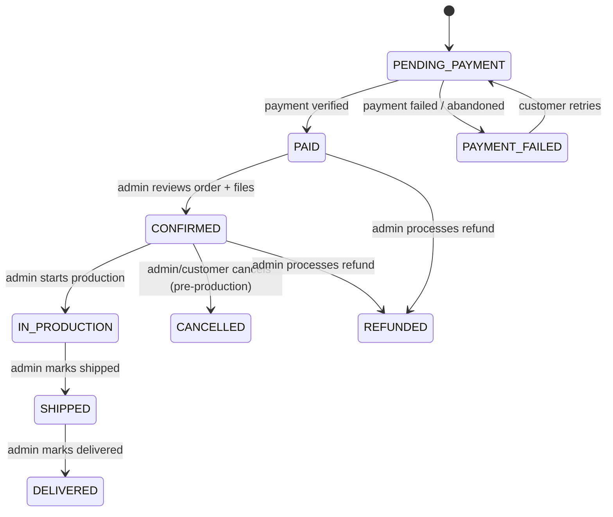
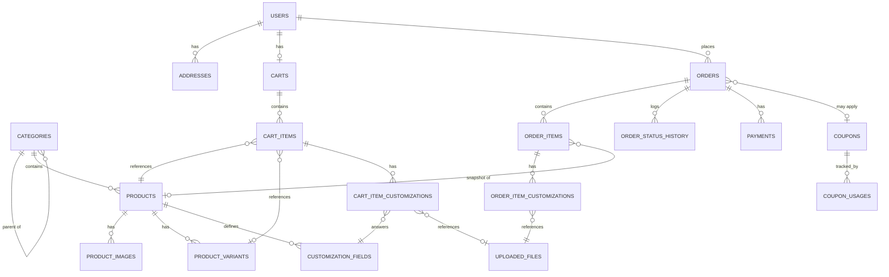
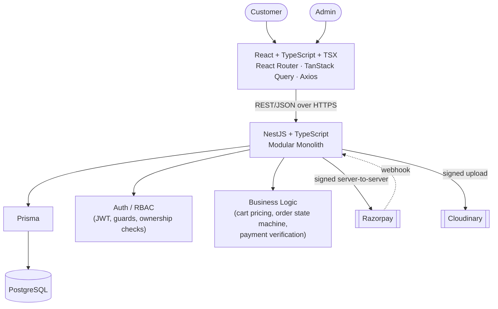

# PrintForge — Complete Product, Technical & Architecture Blueprint v1.0

> Working project name **PrintForge** is a placeholder — rename freely before Phase 0 kicks off. Nothing in this document depends on the name.

**Status:** DRAFT — awaiting sign-off against the Blueprint Freeze Checklist (Section 44).
**Owners:** Atharva Vavhal (Backend Lead), Harshad Gat (Frontend Lead).
**Reference used for conceptual UX/workflow analysis only:** printdeer360.com. No branding, copy, imagery, or code from the reference is reused anywhere in this document or in the resulting system.

---

## Table of Contents

1. Project Context
2. Technology Stack — Frozen
3. Primary Objective
4. Scope of This Document
5. Reference System Analysis
6. Product Requirements Document
7. Complete Feature Inventory
8. User Roles and RBAC
9. Customer Journey
10. Product Architecture
11. Product Customization System
12. Cart Architecture
13. Checkout Architecture
14. Razorpay Architecture
15. Order Management
16. Database Architecture
17. Prisma Architecture
18. Backend Architecture (NestJS)
19. Frontend Architecture (React)
20. Admin System
21. REST API Contract
22. API Response Standard
23. Frontend/Backend Contract
24. Cloudinary Architecture
25. Security Architecture
26. Business Rules
27. Error / Edge Case Matrix
28. Frontend UI/UX Blueprint
29. Responsive Design
30. SEO
31. Performance
32. Testing Strategy
33. Git Workflow
34. Development Roadmap
35. Deployment Architecture
36. Environment Strategy
37. MVP Scope Freeze
38. Future Roadmap
39. Cost / Complexity Control
40. Architecture Decision Records
41. Final System Architecture
42. Final Ownership Matrix
43. Final Implementation Checklist
44. Blueprint Freeze Checklist
45. Blueprint Consistency Audit

---

## 1. Project Context

This is a two-developer, budget-constrained, first paid client engagement. The platform is a custom-printing e-commerce site: customers browse printable products (apparel, packaging, promotional items, stationery, etc.), customize them (text, logo, uploaded artwork, variant selection), pay online, and the business fulfils the order through a production pipeline.

Constraints that shape every decision in this document:

- Two developers total, with a hard, non-overlapping ownership split (backend vs. frontend).
- Limited budget → limited infrastructure, limited third-party services, limited operational overhead.
- The system must be production-ready and secure from day one — "budget constrained" does not mean "insecure" or "untested," it means "no infrastructure or feature that isn't earning its cost."
- The system must be extensible: MVP is deliberately narrow, but the data model and module boundaries must not block Phase 2/3 features.

Guiding principle used throughout: **when in doubt, cut scope, not quality.**

---

## 2. Technology Stack — Frozen

| Layer | Technology |
|---|---|
| Frontend | React + TypeScript (TSX), Vite, React Router, TanStack Query, Axios, React Hook Form, Zod, CSS Modules + CSS Variables, Lucide React |
| Backend | Node.js, TypeScript, NestJS, REST, JWT, Passport (JWT strategy), class-validator, Prisma |
| Database | PostgreSQL |
| External services | Razorpay (payments), Cloudinary (media storage/transformation) |
| Architecture style | Modular monolith, REST/JSON, JWT auth, RBAC, domain-oriented modules |

This stack is **frozen** for MVP and Phase 2. Any deviation is flagged explicitly under **TECHNOLOGY CONCERN** — none are raised in this document; the stack is fit for purpose at this scale.

Explicitly excluded unless a concrete future requirement proves otherwise: Java/Spring Boot, MongoDB, microservices, Kafka/queues, Kubernetes, GraphQL, Redis, Elasticsearch, Redux (or any global state library beyond React Context + TanStack Query).

**TECHNOLOGY CONCERN — Redis (flagged, not adopted):** Two features will eventually want Redis-like behavior: rate limiting counters and idempotency-key locking for payment webhooks. For MVP scale (low request volume, single backend instance), both are implemented in PostgreSQL (a `webhook_events` table with a unique constraint gives idempotency; `@nestjs/throttler`'s in-memory store gives rate limiting). Revisit Redis only if the backend scales to multiple instances (in-memory rate limiting stops being correct across instances) — this is a Phase 2+/scale trigger, not an MVP requirement.

---

## 3. Primary Objective

Produce a single, unambiguous, internally consistent blueprint that both developers can implement against without further product decisions. This document is the contract between:

- product intent ↔ engineering scope
- backend ↔ frontend (API contract)
- MVP ↔ future phases (what is deliberately deferred, and why)

No application code is included. Implementation begins only after Section 44 is signed off.

---

## 4. Scope of This Document

In scope: product definition, data architecture, API contract, security model, payment/order lifecycle, UI/UX direction, roadmap, deployment plan.

Out of scope (by instruction): React components, NestJS controllers, Prisma schema files, SQL DDL, authentication implementation code. Small JSON snippets appear only to pin down API contracts.

---

## 5. Reference System Analysis

Conceptual analysis of printdeer360.com's apparent feature surface, reclassified for our budget/team size. This is a workflow analysis, not a design or content copy.

### 5.1 Public experience

| Area | Classification | Notes |
|---|---|---|
| Homepage (hero, featured categories, trust signals) | MUST HAVE | Simple, original design — Section 28 |
| Category browsing | MUST HAVE | Core discovery path |
| Product listing with filters (category, price) | MUST HAVE | Filters kept minimal for MVP: category, price range, sort |
| Search | SHOULD HAVE | Simple `ILIKE`/trigram search on product name/description is enough at this catalog size; no search engine infra |
| Product detail page | MUST HAVE | Includes variants, customization, pricing |
| Product customization UI | MUST HAVE | Core differentiator of the business |
| Cart | MUST HAVE | |
| Checkout | MUST HAVE | |
| Customer account (orders, addresses, profile) | MUST HAVE | Minimal: profile, addresses, order history |
| Order tracking/status | MUST HAVE | Status display, not live carrier tracking |
| Reviews | SHOULD HAVE | Phase 2 — see Section 39 for cost/value reasoning |
| Blog/content pages | COULD HAVE | Phase 2/3, static content only, no CMS build |
| Wishlist | COULD HAVE | Phase 3 |
| Live chat / contact form | SHOULD HAVE | A simple contact form (email-forwarding) is MUST HAVE; live chat is NOT REQUIRED |

### 5.2 Business workflows

| Workflow | Classification | Notes |
|---|---|---|
| Product variants (size/color/material) | MUST HAVE | |
| Customization: text | MUST HAVE | |
| Customization: logo/image/design file upload | MUST HAVE | Cloudinary-backed |
| Customer instructions/notes per item | MUST HAVE | Free-text field on order item |
| Quantity with per-product minimums | MUST HAVE | Bulk/print-run nature of the business |
| Order creation tied to payment | MUST HAVE | Order only created after payment intent, confirmed after verification (Section 14) |
| Payment (Razorpay) | MUST HAVE | |
| Order status through a production pipeline | MUST HAVE | Simplified state machine, Section 15 |
| Design proofing/approval workflow (customer approves a proof before production) | SHOULD HAVE | Phase 2 — MVP substitutes manual admin↔customer contact outside the system; see Section 39 |
| Inventory tracking (stock counts) | SHOULD HAVE | Phase 2 — MVP variants carry an `isAvailable` flag, not quantity-tracked stock |
| Shipping rate calculation / carrier integration | COULD HAVE | Phase 3 — MVP uses flat/manual shipping |
| Invoicing (formal tax invoices/GST) | SHOULD HAVE | Phase 2, likely required for an Indian business — flagged as **SCOPE WARNING** below |

**SCOPE WARNING:** If the client operates in India and needs GST-compliant invoices for MVP launch (legal requirement, not a nice-to-have), invoicing must be pulled into MVP. This document currently treats invoicing as Phase 2 (a simple order-summary PDF is NOT a compliant tax invoice). **ASSUMPTION:** the client will issue tax invoices outside this system (via their accounting/GST software) for MVP, and the platform is not the system of record for tax compliance. Confirm before freeze.

### 5.3 Admin capabilities (inferred operational needs)

| Capability | Classification |
|---|---|
| Product/category/variant/customization-field management | MUST HAVE |
| Order list, filter, detail, status transitions | MUST HAVE |
| View uploaded design files per order | MUST HAVE |
| Customer list (read-only) | MUST HAVE |
| Basic dashboard (order count, revenue, recent orders) | MUST HAVE |
| Coupon management | SHOULD HAVE |
| Review moderation | SHOULD HAVE |
| Content/blog management | COULD HAVE |
| Role/staff management beyond a single ADMIN role | NOT REQUIRED for MVP | See Section 8 |
| Advanced analytics (cohorts, LTV, funnels) | NOT REQUIRED | Phase 3+, low value at MVP order volume |

---

## 6. Product Requirements Document

**Product vision:** A focused, fast, trustworthy web platform where a customer can design and order custom-printed products end-to-end online, and the business can run its entire order-to-fulfilment workflow from one admin panel, without spreadsheets or WhatsApp-only ordering.

**Target users:**
- Retail/individual customers ordering small quantities of customized printed goods (apparel, stationery, promotional items).
- Small businesses ordering modest bulk quantities (branded merchandise, packaging).
- One internal admin/operator role (the client's own staff) managing catalog and orders.

**Business model:** Direct-to-consumer e-commerce, per-order payment, price varies by product + variant + quantity + customization complexity. Revenue recognized at payment; fulfilment happens after payment (pay-first business).

**Core user problems:**
- Customers: "I want a specific custom-printed item, I want to see roughly what it'll look like, and I want to pay and track it online instead of emailing back and forth."
- Business: "I need a single system where I can manage what's sellable, see what's been ordered (including the exact design files/text per order), take payment reliably, and track production status."

**Core user journeys:** see Section 9 (customer) and Section 20 (admin).

**Business objectives (MVP):**
1. Replace manual/offline ordering with a self-serve web flow for the highest-volume product types.
2. Guarantee payment correctness (no order without verified payment; no lost payments).
3. Give the admin a single place to see every order and its customization assets.
4. Ship fast with two developers without compromising security or data integrity.

**Success criteria (MVP):**
- A customer can complete browse → customize → pay → confirmation unassisted.
- Zero orders exist in the system without a verified payment (or are clearly marked `PENDING_PAYMENT`/`PAYMENT_FAILED` and never fulfilled).
- Admin can fulfil an order using only information available in the admin panel (no side-channel needed to find the design file or instructions).
- Page loads and checkout complete without manual server intervention.

**System boundaries:** The platform owns catalog, cart, checkout, payment initiation/verification, order lifecycle, and customer accounts. It does **not** own: tax/GST invoicing (Phase 2+, see Scope Warning above), shipping carrier integration (Phase 3), production/manufacturing execution (physical process, off-system), marketing/CRM/email campaigns (Phase 2+, transactional email only in MVP).

**MVP definition:** Section 37 (MVP Scope Freeze) is the authoritative table. This PRD section describes intent; Section 37 is binding.

**Future roadmap:** Section 38.

---

## 7. Complete Feature Inventory

Priority: P0 = blocking MVP launch, P1 = high value Phase 2, P2 = Phase 3/future. Complexity: S/M/L relative to a 2-person team.

| ID | Module | Feature | Description | User | Priority | MVP/Phase | Complexity | Dependencies |
|---|---|---|---|---|---|---|---|---|
| AUTH-1 | Auth | Register/login (email+password) | JWT-based auth, bcrypt hashing | Customer | P0 | MVP | S | — |
| AUTH-2 | Auth | Admin login | Same mechanism, `role=ADMIN` | Admin | P0 | MVP | S | AUTH-1 |
| AUTH-3 | Auth | Refresh token / session persistence | Access + refresh token pair | Both | P0 | MVP | M | AUTH-1 |
| AUTH-4 | Auth | Password reset via email | Token-based reset link | Customer | P1 | Phase 2 | M | Email provider |
| AUTH-5 | Auth | Social login (Google) | OAuth | Customer | P2 | Future | M | — |
| USER-1 | Users | Profile management | Name, phone, email | Customer | P0 | MVP | S | AUTH-1 |
| USER-2 | Users | Address book (multiple addresses) | CRUD addresses | Customer | P0 | MVP | S | USER-1 |
| CAT-1 | Categories | Category CRUD (admin) | Flat or 2-level categories | Admin | P0 | MVP | S | — |
| CAT-2 | Categories | Category browsing (public) | List products by category | Customer | P0 | MVP | S | CAT-1 |
| PROD-1 | Products | Product CRUD (admin) | Name, description, base price, images | Admin | P0 | MVP | M | CAT-1 |
| PROD-2 | Products | Product variants | Size/color/material with price delta | Admin/Customer | P0 | MVP | M | PROD-1 |
| PROD-3 | Products | Product listing (public) + filters | Category, price range, sort | Customer | P0 | MVP | M | PROD-1 |
| PROD-4 | Products | Product detail page (public) | Full detail, gallery, variants | Customer | P0 | MVP | M | PROD-1 |
| PROD-5 | Products | Search | Name/description text search | Customer | P1 | Phase 2 (basic version MVP) | S | PROD-3 |
| PROD-6 | Products | Related products | Same-category suggestion | Customer | P2 | Future | S | PROD-3 |
| CUST-1 | Customization | Customization field definitions (admin) | Per-product fields: text/logo/image/color/instructions | Admin | P0 | MVP | M | PROD-1 |
| CUST-2 | Customization | Customization UI (storefront) | Render fields per product, validate | Customer | P0 | MVP | L | CUST-1 |
| UPL-1 | Uploads | File upload to Cloudinary | Design/logo files, validated | Customer | P0 | MVP | M | Cloudinary |
| SRCH-1 | Search | Full catalog search | See PROD-5 | Customer | P1 | Phase 2 | S | PROD-3 |
| FILT-1 | Filters | Category/price/sort filters | Query-param driven | Customer | P0 | MVP | S | PROD-3 |
| CART-1 | Cart | Guest (client-side) cart | Pre-login cart in browser state | Customer | P0 | MVP | S | — |
| CART-2 | Cart | Authenticated (DB) cart | Persisted per user | Customer | P0 | MVP | M | AUTH-1 |
| CART-3 | Cart | Cart → login merge | Merge client cart into DB cart on login | Customer | P0 | MVP | S | CART-1, CART-2 |
| CART-4 | Cart | Server-side price recalculation | Cart totals always recomputed server-side | Customer | P0 | MVP | M | PROD-2 |
| CHK-1 | Checkout | Address selection/entry | Reuse USER-2 or one-off address | Customer | P0 | MVP | S | USER-2 |
| CHK-2 | Checkout | Order summary + validation | Re-validate product/variant/price/coupon | Customer | P0 | MVP | M | CART-4 |
| PAY-1 | Payments | Razorpay order creation | Backend-initiated | Customer | P0 | MVP | M | CHK-2 |
| PAY-2 | Payments | Razorpay checkout (frontend) | Razorpay Checkout.js modal | Customer | P0 | MVP | S | PAY-1 |
| PAY-3 | Payments | Signature verification | Backend verifies payment | System | P0 | MVP | M | PAY-1 |
| PAY-4 | Payments | Webhook handling | Authoritative status source | System | P0 | MVP | L | PAY-1 |
| PAY-5 | Payments | Refund initiation (admin) | Manual trigger, Razorpay refund API | Admin | P1 | Phase 2 | M | PAY-3 |
| ORD-1 | Orders | Order creation (post-payment) | Snapshot pricing into order items | System | P0 | MVP | M | PAY-3 |
| ORD-2 | Orders | Order status state machine | Section 15 | System/Admin | P0 | MVP | M | ORD-1 |
| ORD-3 | Orders | Order history (customer) | List + detail | Customer | P0 | MVP | S | ORD-1 |
| ORD-4 | Orders | Order detail with files (admin) | Full order + uploaded assets | Admin | P0 | MVP | S | ORD-1, UPL-1 |
| ORD-5 | Orders | Order status history/audit trail | Every transition logged | System | P0 | MVP | S | ORD-2 |
| ORD-6 | Orders | Order cancellation | Customer/admin, pre-production only | Both | P1 | Phase 2 | M | ORD-2 |
| REV-1 | Reviews | Product reviews (post-delivery) | Rating + text | Customer | P1 | Phase 2 | M | ORD-2 |
| REV-2 | Reviews | Review moderation (admin) | Approve/hide | Admin | P1 | Phase 2 | S | REV-1 |
| COUP-1 | Coupons | Coupon CRUD (admin) | Code, % or flat, expiry, min order | Admin | P1 | Phase 2 | M | — |
| COUP-2 | Coupons | Coupon application at checkout | Server-validated | Customer | P1 | Phase 2 | M | COUP-1, CHK-2 |
| ADMIN-1 | Admin | Dashboard metrics | Orders, revenue, recent activity | Admin | P0 | MVP | M | ORD-1 |
| ADMIN-2 | Admin | Customer list (read-only) | Search/view customers | Admin | P0 | MVP | S | USER-1 |
| CNT-1 | Content | Static content pages (About, Contact, Policies) | Hardcoded/simple pages | Customer | P0 | MVP | S | — |
| CNT-2 | Content | Blog | Editorial content | Customer | P2 | Future | M | — |
| NOTIF-1 | Notifications | Transactional email (order confirmation, status change) | System-triggered | Customer | P0 | MVP | M | Email provider |
| NOTIF-2 | Notifications | SMS/WhatsApp notifications | | Customer | P2 | Future | M | Third-party |
| ANLY-1 | Analytics | Basic dashboard metrics | Covered by ADMIN-1 | Admin | P0 | MVP | — | ADMIN-1 |
| ANLY-2 | Analytics | Advanced analytics/cohorts | | Admin | P2 | Future | L | — |
| INV-1 | Inventory | Stock-count tracking | | Admin | P1 | Phase 2 | M | PROD-2 |
| SHIP-1 | Shipping | Carrier rate/label integration | | System | P2 | Future | L | Carrier API |
| PROD-WF-1 | Production | Design proof/approval workflow | Customer-facing approve/reject | Both | P1 | Phase 2 | L | ORD-2 |

---

## 8. User Roles and RBAC

**Final roles: `CUSTOMER` and `ADMIN`. No other roles for MVP.**

Evaluated and rejected for MVP: a dedicated `STAFF`/production role, a `DESIGNER` role for proof approval, and a granular multi-role/permission table system. Reasoning: the client is a small operation; in practice one or two people will hold admin access at launch. Building a generic `roles`/`permissions`/`user_roles` many-to-many system now is speculative complexity with no near-term payoff — a single `role` enum column on `users` is sufficient and trivially migrates to a real RBAC join-table model later if a `STAFF` role becomes necessary (Phase 2 candidate once there's a real second internal user with narrower access needs).

Implementation model: `users.role` is an enum (`CUSTOMER`, `ADMIN`). Authorization is enforced with a NestJS guard reading this field from the validated JWT — no dynamic permission lookup needed for two fixed roles.

**Permission matrix**

| Permission | Customer | Admin |
|---|---|---|
| Browse catalog, search, filter | ✅ | ✅ |
| Manage own cart | ✅ | ✅ (as any customer would) |
| Place order / pay | ✅ | — |
| View own orders | ✅ (own only) | — |
| View all orders | ❌ | ✅ |
| Change order status | ❌ | ✅ |
| View payment records | Own orders only, status only (no raw gateway secrets) | ✅ full |
| Manage products/categories/variants/customization fields | ❌ | ✅ |
| Manage own profile/addresses | ✅ | ✅ (own) |
| View/manage customer list | ❌ | ✅ (read; no edit of customer PII beyond support needs) |
| Upload design files | ✅ (own order items) | ✅ (on behalf of customer, admin flows) |
| View uploaded files | Own only | ✅ all |
| Submit reviews | ✅ (own delivered orders) | — |
| Moderate reviews | ❌ | ✅ |
| Manage coupons | ❌ | ✅ |
| Apply coupons at checkout | ✅ | — |
| Manage content pages | ❌ | ✅ |
| View admin dashboard | ❌ | ✅ |
| Refund a payment | ❌ | ✅ |

Every protected endpoint enforces **both** authentication (valid JWT) and, where relevant, **resource ownership** (a customer can only read/mutate rows tied to their own `userId` — enforced in the service layer, never trusted from the client — see Section 25 and Section 26).

---

## 9. Customer Journey

```text
Landing → Browse → Search → Category → Product → Customization → Cart
  → Checkout → Razorpay → Payment Verification → Order Confirmation
  → Order Tracking → Delivery → Review
```

| Stage | UI | API | Data | Validation | Errors | Loading state | Security | Business rules |
|---|---|---|---|---|---|---|---|---|
| Landing | Hero, featured categories/products | `GET /categories`, `GET /products?featured=true` | Category/product summaries | — | Empty state if no featured products | Skeleton cards | Public, no auth | — |
| Browse/Category | Product grid, filters | `GET /products?category=&page=&sort=` | Paginated product list | Query params validated server-side (whitelisted sort keys, page bounds) | Empty result state | Skeleton grid | Public | Only active/published products returned |
| Search | Search bar + results | `GET /products?q=` | Paginated results | Query length limits, sanitized | "No results" state with suggestion to clear filters | Skeleton grid | Public | Same visibility rule as browse |
| Product detail | Gallery, variant picker, price, customization entry point | `GET /products/:slug` | Full product incl. variants, customization fields | 404 if not found/inactive | 404 page | Skeleton detail | Public | Price shown is base + variant delta; final price always recalculated server-side later |
| Customization | Dynamic form (text/logo/color/instructions) per product's fields | `POST /uploads` (per file), local form state otherwise | Field values + Cloudinary file refs | Client-side Zod schema generated from field defs; server re-validates required fields and file metadata | Inline field errors; upload failure toast with retry | Per-field upload spinner | Public until add-to-cart; upload endpoint requires auth or a scoped guest-upload token (see Section 11) | Required fields enforced before add-to-cart is enabled |
| Cart | Line items, quantity, remove, totals | `GET/POST/PATCH/DELETE /cart` (or local state pre-login) | Cart items with variant + customization refs | Quantity ≥ product minimum; variant availability | Line-item error banner if a product/variant became unavailable | Optimistic update + rollback on error | Cart mutation requires either session (guest) or auth (logged-in) | **Server recomputes price on every read** — Section 12 |
| Checkout | Address form/select, order summary, coupon field, pay button | `GET /addresses`, `POST /checkout/validate`, `POST /checkout/orders` | Address, validated cart, coupon result | Full server-side re-validation of cart, price, coupon, stock/availability | Field-level + summary-level errors; blocks payment until resolved | Spinner on submit | **Requires login** (Section 12 decision) | Backend is sole source of truth for final total (Section 13) |
| Razorpay | Razorpay Checkout.js modal | `POST /payments/razorpay-order` | Razorpay `order_id`, amount, key | Amount matches backend-computed total exactly | Modal dismiss/failure handled gracefully, order stays `PENDING_PAYMENT` | Modal's own loading state | Razorpay order created server-side only | Section 14 |
| Payment verification | Success/redirect screen | `POST /payments/verify` (frontend fast-path) + webhook (authoritative) | Razorpay `payment_id`, `order_id`, `signature` | HMAC signature verification server-side | If verification fails, order stays `PENDING_PAYMENT`, customer sees retry option | Spinner while verifying | Signature check prevents forged confirmations | Order is only marked `PAID` after signature check passes; webhook double-confirms |
| Order confirmation | Confirmation page with order number | `GET /orders/:id` | Order summary | Ownership check | 404/403 if not the owner | Skeleton | Auth required, ownership enforced | — |
| Order tracking | Status timeline | `GET /orders/:id` | Order + status history | Ownership check | — | Skeleton | Auth required, ownership enforced | Status only moves forward (Section 15) |
| Delivery | Status = `DELIVERED` | Status update triggers customer notification | — | — | — | — | Admin-only transition | — |
| Review | Rating + text form (Phase 2) | `POST /reviews` | Rating, text, order item ref | Only for delivered orders customer owns | Duplicate-review prevention | — | Auth required, ownership + delivery-status enforced | One review per order item |


## 10. Product Architecture

Entities: `Category`, `Product`, `ProductImage`, `ProductVariant`, `CustomizationField`.

- **Category**: flat with one optional level of nesting (`parentCategoryId` nullable, self-referential). Two levels is enough for this catalog size; deeper trees add UI and query complexity with no proven need.
- **Product**: belongs to one `Category`. Carries `name`, `slug`, `description`, `basePrice`, `minQuantity`, `isActive`, SEO fields (Section 30), timestamps. `basePrice` is the starting price before variant deltas and customization surcharges.
- **ProductImage**: many per product, ordered (`sortOrder`), one flagged `isPrimary`. Stores Cloudinary `publicId` + derived `url`, not binary data.
- **ProductVariant**: many per product. A variant is a concrete purchasable combination (e.g., Size=M, Color=Black). MVP models variants as a **flat list of combinations per product**, each with its own `priceDelta` (added to `basePrice`), `sku`, and `isAvailable` boolean — not a generic attribute-matrix engine. This is deliberately simple: the admin creates each valid combination explicitly rather than the system generating a cartesian product of attributes. Trade-off accepted: more admin data entry for products with many combinations, in exchange for a much simpler schema and UI. Revisit only if a specific product needs 50+ combinations.
- **CustomizationField**: many per product, defines what the customer fills in for that product (Section 11).
- **Availability**: MVP has no stock-count inventory (Section 5.2). `ProductVariant.isAvailable` is a manual admin toggle. Quantity-tracked inventory is Phase 2 (`INV-1`).
- **Related products**: NOT REQUIRED for MVP (simple "same category" query is cheap to add later; no dedicated relation table needed).
- **Specifications/metadata**: a single `specifications` JSONB column on `Product` for free-form spec key/value pairs (material, weight, print method) — avoids a rigid `product_specifications` table for data that varies wildly by product type and is display-only (never used in pricing/business logic).

**Relationships:**

```text
Category 1──* Product
Product  1──* ProductImage
Product  1──* ProductVariant
Product  1──* CustomizationField
```

Deletion behavior: a `Product` cannot be hard-deleted once it has ever appeared in an `OrderItem` (soft-delete via `isActive=false` instead) — order history must remain readable. Categories, images, variants, and customization fields cascade-delete with their parent product **only if the product has never been ordered**; otherwise the same soft-delete rule applies transitively (see Section 26, "orders are immutable history").

---

## 11. Product Customization System

Supported field types (MVP): `TEXT`, `LOGO_UPLOAD`, `IMAGE_UPLOAD`, `DESIGN_FILE_UPLOAD`, `COLOR_SELECT`, `INSTRUCTIONS` (free text). Size/variant selection is handled by `ProductVariant`, not by a customization field.

```text
Product → CustomizationField (definitions, admin-authored)
                ↓
Customer fills form on Product Detail page
                ↓
File fields → POST /uploads → Cloudinary → returns { publicId, url, format, bytes }
                ↓
Form (text values + file refs) → added to Cart as CartItemCustomization
                ↓
Checkout → Order created → CartItemCustomization becomes OrderItemCustomization (snapshotted)
```

**CustomizationField definition (admin-authored, per product):** `label`, `type`, `isRequired`, `sortOrder`, `helpText`, and type-specific constraints (`maxLength` for TEXT, `allowedFormats`/`maxFileSizeMb` for upload types, `options[]` for `COLOR_SELECT`).

**Validation — both layers, backend authoritative:**
- Frontend: a Zod schema is generated per-product from the field definitions returned by `GET /products/:slug`, giving instant inline validation.
- Backend: re-validates every field at cart-add time and again at checkout time (required fields present, text length, file metadata matches an already-uploaded, Cloudinary-confirmed asset owned by the requesting user/session). The backend never trusts that a `publicId` submitted by the client is real, unaltered, or belongs to that user — it is checked against Cloudinary asset metadata and against the upload record created in step "file fields" above.

**File validation (upload endpoint, `POST /uploads`):**
- Allowed MIME types: `image/png`, `image/jpeg`, `image/svg+xml`, `application/pdf` (common design-file formats). Configurable per `CustomizationField.allowedFormats`.
- Max file size: 10 MB default, overridable per field (kept modest deliberately — large press-ready files are an explicit Phase 2 concern with its own workflow, see Section 39).
- Files are streamed directly from the request to Cloudinary (never written to local disk, never stored in PostgreSQL as binary/BYTEA — Section 24).
- Upload requires an authenticated **or** guest-scoped request: since checkout requires login (Section 12), uploads during the pre-login customization step use a short-lived **guest session token** (a signed, unauthenticated-but-scoped JWT issued on first cart interaction) so a design uploaded before registration can be attributed and later merged into the customer's account cart. This token can only create uploads and a guest cart — nothing else.

**Storage model:** `UploadedFile` table stores `cloudinaryPublicId`, `url`, `format`, `bytes`, `uploadedByUserId` (nullable — guest uploads), `guestSessionId` (nullable), `createdAt`. `OrderItemCustomization` references `UploadedFile.id`, never a raw URL string, so admin/customer views always resolve through Cloudinary's current URL/transformation rules and orphaned-file cleanup (Section 24) has a clear ownership trail.

**Relationship uploaded files → order items:** one `OrderItemCustomization` row per customization field value on a given `OrderItem`; upload-type fields store an `uploadedFileId` FK, text-type fields store the value inline (`textValue` column). This keeps the customization payload queryable and typed instead of a single opaque JSON blob, while still being schema-flexible per product via the field-definition layer.

---

## 12. Cart Architecture

**Decision: no guest checkout. Account (login/registration) is required to complete checkout. Browsing and building a cart before login is fully supported.**

Reasoning: this business is reorder-heavy (customers re-order the same custom design) and has a real post-purchase surface (order tracking, re-downloadable proofs, design files tied to an account). Requiring login only at the checkout boundary — not before — keeps top-of-funnel friction low while avoiding two categories of complexity that guest checkout would otherwise force onto a two-person team: (1) a guest-order lookup/security model (how does a guest securely view their own order later without an account?), and (2) reconciling guest cart→DB cart merge logic for orders instead of just carts. **SCOPE WARNING noted for the client:** requiring login at checkout is a known conversion-rate trade-off in general e-commerce; if the client has strong evidence their audience abandons at forced registration, guest checkout can be added in Phase 2 as an explicit, scoped follow-up — it is not architecturally blocked by anything here, just deferred.

**Cart states:**
- **Guest cart:** held entirely in frontend state (React Context + `localStorage` persistence, not a state-management library). Contains product/variant IDs, quantity, and customization values (including any already-uploaded file refs from the guest-session upload token above). Never hits the database as a "cart" — only the underlying uploads do.
- **Authenticated cart:** persisted server-side (`Cart` + `CartItem` + `CartItemCustomization` tables), one open cart per user.
- **Merge on login/registration:** frontend sends the local cart payload with the login/register request (or immediately after, one call); backend validates each line item (product/variant still exists and is active) and upserts into the user's `Cart`. Invalid lines are dropped and reported back to the frontend for a "some items couldn't be added" notice — never silently dropped without telling the user.

**Cart item shape:** `productId`, `variantId`, `quantity`, `customizations[]` (field id → value/file ref), computed unit price and line total (computed, not stored as client-supplied truth).

**Price calculation:** on every cart read (`GET /cart`) and on every mutation, the backend recomputes: `unitPrice = product.basePrice + variant.priceDelta + Σ(customization surcharges, if any)`, `lineTotal = unitPrice × quantity`, `cartTotal = Σ(lineTotal) − discount`. The frontend never computes or persists a price; it only displays what the backend returns. Quantity is validated against `product.minQuantity`.

**Discounts:** a coupon code, if applied, is stored as `Cart.couponCode` and re-validated (existence, expiry, min-order, per-user usage limit) on every total recomputation — never trusted as a stored discount amount (Section 26).

**Cart validation performed on every read/mutation:** product still active, variant still available, quantity ≥ minimum, required customization fields still present, referenced uploaded files still exist. Any failure surfaces as a line-item-level warning, not a hard error that blocks viewing the cart.

---

## 13. Checkout Architecture

```text
Cart (validated) → Address → Order Summary (server-computed) → Coupon (re-validated)
   → POST /checkout/orders → Order (PENDING_PAYMENT) + Razorpay order → Razorpay Checkout
```

Steps:
1. **Customer details/address:** select an existing `Address` or submit a new one (persisted to the address book if the customer opts in). Server validates required fields (name, phone, line1, city, state, postal code, country) via `class-validator` DTOs.
2. **Order summary:** `POST /checkout/validate` re-runs the full cart validation from Section 12 and returns the authoritative summary (line items, subtotal, discount, shipping — MVP flat/manual — total). The frontend renders exactly this response; it does not independently compute anything.
3. **Coupon validation:** re-checked server-side at this step against current cart contents, not the value cached from an earlier cart view.
4. **Order + payment initiation:** `POST /checkout/orders` creates an `Order` row in `PENDING_PAYMENT` with **snapshotted** line items (product name, variant label, unit price, customization values all copied at this moment — Section 26, price immutability), then creates a matching Razorpay order (Section 14) and returns the Razorpay order id/amount/key to the frontend.
5. **Payment failure/retry:** if Razorpay checkout is dismissed, fails, or the customer abandons it, the `Order` remains `PENDING_PAYMENT`. The frontend offers a "retry payment" action that re-opens Razorpay Checkout against the **same** order/Razorpay-order (no duplicate `Order` rows are created for retries — Section 14 covers idempotency).

**IMPORTANT — restated as a binding rule:** the backend is the sole authority on price. The frontend never sends, and the backend never accepts, a client-supplied price, subtotal, discount amount, or total. Every amount the frontend displays and every amount Razorpay is asked to charge is a value the backend computed in the same request cycle.

---

## 14. Razorpay Architecture

```text
Frontend → Backend: "start checkout"
Backend: validate cart/price → create Order (PENDING_PAYMENT) → create Razorpay Order
Backend → Frontend: { razorpayOrderId, amount, currency, keyId }
Frontend: opens Razorpay Checkout.js with that data
Customer completes payment in the Razorpay modal
Razorpay → Frontend: razorpay_payment_id, razorpay_order_id, razorpay_signature (on success callback)
Frontend → Backend: POST /payments/verify { those three fields }
Backend: verify HMAC signature using RAZORPAY_KEY_SECRET → mark Payment/Order accordingly
Razorpay → Backend (async, independent of the above): POST /payments/webhook
Backend: verify webhook signature using RAZORPAY_WEBHOOK_SECRET → authoritative status update
```

**Entities:** `Payment` (one row per payment *attempt* against an `Order`: `razorpayOrderId`, `razorpayPaymentId` nullable until captured, `status`, `amount`, `method`, `rawResponse` JSONB for support/debugging, timestamps) and `WebhookEvent` (`razorpayEventId` unique, `type`, `payload` JSONB, `processedAt`) — the uniqueness constraint on `razorpayEventId` is the idempotency mechanism for webhooks.

**Payment states (on `Payment`):** `CREATED` → `AUTHORIZED`/`CAPTURED` (success) or `FAILED`. **Order states** derived from payment are covered in Section 15 — `Order.status` and `Payment.status` are separate fields; the order state machine only advances on a **verified** payment event (signature-checked frontend call **or** verified webhook — whichever arrives and passes verification first).

**Signature verification (both paths use HMAC-SHA256 with the appropriate secret):**
- Frontend-callback path: verify `razorpay_order_id + "|" + razorpay_payment_id` signed with `RAZORPAY_KEY_SECRET` equals `razorpay_signature`.
- Webhook path: verify the raw request body signed with `RAZORPAY_WEBHOOK_SECRET` equals the `X-Razorpay-Signature` header. The webhook handler reads the **raw** body for this check (before any body-parsing middleware transforms it) — a common implementation pitfall called out explicitly here.

**Why both paths exist:** the frontend-callback path gives the customer an instant "payment successful" UI without waiting for webhook latency. The webhook is the **authoritative, non-bypassable** source of truth, because it fires from Razorpay's servers regardless of whether the customer's browser is still connected. Order fulfilment eligibility (moving out of `PAID`) is never gated on the frontend call alone in a way that could be skipped by a malicious client that fabricates a fake "success" UI state — the backend always independently verifies before trusting either path, and the webhook is treated as capable of confirming a payment the frontend call never reported.

**Idempotency / duplicate prevention:**
- `Order` ↔ `razorpayOrderId` is 1:1 and unique — retrying payment on a `PENDING_PAYMENT` order reuses the same Razorpay order, never creates a second one, as long as it hasn't expired; if Razorpay's own order has expired, the backend creates a new Razorpay order but still against the *same* `Order` row.
- `WebhookEvent.razorpayEventId` unique constraint makes webhook processing idempotent — a duplicated webhook delivery (Razorpay retries on non-2xx) is detected and no-op'd on the second delivery.
- Order status transitions are also idempotent at the state-machine level (Section 15): applying "mark paid" to an already-`PAID` order is a safe no-op, not an error, so the two independent confirmation paths (frontend + webhook) racing each other never double-process.

**Explicit scenario handling:**

| # | Scenario | Backend behavior |
|---|---|---|
| 1 | Payment succeeds | Signature verified (either path) → `Payment.status=CAPTURED`, `Order.status: PENDING_PAYMENT → PAID`, confirmation email sent, `OrderStatusHistory` row written |
| 2 | Payment fails | Razorpay reports failure → `Payment.status=FAILED`, `Order.status` stays `PENDING_PAYMENT` (or moves to `PAYMENT_FAILED` after N failed attempts / explicit customer abandonment — Section 15), customer can retry |
| 3 | Browser closes mid-payment | Frontend never gets a callback; order stays `PENDING_PAYMENT`. The webhook (if payment actually completed on Razorpay's side) arrives independently and still marks the order `PAID` — the sale is not lost just because the tab closed |
| 4 | Frontend loses connection after payment | Same as #3 — webhook is the safety net precisely for this case |
| 5 | Webhook arrives before frontend call | Webhook processes first (verified, idempotent) → order already `PAID` by the time the frontend call arrives; frontend call's verification still runs but finds a no-op — same success response to the user |
| 6 | Webhook arrives after frontend call | Frontend call verifies and marks `PAID` first; webhook arrives later, sees the `WebhookEvent` id hasn't been processed, applies the same (already-applied) transition — idempotent no-op, no duplicate emails (email sending is itself guarded by "only send on the transition that actually changes state") |
| 7 | Customer retries payment | New Razorpay payment attempt against the same `Order`/Razorpay-order; a new `Payment` attempt row is created; once one attempt succeeds the order moves to `PAID` and further attempts are rejected by the backend (checkout endpoint checks `Order.status` before allowing a new attempt) |
| 8 | Duplicate request (e.g., double-click "Pay") | Frontend disables the pay button on submit; backend additionally guards `POST /checkout/orders` idempotency via a client-generated `Idempotency-Key` header mapped to a short-lived server-side dedup record, so a retried network request never creates two orders |

**Reconciliation:** a scheduled admin action (manual "Reconcile" button in MVP, not an automated cron — Section 39 cost/complexity call) queries Razorpay for any `PENDING_PAYMENT` orders older than X hours and compares against Razorpay's payment records, surfacing mismatches for manual review. Full automated reconciliation jobs are Phase 2.

**Refund architecture:** Phase 2 (`PAY-5`). MVP has no in-app refund initiation; refunds are handled directly in the Razorpay dashboard by the admin outside this system, and the order is manually marked `REFUNDED` by the admin (Section 15) to keep the system's record consistent. In-app refund initiation via Razorpay's Refund API is a Phase 2 addition once refund volume justifies the engineering time.

---

## 15. Order Management

**Order state machine (MVP — deliberately narrower than a full production pipeline):**



**Why the full reference pipeline (`DESIGN_REVIEW`, `DESIGN_APPROVED`, `QUALITY_CHECK`, `PACKED`) is not in MVP:** with one or two admin operators, that level of granularity is tracked mentally/verbally faster than it can be clicked through a UI at current order volume, and each extra state is an extra transition to build, test, and get wrong. `CONFIRMED` and `IN_PRODUCTION` absorb design-review and quality-check informally (admin verifies the uploaded file is print-ready before moving `PAID → CONFIRMED`; contacts the customer directly, outside the system, if it isn't). A formal customer-facing design-approval workflow (`PROD-WF-1`) is Phase 2 — see Section 39 for why it's high-value-but-not-yet.

**Transitions and who can perform them:**

| From | To | Trigger | Actor |
|---|---|---|---|
| — | `PENDING_PAYMENT` | Order created at checkout | System |
| `PENDING_PAYMENT` | `PAID` | Verified payment (Section 14) | System |
| `PENDING_PAYMENT` | `PAYMENT_FAILED` | Payment failure or timeout | System |
| `PAYMENT_FAILED` | `PENDING_PAYMENT` | Customer retries payment | Customer action → System |
| `PAID` | `CONFIRMED` | Admin reviews order/files | Admin |
| `CONFIRMED` | `IN_PRODUCTION` | Admin starts production | Admin |
| `IN_PRODUCTION` | `SHIPPED` | Admin marks shipped | Admin |
| `SHIPPED` | `DELIVERED` | Admin marks delivered | Admin |
| `CONFIRMED` | `CANCELLED` | Cancellation before production starts | Admin (customer-initiated requests go through admin in MVP — no self-service cancel button yet, `ORD-6` is Phase 2) |
| `PAID`/`CONFIRMED` | `REFUNDED` | Manual refund processed | Admin |

All other transitions are rejected by the backend (state machine enforced server-side, not just in the UI). Every transition writes an `OrderStatusHistory` row (`fromStatus`, `toStatus`, `changedByUserId`, `note`, `createdAt`) — full audit trail, immutable/append-only. Customers only ever see forward progress; there is no "un-ship" action exposed anywhere.

**Cancellation rules:** allowed only up to `CONFIRMED` (before `IN_PRODUCTION`), since production consumes real materials. Once `IN_PRODUCTION` or later, only a `REFUNDED` path (case-by-case, admin discretion) applies, not `CANCELLED`.

---

## 16. Database Architecture

Final table list (MVP). Deliberately **excludes** a generic `roles`/`permissions`/`user_roles` join-table system (Section 8) and a `coupon_usages` table is **included** because per-user coupon-limit enforcement genuinely needs it.

| Table | Purpose |
|---|---|
| `users` | Customer + admin accounts |
| `addresses` | Customer address book |
| `categories` | Product categories (self-referential, one nesting level) |
| `products` | Sellable products |
| `product_images` | Product gallery images (Cloudinary refs) |
| `product_variants` | Purchasable variant combinations |
| `customization_fields` | Per-product customization field definitions |
| `uploaded_files` | Cloudinary file metadata (design/logo uploads) |
| `carts` | One open cart per authenticated user |
| `cart_items` | Cart line items |
| `cart_item_customizations` | Customization values on a cart line item |
| `orders` | Placed orders |
| `order_items` | Snapshotted order line items |
| `order_item_customizations` | Snapshotted customization values per order item |
| `order_status_history` | Audit trail of status transitions |
| `payments` | Payment attempts per order |
| `webhook_events` | Razorpay webhook idempotency ledger |
| `coupons` | Discount codes |
| `coupon_usages` | Per-user coupon redemption tracking |
| `reviews` | Product reviews (Phase 2, schema reserved now) |

### 16.1 Table specifications

**users** — `id` (uuid, PK), `email` (unique, not null), `passwordHash` (not null), `role` (enum: `CUSTOMER`\|`ADMIN`, default `CUSTOMER`), `firstName`, `lastName`, `phone` (nullable), `isActive` (bool, default true), `createdAt`, `updatedAt`. Index on `email`.

**addresses** — `id` (PK), `userId` (FK → users, cascade delete), `label` (nullable, e.g. "Home"), `fullName`, `phone`, `line1`, `line2` (nullable), `city`, `state`, `postalCode`, `country`, `isDefault` (bool), timestamps. Index on `userId`.

**categories** — `id` (PK), `name`, `slug` (unique), `parentCategoryId` (FK → categories, nullable, `SET NULL` on delete), `isActive`, `sortOrder`, timestamps.

**products** — `id` (PK), `categoryId` (FK → categories, `RESTRICT` on delete — a category with products cannot be deleted), `name`, `slug` (unique), `description` (text), `basePrice` (decimal(10,2)), `minQuantity` (int, default 1), `specifications` (jsonb, nullable), `isActive` (bool), SEO fields (`metaTitle`, `metaDescription`, nullable), timestamps. Indexes: `categoryId`, `slug`, `isActive`.

**product_images** — `id` (PK), `productId` (FK → products, cascade delete *unless product has orders*, enforced at application layer per Section 10), `cloudinaryPublicId`, `url`, `sortOrder`, `isPrimary` (bool), timestamps. Index on `productId`.

**product_variants** — `id` (PK), `productId` (FK → products, cascade/restrict per Section 10), `label` (e.g. "M / Black"), `sku` (unique, nullable), `priceDelta` (decimal(10,2), default 0), `isAvailable` (bool, default true), timestamps. Index on `productId`. Unique constraint on (`productId`, `label`).

**customization_fields** — `id` (PK), `productId` (FK → products), `label`, `type` (enum: `TEXT`\|`LOGO_UPLOAD`\|`IMAGE_UPLOAD`\|`DESIGN_FILE_UPLOAD`\|`COLOR_SELECT`\|`INSTRUCTIONS`), `isRequired` (bool), `sortOrder`, `helpText` (nullable), `constraints` (jsonb — `maxLength`, `allowedFormats`, `maxFileSizeMb`, `options[]`, all optional/type-dependent), timestamps. Index on `productId`.

**uploaded_files** — `id` (PK), `cloudinaryPublicId` (unique), `url`, `format`, `bytes` (int), `uploadedByUserId` (FK → users, nullable), `guestSessionId` (string, nullable, indexed), `createdAt`.

**carts** — `id` (PK), `userId` (FK → users, unique — one open cart per user), `couponCode` (nullable), timestamps.

**cart_items** — `id` (PK), `cartId` (FK → carts, cascade delete), `productId` (FK → products, `RESTRICT`), `variantId` (FK → product_variants, `RESTRICT`, nullable if product has no variants), `quantity` (int), timestamps. Index on `cartId`.

**cart_item_customizations** — `id` (PK), `cartItemId` (FK → cart_items, cascade delete), `customizationFieldId` (FK → customization_fields, `RESTRICT`), `textValue` (nullable), `uploadedFileId` (FK → uploaded_files, nullable), timestamps.

**orders** — `id` (PK), `orderNumber` (unique, human-readable, e.g. `PF-2026-000123`), `userId` (FK → users, `RESTRICT` — never delete a user with orders; deactivate instead), `status` (enum, Section 15), `subtotal`, `discountAmount`, `total` (decimal(10,2), all snapshotted/computed at order-creation time), `couponCode` (nullable, snapshotted), `shippingAddressId` (FK → addresses, `RESTRICT`, or a denormalized address snapshot — see note below), `razorpayOrderId` (unique, nullable until payment created), timestamps. Indexes: `userId`, `status`, `orderNumber`, `razorpayOrderId`.

> **ASSUMPTION:** `orders.shippingAddressId` references `addresses`, but if a customer later edits/deletes that address, the order's historical shipping address must not change. Resolve this by **snapshotting** the address fields directly onto the `orders` row (denormalized copy) rather than a live FK, consistent with the "orders are immutable history" rule in Section 26. This document specifies the *rule* (snapshot, not live reference); exact column layout is left to Prisma schema design.

**order_items** — `id` (PK), `orderId` (FK → orders, cascade delete with parent order only), `productId` (FK → products, `SET NULL` — product may later be deleted from catalog, order history keeps the snapshot), `productNameSnapshot`, `variantLabelSnapshot` (nullable), `unitPriceSnapshot`, `quantity`, `lineTotal`, timestamps.

**order_item_customizations** — `id` (PK), `orderItemId` (FK → order_items, cascade delete), `fieldLabelSnapshot`, `textValue` (nullable), `uploadedFileId` (FK → uploaded_files, `RESTRICT`), timestamps.

**order_status_history** — `id` (PK), `orderId` (FK → orders, cascade delete), `fromStatus` (nullable for the initial row), `toStatus`, `changedByUserId` (FK → users, nullable — system-triggered transitions), `note` (nullable), `createdAt`. Index on `orderId`. Append-only, no update/delete in application logic.

**payments** — `id` (PK), `orderId` (FK → orders, `RESTRICT`), `razorpayOrderId`, `razorpayPaymentId` (nullable), `status` (enum: `CREATED`\|`AUTHORIZED`\|`CAPTURED`\|`FAILED`), `amount`, `method` (nullable), `rawResponse` (jsonb), timestamps. Index on `orderId`, `razorpayPaymentId`.

**webhook_events** — `id` (PK), `razorpayEventId` (unique, not null), `type`, `payload` (jsonb), `processedAt` (nullable until handled), `createdAt`.

**coupons** — `id` (PK), `code` (unique), `type` (enum: `PERCENT`\|`FLAT`), `value` (decimal), `minOrderAmount` (nullable), `maxUsesPerUser` (nullable, default 1), `expiresAt` (nullable), `isActive`, timestamps.

**coupon_usages** — `id` (PK), `couponId` (FK → coupons), `userId` (FK → users), `orderId` (FK → orders), `createdAt`. Unique constraint (`couponId`, `orderId`) prevents double-application to one order; count of (`couponId`, `userId`) rows enforces `maxUsesPerUser`.

**reviews** (Phase 2, schema reserved) — `id` (PK), `orderItemId` (FK → order_items, unique — one review per purchased item), `productId` (FK → products, denormalized for query convenience), `userId` (FK → users), `rating` (1–5), `text` (nullable), `isApproved` (bool, default false), timestamps.

### 16.2 ER Diagram



---

## 17. Prisma Architecture

**Model organization:** a single `schema.prisma` for MVP (modular monolith → single database → single schema file is simplest to reason about with two developers). If the file grows unwieldy, Prisma's `prisma-import`-style multi-file organization can be adopted later without a data-model change — that's a file-organization decision, not an architecture one.

**Relationships:** modeled with explicit `@relation` names wherever a table has more than one FK to the same target (e.g., `order_items.productId` vs. any future "replacement product" reference) to keep generated types unambiguous.

**Migrations:** Prisma Migrate, one migration per meaningful schema change, committed to `backend/prisma/migrations/`. No manual SQL edits to a migration once it has been applied to any shared environment — a mistake gets a new forward migration, not an edited history.

**Seed strategy:** `backend/prisma/seed.ts` seeds: an admin user, 2–3 categories, 6–10 representative products with variants and customization fields, and one sample coupon — enough for both developers to run the full customer journey locally without hand-creating data. Seed script is idempotent (safe to re-run against a fresh dev database).

**Development vs. production database:** separate PostgreSQL instances (Section 35/36). `npx prisma migrate dev` locally; `npx prisma migrate deploy` in CI/deploy for production — deploy never uses `migrate dev`'s auto-generated/shadow-database flow against production data.

**Transaction usage:** Prisma `$transaction` wraps every multi-table write that must be atomic: cart→order conversion (order + order_items + order_item_customizations + status-history row), and payment verification (payment status update + order status update + status-history row) are the two critical transactional boundaries in the system. Partial writes here are a data-integrity bug, not just a UX bug.

**Indexing strategy:** every FK column is indexed (Prisma does this by default for relations); additional indexes called out per-table in Section 16.1 are added explicitly for query patterns known up front (status filtering on `orders`, slug lookups on `products`/`categories`). No speculative indexing beyond that — added when a real slow query is found (`EXPLAIN ANALYZE`-driven, not guessed).


## 18. Backend Architecture (NestJS)

Modules (domain-oriented, modular monolith — each module owns its controller/service/DTOs, imports only what it needs, no circular dependencies):

| Module | Responsibility | Public API surface | Depends on |
|---|---|---|---|
| `auth` | Register/login/refresh, JWT issuance, password hashing, guest-session tokens | `/auth/*` | `users` |
| `users` | User profile, addresses | `/users/*`, `/addresses/*` | — |
| `categories` | Category CRUD + public listing | `/categories/*` | — |
| `products` | Product/variant/customization-field CRUD + public browse/search/detail | `/products/*` | `categories`, `uploads` (image refs) |
| `uploads` | Cloudinary upload handling, `uploaded_files` records | `/uploads/*` | — |
| `cart` | Cart CRUD, price computation, coupon re-validation, login-merge | `/cart/*` | `products`, `coupons` |
| `checkout` | Order-summary validation, order creation, ties to `payments` | `/checkout/*` | `cart`, `orders`, `payments` |
| `orders` | Order retrieval, status transitions, status history | `/orders/*` | `products` (snapshot read), `users` |
| `payments` | Razorpay order creation, verification, webhook handling | `/payments/*` | `orders` |
| `reviews` (Phase 2) | Review CRUD + moderation | `/reviews/*` | `orders`, `products` |
| `coupons` | Coupon CRUD (admin), validation helper consumed by `cart`/`checkout` | `/coupons/*` (admin), internal validation service | — |
| `admin` | Cross-cutting admin-only aggregation endpoints (dashboard metrics, customer list) | `/admin/*` | `orders`, `users`, `products` |
| `common` | Shared guards (JWT, roles, ownership), interceptors (response envelope), filters (exception→API error format), DTOs/decorators used across modules | — (no controller) | — |

**Dependency direction rule** (prevents circularity): `common` depends on nothing; domain modules depend on `common` and, where genuinely needed, on one other domain module in a single direction (`checkout → cart/orders/payments`, never the reverse). `admin` is allowed to depend on multiple domain modules since it's purely an aggregation layer with no business logic of its own — business logic stays in the owning module.

**DTOs/validation:** every controller method takes a `class-validator`-decorated DTO; validation happens at the NestJS pipe level before the handler runs. Admin-only DTOs (e.g., `CreateProductDto`) are distinct types from public-facing response shapes — internal fields (cost data, soft-delete flags) are never serialized to public responses by construction, not by manual filtering.

**Public vs. private APIs within a module:** each module's controller separates public routes (no guard) from customer routes (`@UseGuards(JwtAuthGuard)`) from admin routes (`@UseGuards(JwtAuthGuard, RolesGuard) @Roles('ADMIN')`) — never a single route that branches behavior internally based on an optional auth header.

---

## 19. Frontend Architecture (React)

```text
src/
  pages/          route-level components (thin — compose features)
  features/       domain features (product-browse, cart, checkout, admin-orders, ...) — each owns its components, hooks, and API calls for that domain
  components/      shared, reusable, domain-agnostic UI (Button, Card, Modal, FormField, ...)
  layouts/         AppLayout, AdminLayout, AuthLayout
  hooks/           shared cross-feature hooks (useAuth, useDebounce, ...)
  services/api/    Axios instance + typed API client functions, one file per backend module (products.api.ts, cart.api.ts, ...)
  schemas/         Zod schemas (mirrors DTO shapes; generated customization schemas live here too)
  types/           shared TypeScript types (mirrors backend response shapes from Section 23)
  utils/           formatting, currency, date helpers
  constants/       route paths, enums mirrored from backend
  assets/          static assets
  styles/          global CSS variables, resets
```

**Route structure:**

| Path | Access | Notes |
|---|---|---|
| `/`, `/products`, `/products/:slug`, `/categories/:slug`, `/search` | Public | |
| `/cart` | Public (guest cart) / Auth (DB cart) | Same route, data source switches on auth state |
| `/checkout` | Auth required | Redirects to `/login?redirect=/checkout` if unauthenticated |
| `/login`, `/register` | Public | Redirects away if already authenticated |
| `/account`, `/account/orders`, `/account/orders/:id`, `/account/addresses` | Auth required (`CUSTOMER` or `ADMIN`) | |
| `/admin/*` | Auth required, `role=ADMIN` | Separate `AdminLayout`, guarded by a route-level check that verifies role client-side **and** every underlying API call is independently guarded server-side (client-side guard is UX only, never the security boundary) |

**API layer:** one Axios instance with a base URL from env config, a request interceptor attaching the JWT, and a response interceptor handling 401 (attempt refresh once, then redirect to login) uniformly. Every backend module has a matching `services/api/*.api.ts` file exposing typed functions (`getProducts(params)`, `createOrder(payload)`, ...) — components never call Axios directly.

**TanStack Query usage:** all server data (products, cart when authenticated, orders, admin data) goes through Query — `useQuery` for reads with sensible `staleTime` per resource (product catalog cached longer than cart/orders), `useMutation` for writes with query-invalidation on success. This is the app's entire "server state" layer.

**Local state:** component-local `useState`/`useReducer` for UI-only state (modal open, form step). The guest cart is the one piece of meaningfully shared client state that isn't server data — held in a small React Context provider (`CartContext`) backed by `localStorage`, not Redux (no justified need for a global state library beyond this narrow case).

**Form state:** React Hook Form + Zod resolver for every form (auth, checkout, admin product forms, dynamic customization forms generated from field definitions).

**Authentication handling:** access token in memory (React Context) + refresh token in an `httpOnly` cookie set by the backend (Section 25) — access token is never persisted to `localStorage` to limit XSS blast radius. On app load, a silent refresh attempt establishes the session.

**Error handling:** a single `ApiError` shape (Section 22) is thrown by the Axios layer; TanStack Query's `onError` + a shared `ErrorBoundary`/toast system render it consistently. Field-level validation errors (422) are mapped onto React Hook Form's `setError` so they render inline, not as a generic toast.

---

## 20. Admin System

**Dashboard:** order count (today/week/month), revenue (same windows), recent orders list, low-level counts (products, customers). All served by `admin` module aggregation endpoints — no client-side aggregation of raw lists.

**Products:** create/update/soft-delete, manage images (upload via the same `uploads` pipeline), manage variants (inline sub-form), manage customization fields (inline sub-form), set pricing/minimum quantity/active status.

**Categories:** create/update/reorder/soft-delete (blocked if it has active products — Section 16).

**Orders:** list with filters (status, date range, customer), search (order number, customer email), detail view showing full snapshot (items, customizations, uploaded files with direct Cloudinary preview links, payment status, address, status history), and the status-transition action (Section 15's allowed-transitions only — invalid transitions aren't offered in the UI and are rejected server-side regardless).

**Customers:** read-only list/search/detail (orders placed, contact info). No admin edit of customer PII beyond what support requires (e.g., correcting a typo'd address on their behalf goes through the same `addresses` API, audited like any other write).

**Reviews (Phase 2):** approve/hide queue.

**Coupons (Phase 2 in full, but admin CRUD is worth building alongside `orders` since the schema already exists):** create/update/deactivate, usage stats.

**Content:** NOT REQUIRED as an admin-managed CMS for MVP — static pages (About, Contact, Policies) are built directly as frontend routes/markdown, no admin editing UI. Revisit only if the client needs to self-edit copy frequently (Phase 2/3).

---

## 21. REST API Contract

Base path: `/api/v1`. All request/response bodies are JSON. Authenticated routes expect `Authorization: Bearer <accessToken>`.

| Group | Method + Path | Purpose | Auth |
|---|---|---|---|
| Auth | `POST /auth/register` | Create account | Public |
| Auth | `POST /auth/login` | Login | Public |
| Auth | `POST /auth/refresh` | Rotate access token | Refresh cookie |
| Auth | `POST /auth/logout` | Invalidate refresh session | Auth |
| Auth | `POST /auth/guest-session` | Issue scoped guest upload/cart token | Public |
| Users | `GET/PATCH /users/me` | View/update own profile | Auth |
| Addresses | `GET/POST /addresses` , `PATCH/DELETE /addresses/:id` | Address book CRUD | Auth (ownership enforced) |
| Categories | `GET /categories` | Public listing | Public |
| Categories | `POST /categories`, `PATCH/DELETE /categories/:id` | Admin CRUD | Admin |
| Products | `GET /products` | List/search/filter (`?category=&q=&minPrice=&maxPrice=&sort=&page=`) | Public |
| Products | `GET /products/:slug` | Detail incl. variants + customization fields | Public |
| Products | `POST /products`, `PATCH/DELETE /products/:id` | Admin CRUD | Admin |
| Products | `POST/PATCH/DELETE /products/:id/variants[/:variantId]` | Variant management | Admin |
| Products | `POST/PATCH/DELETE /products/:id/customization-fields[/:fieldId]` | Field management | Admin |
| Uploads | `POST /uploads` | Upload a file (multipart) → Cloudinary | Auth or guest-session token |
| Cart | `GET /cart` | Current cart, server-computed totals | Auth (or omitted — guest cart is client-only) |
| Cart | `POST /cart/items`, `PATCH/DELETE /cart/items/:id` | Mutate cart (authenticated) | Auth |
| Cart | `POST /cart/merge` | Merge guest cart on login | Auth |
| Cart | `POST /cart/coupon`, `DELETE /cart/coupon` | Apply/remove coupon | Auth |
| Checkout | `POST /checkout/validate` | Re-validate + return authoritative summary | Auth |
| Checkout | `POST /checkout/orders` | Create order + Razorpay order | Auth |
| Payments | `POST /payments/verify` | Frontend-callback verification | Auth |
| Payments | `POST /payments/webhook` | Razorpay webhook | Signed, unauthenticated (signature is the auth) |
| Orders | `GET /orders` | Own order list | Auth |
| Orders | `GET /orders/:id` | Own order detail | Auth (ownership) |
| Orders | `GET /admin/orders`, `GET /admin/orders/:id` | Full order list/detail | Admin |
| Orders | `PATCH /admin/orders/:id/status` | Status transition | Admin |
| Reviews (Phase 2) | `POST /reviews`, `GET /products/:id/reviews` | Submit/list | Auth / Public |
| Coupons | `GET/POST/PATCH/DELETE /admin/coupons` | Admin CRUD | Admin |
| Admin | `GET /admin/dashboard` | Aggregate metrics | Admin |
| Admin | `GET /admin/customers`, `GET /admin/customers/:id` | Customer list/detail | Admin |

Every list endpoint supports `?page=&pageSize=` and returns the pagination envelope from Section 22. Every write endpoint returns the full updated resource (not just an id) so the frontend never needs a follow-up `GET`.

---

## 22. API Response Standard

**Success:**
```json
{
  "success": true,
  "data": { "...": "..." },
  "meta": null
}
```

**Paginated success:**
```json
{
  "success": true,
  "data": [ { "...": "..." } ],
  "meta": { "page": 1, "pageSize": 20, "totalItems": 134, "totalPages": 7 }
}
```

**Error (all error types share this envelope):**
```json
{
  "success": false,
  "error": {
    "code": "VALIDATION_ERROR",
    "message": "One or more fields are invalid.",
    "details": [ { "field": "email", "message": "Must be a valid email address" } ]
  }
}
```

**HTTP status conventions:** `200` read/update success, `201` create success, `204` delete success (no body), `400` malformed request, `401` missing/invalid/expired auth, `403` authenticated but not authorized (wrong role or not resource owner), `404` resource not found (or intentionally not disclosed to this user — Section 26), `409` conflict (e.g., duplicate email, invalid state transition), `422` validation failure (`details[]` populated), `429` rate limited, `500` unhandled server error (never leaks internals — generic message + server-side logged stack trace).

**Conventions frozen across the whole API:**
- Dates: ISO 8601 UTC strings (`2026-08-25T10:30:00.000Z`); frontend formats to local display.
- Currency: amounts are decimal strings or numbers in **major units with 2 decimal places** (e.g., `499.00` for ₹499.00), currency is always INR and not repeated per-field; a single top-level `currency: "INR"` accompanies any order/payment/cart total payload.
- IDs: UUID v4 strings everywhere (`orderNumber` is a separate human-readable field, not a replacement for `id`).
- Nulls: absent/optional fields are `null`, never omitted from the JSON shape — response shapes are stable and fully typed on the frontend.

---

## 23. Frontend/Backend Contract

Representative critical contracts (the full set mirrors Section 21; these are the ones both developers must agree on before parallel work starts).

**`GET /api/v1/products?category=apparel&page=1&pageSize=20&sort=price_asc`**
```json
{
  "success": true,
  "data": [
    {
      "id": "uuid",
      "slug": "custom-cotton-tshirt",
      "name": "Custom Cotton T-Shirt",
      "basePrice": "399.00",
      "minQuantity": 10,
      "primaryImageUrl": "https://res.cloudinary.com/.../tshirt.jpg",
      "categoryName": "Apparel",
      "isActive": true
    }
  ],
  "meta": { "page": 1, "pageSize": 20, "totalItems": 42, "totalPages": 3 }
}
```

**`GET /api/v1/products/:slug`** — adds `description`, `images[]`, `variants[]` (`id`, `label`, `priceDelta`, `isAvailable`), `customizationFields[]` (`id`, `label`, `type`, `isRequired`, `sortOrder`, `helpText`, `constraints`), `specifications` (object).

**`POST /api/v1/cart/items`** — request: `{ "productId": "uuid", "variantId": "uuid|null", "quantity": 10, "customizations": [ { "customizationFieldId": "uuid", "textValue": "Team Alpha", "uploadedFileId": null } ] }`. Response: the full recomputed cart (`GET /cart` shape) — never just the created item — so the frontend always renders the authoritative totals.

**`POST /api/v1/checkout/orders`** — request: `{ "shippingAddressId": "uuid" }` (cart and coupon are read server-side from the authenticated user's current cart, never re-submitted by the client). Response: `{ "orderId": "uuid", "orderNumber": "PF-2026-000123", "razorpay": { "orderId": "order_xyz", "amount": 499000, "currency": "INR", "keyId": "rzp_live_..." } }` — note `amount` here is in **paise** (Razorpay's own unit), the one deliberate exception to the "major units" convention in Section 22, called out explicitly so Harshad doesn't multiply/divide incorrectly.

**`POST /api/v1/payments/verify`** — request: `{ "razorpayOrderId": "order_xyz", "razorpayPaymentId": "pay_abc", "razorpaySignature": "sig..." }`. Response: `{ "orderId": "uuid", "status": "PAID" }` or a `409` error envelope if verification fails (order remains `PENDING_PAYMENT`).

**`GET /api/v1/orders/:id`** — full order detail including `items[]` (each with `customizations[]` resolving `uploadedFileUrl` for any file fields), `statusHistory[]`, `payment` summary (status, method, amount — never raw gateway secrets/signatures).

The frontend never guesses a shape not defined here or in Section 21 — any new field either developer needs gets added to this contract first, in the same PR/discussion that adds it to the backend DTO and the frontend type.


## 24. Cloudinary Architecture

```text
Frontend (file input) → Backend (POST /uploads, multipart, validated) → Cloudinary (stored) → PostgreSQL (uploaded_files metadata: publicId, url, format, bytes)
```

**Backend responsibilities:** receive the multipart upload, validate MIME type/size/field constraints (Section 11) *before* forwarding to Cloudinary, stream the buffer to Cloudinary via the server-side SDK using a signed upload (server holds the API secret — never exposed to the frontend), store the returned `public_id`/`secure_url`/`format`/`bytes` in `uploaded_files`, return that record to the frontend.

**Frontend responsibilities:** file picker + client-side pre-validation (type/size, for fast feedback only — not trusted), upload progress UI, display the returned `url` (optionally through a Cloudinary transformation query param for thumbnails, e.g., `?w=300,h=300,c=fit`).

**Why the backend proxies the upload instead of direct-to-Cloudinary unsigned/browser uploads:** an unsigned browser upload preset would let anyone upload arbitrary files to the account without any of our validation or ownership tracking. Proxying through the backend costs a small amount of server bandwidth in exchange for full control over validation, quota, and the `uploaded_files` ownership record — the right trade at this scale.

**Folders:** Cloudinary assets organized by purpose/environment: `printforge/{env}/products/`, `printforge/{env}/customizations/{userId-or-guestSessionId}/`. This keeps admin-uploaded product imagery separate from customer-uploaded design files, and makes bulk cleanup/quota review straightforward.

**Public/private files:** product images are public (needed for storefront rendering). Customer-uploaded customization files (logos/designs) are stored with Cloudinary's default authenticated-delivery-off setting for MVP simplicity (URLs are unguessable UUID-based public IDs, which is an acceptable obscurity-based control given these aren't highly sensitive files) — **SCOPE WARNING:** if design files may contain sensitive client branding under NDA, upgrade customization uploads to Cloudinary's authenticated/signed-delivery mode in Phase 2; flag this to the client during requirements sign-off.

**Deletion:** when a product image is removed via the admin UI, the backend calls Cloudinary's destroy API and removes the `product_images` row in the same request. Customer upload files are **never deleted automatically** while referenced by any `cart_item_customization` or `order_item_customization` (audit/reprint value) — an orphaned-file cleanup job (uploads never attached to a cart or order after 24h) is a Phase 2 housekeeping task, not an MVP requirement, since Cloudinary's free/starter tier storage is cheap relative to two developers' time building a cleanup job now.

**Security:** all Cloudinary credentials (cloud name, API key, API secret) are backend-only environment variables (Section 25/36); the frontend never sees the API secret and never uploads directly to Cloudinary.

---

## 25. Security Architecture

- **JWT:** short-lived access token (15 min) + longer-lived refresh token (7–30 days) stored in an `httpOnly`, `Secure`, `SameSite=Strict` cookie. Access token carries `sub` (user id) and `role` only — no PII in the payload.
- **Password hashing:** bcrypt (cost factor 12), never reversible, never logged.
- **Authentication:** Passport JWT strategy validates the access token on every protected route; a refresh endpoint rotates both tokens and invalidates the previous refresh token (rotation, not reuse) to limit replay risk.
- **Authorization/RBAC:** a `RolesGuard` checks `role` from the validated JWT against `@Roles(...)` metadata on the route. **Ownership checks are separate from role checks** and enforced in the service layer for every resource a customer can access (e.g., `GET /orders/:id` checks `order.userId === req.user.id` in addition to requiring authentication — a valid JWT alone is never sufficient to read another customer's order).
- **CORS:** locked to the known frontend origin(s) per environment (`FRONTEND_URL`), not `*`.
- **CSRF:** the refresh cookie is `SameSite=Strict`, which mitigates CSRF for the cookie-based flow; state-changing requests additionally require the `Authorization` header (which cookies alone can't forge cross-site), giving defense in depth without a separate CSRF token scheme.
- **Input validation:** every DTO validated with `class-validator`/`class-transformer` at the pipe level; unknown/extra fields stripped (`whitelist: true`, `forbidNonWhitelisted: true`) so clients can't smuggle unexpected fields (e.g., a `price` field on a cart-item DTO) into a write.
- **File upload security:** MIME/size validation server-side (Section 11/24), files never executed or served from the backend's own filesystem, virus/malware scanning is **NOT REQUIRED** for MVP (flagged as a Phase 2 hardening item if the client's risk tolerance requires it — **SCOPE WARNING** noted here explicitly since customer-uploaded files are a real attack surface).
- **Rate limiting:** `@nestjs/throttler` on auth endpoints (login/register/password-reset) and the payment-verify/webhook endpoints, in-memory store (Section 2's Redis note applies if the backend ever scales past one instance).
- **API security:** Helmet middleware for standard security headers, request body size limits, no stack traces or internal error details ever returned to the client (Section 22).
- **Secrets/environment variables:** all credentials (`DATABASE_URL`, `JWT_SECRET`, Razorpay keys, Cloudinary credentials) loaded via environment variables, validated at boot (`class-validator`-based env schema — the app fails fast on startup if a required secret is missing, not at first use).
- **Payment security:** signature verification is mandatory and non-bypassable (Section 14); the Razorpay key **secret** and **webhook secret** never reach the frontend; the frontend only ever sees the publishable `keyId`.
- **Database security:** least-privilege DB user for the application (no superuser), connection over TLS in production, parameterized queries throughout (Prisma does this by default — no raw string-interpolated SQL).
- **Authorization checks on every protected resource:** restated as a blanket rule — no controller method that reads or mutates a user-owned resource skips the ownership check, even if "it's just an admin tool internally" — every such shortcut is exactly how horizontal privilege-escalation bugs happen.

**Must NEVER be committed to Git:** `.env*` files with real values, `DATABASE_URL`, `JWT_SECRET`, `RAZORPAY_KEY_SECRET`, `RAZORPAY_WEBHOOK_SECRET`, Cloudinary `API_SECRET`, any production credentials, TLS private keys, database backups/dumps. `.env.example` (keys only, no values) is the only env file checked in.

---

## 26. Business Rules

Centralized, binding rules — these override any ambiguity elsewhere in this document:

1. The backend owns all price calculation. The frontend never sends, and the backend never trusts, a client-supplied price, subtotal, discount, or total.
2. A customer can never read, modify, or cancel another customer's cart, address, order, upload, or review — ownership is checked on every access, not just role.
3. Only `ADMIN` can create/update/delete catalog data (categories, products, variants, customization fields) and change order status.
4. Every payment must be verified server-side (signature check) before an order is marked `PAID` — a frontend "success" state alone never advances order status.
5. Orders are immutable history once created: product name/price/variant/customization values are snapshotted onto the order at creation time and never recomputed retroactively, even if the underlying product/price later changes.
6. Completed (post-`PAID`) orders are never hard-deleted, by any actor, through any interface — cancellation/refund are status transitions, not deletions.
7. Uploaded files are never deleted while referenced by an active cart or any order.
8. Order totals are immutable after payment; if a correction is ever needed post-payment, it happens through an explicit, admin-only, audited adjustment process (recorded in `order_status_history`'s `note` field at minimum for MVP) — never a silent row edit.
9. Invalid uploads (wrong type, oversized, missing required field) are rejected before they can be added to a cart, not just warned about.
10. A product/variant/coupon is re-validated against its *current* state at every cart read and again at checkout — a cart is a live view, not a frozen snapshot, until the order is actually created.
11. State transitions (order status, payment status) are enforced server-side against the defined state machine regardless of what the UI offers or what the client requests.
12. Guest-session tokens (Section 11/19) can only create uploads and a local cart; they can never authenticate a checkout, profile read, or any customer-scoped endpoint.

---

## 27. Error / Edge Case Matrix

| Scenario | Detection | Backend behavior | Frontend behavior | User message |
|---|---|---|---|---|
| Invalid login | Wrong email/password | `401`, generic error (no "email not found" disclosure) | Show inline error, no field-specific blame | "Incorrect email or password." |
| Expired JWT | Token exp check fails | `401` | Silent refresh attempt; if refresh also fails, redirect to login | "Your session expired — please log in again." |
| Unauthorized request | Missing/invalid token on protected route | `401` | Redirect to login with return URL | "Please log in to continue." |
| Forbidden (wrong role/owner) | Role or ownership check fails | `403` | Redirect to a generic "not allowed" state, never leak that the resource exists | "You don't have access to this." |
| Product removed from cart (deactivated) | Cart re-validation finds `isActive=false` | Line item flagged invalid, excluded from total | Line item shown greyed-out with "no longer available," removable | "This item is no longer available and was excluded from your total." |
| Product price changed since added to cart | Recompute always uses live price | Cart total reflects current price automatically | Price shown always matches backend response, no stale client math | (transparent — no special message needed since price is always live) |
| Invalid variant (deactivated/deleted) | Same as product | Line item flagged invalid | Prompt to pick another variant | "This option is no longer available — please choose another." |
| Invalid customization (missing required field) | Server-side field validation at cart-add/checkout | `422` with field-level `details[]` | Inline field error, blocks add-to-cart/checkout | "Please complete the required customization fields." |
| Invalid file (type/size) | Upload endpoint validation | `422`, upload rejected, nothing stored | Inline error under the file field, allow retry | "This file type/size isn't supported — please upload a [types] under [size]MB." |
| Cloudinary failure (upload API error) | SDK error/timeout | `502`/`503`-style error, no partial `uploaded_files` row created | Toast with retry option | "Upload failed — please try again." |
| Payment failure | Razorpay reports failure | `Payment.status=FAILED`, order stays `PENDING_PAYMENT` | Show failure state with "retry payment" | "Payment didn't go through — you can try again." |
| Payment success but frontend disconnects | Webhook still arrives | Webhook marks order `PAID` independently (Section 14) | On next visit, order shows correctly as `PAID` | (no error — order recovers via webhook) |
| Duplicate payment attempt | Idempotency key + order-status check on `POST /checkout/orders` | Second identical request is a no-op, returns the existing order | Pay button disabled during submit | (transparent) |
| Duplicate order (double network retry) | `Idempotency-Key` header dedup | Only one order created | — | — |
| Webhook delay | Frontend-callback path already verified and marked `PAID` | Later webhook is a verified no-op | — | — |
| Webhook duplication | `webhook_events.razorpayEventId` unique constraint | Second delivery detected and skipped | — | — |
| Invalid coupon | Code not found/inactive | `404`/`409` on coupon-apply | Inline error under coupon field | "This coupon code isn't valid." |
| Expired coupon | `expiresAt` check | `409` | Inline error | "This coupon has expired." |
| Coupon usage limit reached | `coupon_usages` count check | `409` | Inline error | "You've already used this coupon." |
| Unauthorized admin access | Role check fails on `/admin/*` | `403` | Redirect out of admin area | "You don't have access to the admin panel." |
| Database failure | Connection/query error | `500`, generic message, full error logged server-side (not exposed) | Generic error state with retry | "Something went wrong on our end — please try again shortly." |

---

## 28. Frontend UI/UX Blueprint

**Design philosophy:** clean, trustworthy, product-forward. Custom-print buyers need to trust that what they see is close to what they'll get — generous product imagery, clear pricing, low visual noise, no gimmicks. Original visual identity — no reuse of the reference site's branding, layout skinning, copy, or imagery.

**Typography:** one system sans-serif stack for UI (`Inter`/system-ui fallback) for legibility and zero font-loading cost risk; a single accent serif or display face reserved for hero/marketing moments only, not body text.

**Color system:** CSS variables define a small, deliberate palette — one primary brand color, one neutral scale (backgrounds/borders/text at 5–7 steps), one success/one error/one warning semantic color. No per-component ad hoc colors — everything references a variable, which also makes a future dark-mode or rebrand a variable-file change, not a component rewrite.

**Spacing/grid:** an 8px base spacing scale (CSS variables: `--space-1` through `--space-8`+), a 12-column responsive grid for listing/catalog pages, single-column max-width reading measure for content pages.

**Buttons:** primary (filled, brand color), secondary (outline), tertiary/text — one consistent size scale (sm/md/lg), consistent disabled/loading states (spinner replaces label, button stays same width to avoid layout shift).

**Cards:** product cards (image, name, price-from, quick category tag) and order/summary cards share the same base card component (radius, shadow, padding tokens) for visual consistency.

**Forms:** label above field, inline validation messages below field (React Hook Form + Zod), consistent error/success border color from the semantic palette, required-field indication is consistent app-wide (not sometimes `*`, sometimes "(required)").

**Navigation:** persistent header (logo, category nav, search, cart icon with count, account menu), footer with policy/content links. **Mobile navigation:** collapses to a hamburger + slide-in panel; cart and account remain one tap away as icons, not buried in the hamburger menu.

**Product cards / product page:** grid card → detail page with gallery (primary + thumbnails), variant selector, dynamic customization form appearing only after a variant is chosen (if the product has variants), sticky "add to cart" summary bar on mobile so price/CTA stay visible while scrolling a long customization form.

**Checkout:** single-page checkout (address → summary → pay) rather than a multi-step wizard for MVP — fewer screens to build and fewer places to lose the customer, appropriate at this order complexity. Multi-step is a Phase 2 UX experiment only if data justifies it.

**Admin dashboard:** dense, functional, table-first — this is a tool, not a marketing surface. Sidebar nav (Dashboard/Products/Categories/Orders/Customers/Coupons), consistent data-table component (sort, paginate, filter) reused across every admin list view.

**Animations:** minimal and purposeful — page-level fade/slide only on route transitions, micro-interactions (button press, add-to-cart confirmation) under 200ms, no decorative animation that delays perceived load.

**Loading states:** skeleton screens (not spinners) for content-shaped loads (product grid, product detail, order list); inline spinners only for button/action-level loads.

**Empty states:** every list view (search results, cart, orders, admin tables) has a designed empty state with a clear next action, not a bare "No data."

**Error states:** consistent error-state component (icon, message, retry action where applicable) used app-wide instead of ad hoc per-page error text.

---

## 29. Responsive Design

| Breakpoint | Range | Key behavior |
|---|---|---|
| Mobile | < 640px | Single-column layouts, hamburger nav, sticky add-to-cart bar on product page, single-column checkout, admin not optimized for mobile (desktop-first tool, usable but not primary target) |
| Tablet | 640–1024px | 2-column product grid, condensed header nav, checkout summary moves below form (still single flow) |
| Desktop | 1024–1440px | 3–4 column product grid, full header nav, checkout as 2-column (form left, summary right sticky), admin tables at full width |
| Large desktop | > 1440px | Content max-width caps (no ultra-wide stretching of text/forms), product grid can extend to 5 columns |

Page-by-page notes: **Homepage** — hero stacks vertically below tablet, category tiles reflow 2→3→4 per row. **Product listing** — filter panel becomes a slide-over/modal below tablet instead of a persistent sidebar. **Product detail** — gallery above the fold on mobile, side-by-side (gallery left, info/customization right) from tablet up. **Cart/Checkout** — order summary collapses to an expandable section on mobile, persistent sidebar from desktop up. **Admin** — tables scroll horizontally on narrow viewports rather than attempting to reflow columns.

---

## 30. SEO

- **Page titles/meta descriptions:** unique per product/category page, templated (`{{productName}} | {{siteName}}`), sourced from `metaTitle`/`metaDescription` with a sensible generated fallback if unset.
- **Canonical URLs:** self-referencing canonical on every indexable page; paginated/filtered listing variants canonical back to the unfiltered category URL to avoid duplicate-content dilution.
- **Open Graph:** `og:title`, `og:description`, `og:image` (primary product image) on product pages; site-level defaults elsewhere.
- **Sitemap:** generated `sitemap.xml` covering categories and active products, regenerated on a schedule or on publish (implementation detail for Phase 1 build, not this blueprint).
- **robots.txt:** disallow `/cart`, `/checkout`, `/account/*`, `/admin/*`; allow everything else.
- **Structured data:** `Product` schema.org JSON-LD on product pages (name, image, price, availability).
- **Image alt text:** required field on `product_images` (falls back to product name if left blank, never rendered empty).

---

## 31. Performance

- **Code splitting:** route-based splitting via React Router + Vite's dynamic `import()` — admin bundle is fully separate from the storefront bundle (a customer never downloads admin code).
- **Lazy loading:** below-the-fold images (`loading="lazy"`), product gallery thumbnails loaded on demand.
- **Image optimization:** all images served through Cloudinary transformation URLs (auto-format/auto-quality, responsive `w=` sizing) — no manually-managed image resizing pipeline needed.
- **Pagination:** every list endpoint paginated server-side (Section 21/22) — no "load all products" endpoint exists.
- **Database indexes:** as specified in Section 16.1, added for known query patterns; verified with `EXPLAIN ANALYZE` under seed-scale data during Phase 1, not guessed further.
- **API optimization:** N+1 query prevention via Prisma `include`/`select` shaping matched to each endpoint's actual response contract (Section 23) — no over-fetching.
- **Frontend bundle optimization:** tree-shaking via Vite defaults, no heavy UI kit dependency (Lucide React is icons-only, not a full component library), CSS Modules avoid a runtime CSS-in-JS cost.

---

## 32. Testing Strategy

**Frontend:** component tests (Vitest + React Testing Library) for shared components and each feature's core interaction (add-to-cart, customization form validation); form validation tests for every Zod schema; responsive behavior spot-checked manually across the breakpoints in Section 29 (no automated visual-regression tooling for MVP — cost not justified yet); cross-browser smoke test (Chrome, Safari, mobile Safari) before each release.

**Backend:** unit tests (Jest) for service-layer business logic, especially price computation (Section 12/13), the order state machine (Section 15), and signature verification (Section 14); API tests (`supertest` against a test database) for every endpoint in Section 21, covering the success path and at least one auth/ownership failure path per protected route; dedicated auth tests (login, refresh rotation, expired-token handling) and authorization tests (role guard, ownership guard) as their own suite since these are the highest-consequence bugs; payment tests specifically mock Razorpay's signature scheme to verify both valid and tampered signatures are handled correctly, and verify webhook idempotency (replaying the same `webhook_events.razorpayEventId` is a no-op).

**Integration:** authentication (register → login → refresh → protected-route access), products (admin creates → public can browse/find it → deactivation removes it from public listing), cart (add → recompute on price/availability change → merge on login), checkout→payment (create order → simulate Razorpay webhook → order reaches `PAID`), orders (status transition sequence matches Section 15's allowed graph, invalid transitions rejected).

**End-to-end (most important full journey, automated where practical):** register → browse → open a customizable product → fill customization + upload a file → add to cart → checkout → complete a Razorpay **test-mode** payment → see order confirmation → see the order in account history → (admin session) see the same order with its uploaded file in the admin panel → transition it through the status states. This single flow, kept green, is the strongest regression signal available to a two-person team and should run before every release.


## 33. Git Workflow

**Branches:** `main` (production, protected, always deployable), `develop` (integration branch), `feature/atharva/<short-desc>`, `feature/harshad/<short-desc>`. Hotfixes: `hotfix/<short-desc>` branched from `main`, merged to both `main` and `develop`.

**Commit naming:** Conventional Commits style — `feat:`, `fix:`, `chore:`, `docs:`, `test:`, `refactor:`, scoped when useful (`feat(orders): add cancellation transition`).

**PR rules:** every feature branch merges into `develop` via PR, never a direct push; PR description links the relevant blueprint section(s) it implements; PRs touching the API contract (Section 21/23) tag the other developer for review regardless of which side of the stack changed, since a contract change affects both.

**Code review:** one approval required before merge (the other developer, given a 2-person team); backend PRs reviewed by Atharva's own discipline (self-review checklist: auth/ownership checks present, price never trusted from client, tests included) when Harshad isn't positioned to review backend logic deeply — cross-review focuses on the contract, not implementation internals, for the non-owning side.

**Merge strategy:** squash-merge feature branches into `develop` (clean, single-commit history per feature); `develop` → `main` via a release PR (regular merge commit, preserving the release's feature history) at each deployment milestone.

**Release strategy:** tag `main` on every production deploy (`v0.1.0`, `v0.2.0`, ...) aligned to the roadmap phases in Section 34; each tag's changelog is the set of merged PRs since the last tag.

**Repository structure:**

```text
project/
├── frontend/
├── backend/
├── docs/          ← this blueprint + ADRs + API contract live here
└── README.md
```

**Ownership:** Atharva owns `backend/`; Harshad owns `frontend/`. Both collaborate on `docs/`, `README.md`, API contract changes, and architecture decisions — any change to Section 21/22/23 of this blueprint is a joint decision, not a unilateral edit by either side.

---

## 34. Development Roadmap

Each phase lists tasks, dependencies, deliverables, the integration checkpoint where both developers verify their sides against each other, and acceptance criteria.

**Phase 0 — Blueprint & Foundation** (Both)
- Tasks: freeze this blueprint (Section 44), scaffold `backend/` (NestJS) and `frontend/` (Vite+React) repos, set up shared `docs/`, agree on local dev environment (Section 36), set up CI skeleton (lint+test on PR).
- Deliverable: both apps boot locally, empty but wired to their respective toolchains.
- Integration checkpoint: a hello-world backend endpoint is callable from the frontend through the Axios layer.
- Acceptance: `npm run dev` works for both, CI runs on a PR.

**Phase 1 — Authentication** (Atharva: backend; Harshad: frontend)
- Atharva: `auth`/`users` modules, JWT issuance/refresh, RBAC guard skeleton, seed admin user.
- Harshad: login/register pages, auth context, protected-route wrapper, Axios interceptor for tokens.
- Dependencies: Phase 0.
- Integration checkpoint: register → login → access a protected placeholder route → refresh works after access-token expiry.
- Acceptance: auth tests (Section 32) pass; a logged-out user is redirected from `/account`.

**Phase 2 — Product Catalog** (Atharva: APIs/DB; Harshad: storefront)
- Atharva: `categories`/`products` modules incl. variants, admin CRUD, public browse/search/filter endpoints, seed data.
- Harshad: homepage, category/listing pages, product detail page (no customization yet), filters UI.
- Integration checkpoint: seeded products render correctly end-to-end from DB → API → UI, including images via Cloudinary URLs.
- Acceptance: a customer can browse, filter, and view product detail entirely against real backend data.

**Phase 3 — Product Customization** (Atharva: backend/storage; Harshad: customization UI)
- Atharva: `customization_fields` CRUD, `uploads` module + Cloudinary integration, field validation.
- Harshad: dynamic customization form generation from field definitions, file upload UI with progress/validation.
- Integration checkpoint: a full customization submission (text + uploaded file) round-trips and is retrievable.
- Acceptance: required-field and file-validation rules from Section 11 are enforced on both layers.

**Phase 4 — Cart** (Both, in parallel)
- Atharva: `cart` module, price computation, coupon re-validation stub, login-merge endpoint.
- Harshad: guest `CartContext`, cart page, add-to-cart from product page, login-merge trigger.
- Integration checkpoint: guest cart survives a page refresh, merges correctly on login, totals always match backend.
- Acceptance: cart edge cases from Section 27 (deactivated product/variant) render correctly.

**Phase 5 — Checkout** (Both, in parallel)
- Atharva: `checkout` module (`validate`, `orders` creation with snapshotting).
- Harshad: checkout page (address, summary, coupon field), order-creation call.
- Integration checkpoint: an order is created in `PENDING_PAYMENT` with correctly snapshotted line items.
- Acceptance: backend-computed total always matches what's displayed; no client-supplied price is ever sent.

**Phase 6 — Razorpay** (Both, in parallel)
- Atharva: Razorpay order creation, signature verification, webhook handler, idempotency (`payments`/`webhook_events`).
- Harshad: Razorpay Checkout.js integration, success/failure/retry UI.
- Integration checkpoint: a **test-mode** payment completes and the order reaches `PAID`, verified via both the frontend-callback path and by manually replaying a webhook payload.
- Acceptance: all 8 scenarios in Section 14's table are manually verified at least once (including simulated webhook-before-frontend ordering).

**Phase 7 — Orders** (Both, in parallel)
- Atharva: `orders` module, status-transition endpoint enforcing the state machine, status history.
- Harshad: order confirmation page, order history/detail pages, status timeline UI.
- Integration checkpoint: an admin (via API/Postman, before Phase 9's UI exists) transitions an order through its full lifecycle and the customer-facing status timeline reflects it correctly.
- Acceptance: invalid transitions are rejected with the correct error envelope (Section 22).

**Phase 8 — Customer Account** (Both, in parallel)
- Atharva: profile/address endpoints (if not already covered in Phase 1/4).
- Harshad: account layout, profile page, address book UI.
- Integration checkpoint: address created here is selectable in checkout (Phase 5 feature, now fully wired).
- Acceptance: a customer can manage their own data and see it reflected in checkout.

**Phase 9 — Admin** (Atharva: APIs; Harshad: UI)
- Atharva: `admin` module (dashboard aggregation, customer list), remaining admin CRUD endpoints not already built (categories/products/variants/customization-fields admin routes, if not finished in Phase 2/3).
- Harshad: admin layout/nav, dashboard page, product/category management UI, order management UI (list/detail/status transitions), customer list UI.
- Integration checkpoint: the admin can run the entire operational workflow (add a product, watch a real test order arrive, move it through statuses) without touching Postman/the database directly.
- Acceptance: every `MUST HAVE` admin capability from Section 5.3 is usable end-to-end.

**Phase 10 — Reviews/Coupons/Content** (only what MVP actually requires — per Section 37, coupons' schema/admin CRUD may already exist; customer-facing coupon application and reviews are Phase 2 unless Section 37 says otherwise at freeze time)
- Tasks scoped at freeze time against Section 37's final table.

**Phase 11 — Testing** (Both)
- Fill out the test suites from Section 32 that were deferred during feature phases for velocity; run the full E2E journey; fix gaps found.

**Phase 12 — Deployment** (Both)
- Execute Section 35/36: provision hosting, configure environments/secrets, first production deploy, smoke test against Section 32's E2E journey in production with a real test-mode (or minimal live) transaction.

---

## 35. Deployment Architecture

```text
                         Internet
                            │
                            ▼
                  React Frontend (static build)
                     hosted on Vercel/Netlify
                            │
                         REST API (HTTPS)
                            │
                            ▼
                  NestJS Backend (Node process)
                   hosted on Railway/Render
                            │
                            ▼
                  PostgreSQL (managed instance)
                   same provider or Neon/Supabase

External:
  Razorpay  (payment processing)
  Cloudinary (media storage/CDN)
```

**Frontend hosting:** a static-hosting/edge platform (Vercel or Netlify) — zero server management, automatic HTTPS, preview deployments per PR (useful for a 2-person team reviewing each other's UI work).

**Backend hosting:** a managed Node.js platform (Railway or Render) rather than raw VPS/Kubernetes — deploys from `main`/`git push`, manages HTTPS/process supervision/restarts, right-sized for a modular monolith at this traffic level. **Choosing between Railway/Render is left as an implementation-time decision** (both fit); this is not a frozen technology, just the class of hosting.

**Database hosting:** a managed PostgreSQL instance (the backend host's own managed Postgres, or Neon/Supabase if a separately-scalable/branchable database is preferred) — automated backups are a non-negotiable requirement of whichever provider is chosen (Section constraint, not a specific vendor lock).

**Domain/HTTPS:** custom domain pointed at the frontend host; backend on a subdomain (`api.<domain>`) with the platform's automatic TLS certificate.

**CORS:** backend `FRONTEND_URL` env var locks CORS to the production frontend origin (plus the preview-deployment pattern if using Vercel/Netlify previews against a staging backend).

**Environment variables:** managed through each hosting platform's secret/env store, never committed (Section 25). Separate variable sets per environment (Section 36).

**Backups:** automated daily PostgreSQL backups via the managed provider, retention per provider default at minimum (upgrade retention only if the client's data-loss tolerance requires it — not assumed here, **ASSUMPTION**: default provider backup retention is acceptable for MVP; confirm with client).

**Logging:** structured application logs (NestJS's built-in logger, JSON format in production) shipped to the hosting platform's built-in log viewer — no dedicated logging infrastructure (e.g., ELK) for MVP; revisit only if debugging production issues without it becomes a real bottleneck.

**Deployment:** push-to-deploy from `main` (Section 33), `prisma migrate deploy` runs as a release step before the new backend version receives traffic.

**Rollback:** redeploy the previous Git tag/commit on the hosting platform (both Railway/Render and Vercel/Netlify support one-click rollback to a prior deploy) — no custom rollback tooling needed. A database migration rollback plan (down-migrations or a restore-from-backup) is a manual, case-by-case admin action given the low frequency of destructive schema changes expected.

---

## 36. Environment Strategy

Two environments for MVP: **development** (local) and **production**. A **staging** environment is a Phase 2 nicety (nice for testing payment webhooks against a public URL before production, achievable in the interim via a tool like ngrok against local dev) — **SCOPE WARNING:** budget-permitting, standing up a real staging environment before the first production Razorpay webhook integration test is strongly advisable operationally, even though it isn't listed as a frozen requirement here; flag to the client as a small extra hosting cost worth taking.

```text
backend/.env.development
backend/.env.production   (values live only in the hosting platform's secret store, never in the repo)
frontend/.env.development
frontend/.env.production  (Vite env vars — anything prefixed VITE_ is bundled client-side, so no secret ever gets a VITE_ prefix)
```

**Required variables (names only — no values in this document):**

```text
DATABASE_URL
JWT_SECRET
JWT_REFRESH_SECRET
RAZORPAY_KEY_ID
RAZORPAY_KEY_SECRET
RAZORPAY_WEBHOOK_SECRET
CLOUDINARY_CLOUD_NAME
CLOUDINARY_API_KEY
CLOUDINARY_API_SECRET
FRONTEND_URL
BACKEND_URL
VITE_API_BASE_URL
VITE_RAZORPAY_KEY_ID   (publishable key only — safe client-side)
```

---

## 37. MVP Scope Freeze

| Feature | MVP | Phase 2 | Future | Reason |
|---|---|---|---|---|
| Auth (register/login/refresh) | ✅ | | | Core requirement |
| Password reset via email | | ✅ | | Not launch-blocking; workaround is admin-assisted reset |
| Social login | | | ✅ | No evidence of need yet |
| Profile + address book | ✅ | | | Needed for checkout |
| Category browsing | ✅ | | | Core discovery |
| Product listing + filters (category/price/sort) | ✅ | | | Core discovery |
| Search (basic text) | ✅ | | | Cheap to include alongside listing; important enough not to defer |
| Product detail + variants | ✅ | | | Core |
| Customization (text/upload/instructions) | ✅ | | | Core business differentiator |
| Guest browsing/cart, login-required checkout | ✅ | | | Section 12 decision |
| Guest checkout (no account) | | ✅ | | Deferred, see Section 12 scope warning |
| Server-computed cart pricing | ✅ | | | Non-negotiable (Section 26) |
| Checkout + address | ✅ | | | Core |
| Coupons (admin CRUD) | ✅ | | | Schema/CRUD cheap once orders exist |
| Coupons (customer-facing application) | | ✅ | | Marketing feature, not launch-blocking |
| Razorpay payment + verification + webhook | ✅ | | | Core |
| Refund initiation in-app | | ✅ | | Manual via Razorpay dashboard is sufficient at launch |
| Order creation/state machine (narrow, Section 15) | ✅ | | | Core |
| Formal design-approval workflow | | ✅ | | Manual admin↔customer contact suffices initially |
| Inventory/stock-count tracking | | ✅ | | `isAvailable` flag suffices initially |
| Order cancellation (self-service) | | ✅ | | Admin-mediated cancellation suffices initially |
| Order history/tracking (customer) | ✅ | | | Core |
| Admin: catalog management | ✅ | | | Core, can't operate without it |
| Admin: order management | ✅ | | | Core |
| Admin: dashboard metrics | ✅ | | | Core operational visibility |
| Admin: customer list | ✅ | | | Core support need |
| Reviews | | ✅ | | Needs order volume to be meaningful first |
| Blog/content management | | | ✅ | Low priority relative to transactional flow |
| Wishlist | | | ✅ | Nice-to-have, no evidence of demand yet |
| Shipping carrier integration | | | ✅ | Manual/flat shipping suffices initially |
| Formal tax invoicing (GST-compliant) | See Scope Warning §5.2 | ✅ | | Confirm legal requirement before freeze |
| Advanced analytics | | | ✅ | Low value at MVP order volume |
| SMS/WhatsApp notifications | | | ✅ | Email is sufficient at launch |

Core commercial workflow validated by this table end-to-end: **Browse → Product → Customize → Cart → Checkout → Razorpay → Order → Admin manages order** — every step of that chain is MVP ✅; everything deferred is additive, not blocking.

---

## 38. Future Roadmap

- **Inventory:** true stock-count decrementing on order, low-stock admin alerts, backorder handling.
- **Shipping:** carrier-rate API integration, label generation, tracking-number sync into order status.
- **Production workflow:** the fuller state machine from the original brief (`DESIGN_REVIEW → DESIGN_APPROVED → QUALITY_CHECK → PACKED`), with customer-facing proof approval.
- **Design approval:** customer reviews and approves/rejects a generated proof before production starts, with revision requests tracked.
- **B2B / bulk orders:** tiered pricing by quantity, purchase-order-style checkout, net-terms invoicing.
- **WhatsApp automation:** order-status notifications and possibly a WhatsApp-based reorder flow, given the reference market's common use of WhatsApp for commerce.
- **Invoices:** formal GST-compliant invoice generation and delivery.
- **Advanced analytics:** cohort/retention analysis, product-level margin reporting, funnel drop-off tracking.
- **Advanced customer accounts:** saved designs/reorder-in-one-click, order-based loyalty.
- **Wishlist.**
- **Loyalty/rewards program.**
- **Advanced promotions:** stacked/tiered coupons, automatic quantity-break discounts, flash sales.

None of these are architecturally blocked by the MVP design — the module boundaries (Section 18), the state-machine pattern (Section 15), and the schema (Section 16) are built to extend rather than require rework.

---

## 39. Cost / Complexity Control

**High-value features (build first, deliver most business value per engineering hour):** Razorpay checkout correctness (a single lost/duplicated payment costs real money and trust — Section 14 is where the team's care should concentrate), the customization + upload pipeline (this *is* the product — a generic printing catalog without good customization UX is a commodity), the admin order view with uploaded files visible inline (this is what lets the business actually operate day one without side-channel file-hunting).

**Low-value features for this stage (correctly deferred):** reviews (no products have been sold yet — zero reviews exist at launch, so building review UI before there's review *content* is wasted motion), blog/content management (a marketing investment, not a transactional one — the business needs to prove the transactional flow works before investing in content), wishlist (a retention feature for a customer base that doesn't exist yet).

**Expensive features relative to their payoff at this stage:** a full design-approval workflow with proof generation/versioning (real engineering weight — file versioning, notification loops, revision tracking — for a need that can be met manually by one admin phoning/emailing the customer at current order volume), automated reconciliation/cron-based payment sweep (manual reconciliation button is a fraction of the engineering cost and sufficient at low order volume), and a generic multi-role RBAC system (Section 8) — real architectural weight for a role that doesn't exist yet.

**Features that create long-term maintenance cost the client should understand upfront:** any bespoke shipping-carrier integration (carrier APIs change, need ongoing maintenance, and lock the system to that carrier's quirks) — defer until shipping volume justifies it; a custom CMS for content (every CMS is a permanent maintenance surface — static/markdown content avoids this entirely for MVP-scale content needs).

**Features that look impressive but don't materially help this business right now:** advanced analytics dashboards (cohorts/LTV charts) look good in a demo but are noise at low order volume where the admin can just look at the order list; social login (marginal conversion lift, real added auth-flow complexity and a Google Cloud Console dependency); a wishlist feature (engagement theater without an existing customer base to re-engage).

**Being direct about one thing:** the single highest-risk area of this entire system is the payment/order integrity boundary (Sections 13–15, 26). If budget or timeline pressure forces a cut anywhere, it must never be here — a bug in price computation, signature verification, or the order state machine is a business-threatening bug (lost revenue, or worse, unpaid orders silently entering production), while a missing wishlist button is not. Prioritize accordingly under pressure.

---

## 40. Architecture Decision Records

**ADR-001 — React + TypeScript (frontend)**
Decision: React + TypeScript for the entire frontend.
Alternatives: Vue, Svelte, plain JS.
Reasoning: largest ecosystem/hiring pool, both developers' existing familiarity assumed from the brief, TypeScript catches contract mismatches with the backend at compile time.
Consequences: strong typing discipline required end-to-end (Section 19's `types/` mirroring the API contract); no runtime cost beyond a standard React app.

**ADR-002 — NestJS (backend)**
Decision: NestJS over a lighter framework (Express/Fastify raw) or another ecosystem entirely.
Alternatives: Express + manual structure, Fastify, Spring Boot (explicitly excluded per constraints).
Reasoning: NestJS's built-in modular structure, DI, and guard/interceptor/pipe pattern map directly onto "domain-oriented modules" and RBAC without hand-rolling that scaffolding — high leverage for a 2-person team needing consistent structure without a lot of boilerplate decisions.
Consequences: a learning-curve/opinionation cost if either developer is unfamiliar with Nest's DI patterns; in exchange, consistent module boundaries (Section 18) that scale to Phase 2/3 features cleanly.

**ADR-003 — PostgreSQL + Prisma**
Decision: PostgreSQL as the only datastore, Prisma as the ORM/migration tool.
Alternatives: MongoDB (explicitly excluded), raw SQL/knex, TypeORM.
Reasoning: the domain is fundamentally relational (orders, order items, customizations, payments — all with strict referential integrity needs); Prisma gives type-safe queries matching the TypeScript-everywhere stack and a solid migration workflow for a small team without a dedicated DBA.
Consequences: Prisma's abstraction occasionally requires dropping to raw SQL for complex reporting queries later (acceptable, supported escape hatch); single-database simplicity means no cross-database consistency problems to design around.

**ADR-004 — Modular monolith**
Decision: one deployable backend service, internally modularized by domain.
Alternatives: microservices (explicitly excluded).
Reasoning: two developers cannot productively operate a distributed system's operational overhead (service discovery, inter-service auth, distributed tracing, multiple deploy pipelines) — that overhead has zero payoff at this scale and would directly slow delivery.
Consequences: all modules share one deploy/scale unit; acceptable since nothing in the feature set has a scaling profile that would require independent scaling of one module.

**ADR-005 — REST API**
Decision: REST/JSON over GraphQL.
Alternatives: GraphQL (explicitly excluded).
Reasoning: REST's per-resource simplicity matches a CRUD-heavy domain and requires no additional client tooling (Apollo/urql) or server-side schema/resolver layer — lower total complexity for the same data needs, and simpler to contract-test (Section 21–23) between two developers.
Consequences: some over/under-fetching on complex admin views is accepted as a known, minor cost, mitigated by shaping each endpoint's response to its actual UI need (Section 31) rather than generic resource dumps.

**ADR-006 — JWT + RBAC (two roles)**
Decision: JWT-based stateless auth, RBAC enforced via a role-check guard plus explicit ownership checks, only two roles (`CUSTOMER`, `ADMIN`).
Alternatives: session-based auth, a full permissions/roles join-table system.
Reasoning: JWT fits a stateless REST API cleanly; two fixed roles is all the current business actually has, so a generic RBAC engine (Section 8) is deferred until a real second internal role exists.
Consequences: migrating to a full roles/permissions table system later is a straightforward, additive schema change (not a rewrite) if/when a `STAFF` role becomes real.

**ADR-007 — Razorpay**
Decision: Razorpay as the sole payment gateway.
Alternatives: Stripe, Cashfree, PayU.
Reasoning: specified by the client/brief; strong fit for an India-based business (UPI/cards/netbanking coverage, INR-native).
Consequences: the entire payment architecture (Section 14) is Razorpay-shaped (order-then-verify-then-webhook pattern); switching gateways later would require a real (if contained, since `payments` is its own module) rework of that module.

**ADR-008 — Cloudinary**
Decision: Cloudinary for all media storage/transformation (product images and customer-uploaded design files).
Alternatives: raw S3/CloudFront, self-hosted storage.
Reasoning: built-in image transformation (Section 24/31 performance strategy) removes the need to build/maintain a separate image-processing pipeline — meaningful time savings for two developers, at a reasonable cost for this traffic scale.
Consequences: vendor dependency for all media delivery; acceptable given Cloudinary's maturity and the modest switching surface (all references go through the `uploads`/`uploaded_files` abstraction, Section 16/18, not scattered raw URLs).

**ADR-009 — Two-developer ownership model**
Decision: hard backend/frontend split (Atharva/Harshad) with a frozen API contract (Section 21–23) as the coordination mechanism, `docs/` and contract changes as shared/joint territory.
Alternatives: full-stack pairing on every feature, feature-based (not layer-based) ownership split.
Reasoning: with exactly two developers and clear pre-existing skill specialization (per the brief), a layer split with a strict contract minimizes cross-blocking — each developer can build against a documented contract without waiting on the other's implementation, as long as the contract itself doesn't change without joint review.
Consequences: contract-first discipline is mandatory (a backend change that silently alters a response shape without updating Section 23 breaks the frontend) — this blueprint's contract sections are the load-bearing artifact making the two-person split work.

---

## 41. Final System Architecture



The storefront and admin panel are the same React application (separate route trees, Section 19), both speaking to the same NestJS API, which is the single source of truth for pricing, authorization, and order state — no logic is duplicated or re-derived client-side anywhere in this architecture.

---

## 42. Final Ownership Matrix

| Module | Atharva | Harshad | Shared |
|---|---|---|---|
| `backend/` (all NestJS modules, Prisma, DB) | ✅ | | |
| Auth/RBAC implementation | ✅ | | |
| Product/category/variant/customization APIs | ✅ | | |
| Cart/checkout/order business logic | ✅ | | |
| Razorpay integration (backend) | ✅ | | |
| Cloudinary integration (backend) | ✅ | | |
| Admin APIs | ✅ | | |
| Backend testing | ✅ | | |
| Backend deployment | ✅ | | |
| `frontend/` (all React app code) | | ✅ | |
| Storefront UI (browse/product/cart/checkout) | | ✅ | |
| Razorpay Checkout.js integration (frontend) | | ✅ | |
| Customer account/dashboard UI | | ✅ | |
| Admin dashboard UI | | ✅ | |
| Frontend testing | | ✅ | |
| Frontend deployment | | ✅ | |
| API contract (Sections 21–23) | | | ✅ |
| `docs/`, `README.md` | | | ✅ |
| Architecture decisions (this document) | | | ✅ |
| Git workflow / release process | | | ✅ |

---

## 43. Final Implementation Checklist

**Project initialization**
- [ ] Repo created with `frontend/`, `backend/`, `docs/`, `README.md` structure
- [ ] `main`/`develop` branches created, branch protection enabled on `main`
- [ ] CI pipeline running lint + test on PR for both apps

**Database**
- [ ] PostgreSQL provisioned (dev + production)
- [ ] Prisma schema modeled per Section 16
- [ ] Initial migration + seed script working

**Authentication**
- [ ] Register/login/refresh/logout endpoints
- [ ] JWT + RBAC guards, ownership-check pattern established
- [ ] Frontend auth context + protected routes

**Products/Categories**
- [ ] Category CRUD (admin) + public listing
- [ ] Product CRUD incl. variants + images (admin)
- [ ] Public browse/search/filter/detail endpoints
- [ ] Storefront listing + detail pages

**Customization/Uploads**
- [ ] Customization field CRUD (admin)
- [ ] Cloudinary-backed upload endpoint with validation
- [ ] Dynamic customization form (frontend)

**Cart**
- [ ] Guest cart (client-side) + authenticated cart (DB)
- [ ] Server-side price computation on every read/mutation
- [ ] Login-merge flow

**Checkout**
- [ ] Address selection/entry
- [ ] Server-side validate + summary endpoint
- [ ] Order creation with snapshotting

**Razorpay**
- [ ] Razorpay order creation
- [ ] Frontend Checkout.js integration
- [ ] Signature verification endpoint
- [ ] Webhook handler with idempotency
- [ ] All 8 Section 14 scenarios manually verified

**Orders**
- [ ] Order state machine enforced server-side
- [ ] Status history logging
- [ ] Customer order history/detail pages
- [ ] Admin order list/detail/status-transition UI

**Customer account**
- [ ] Profile management
- [ ] Address book

**Admin**
- [ ] Dashboard metrics endpoint + UI
- [ ] Customer list endpoint + UI
- [ ] Coupon CRUD (admin)

**Reviews/Coupons (per Section 37 freeze)**
- [ ] Scoped and built only if included at freeze

**Testing**
- [ ] Backend unit/API/auth/payment test suites
- [ ] Frontend component/form test suites
- [ ] Full E2E journey (Section 32) automated or scripted and passing

**Security**
- [ ] Section 25 checklist reviewed line by line before launch
- [ ] `.env.example` committed, no real secrets in repo history

**SEO**
- [ ] Meta tags, sitemap, robots.txt, structured data live

**Deployment**
- [ ] Frontend/backend/database hosting provisioned
- [ ] Environment variables configured per environment
- [ ] Domain + HTTPS live
- [ ] Backups confirmed active
- [ ] Production smoke test of the full E2E journey with a real (test-mode) payment

**Documentation**
- [ ] This blueprint kept in `docs/`, updated if any frozen decision changes post-freeze (with an explicit changelog note, not a silent edit)

---

## 44. Blueprint Freeze Checklist

Every item below must be explicitly approved before implementation (Phase 1) begins:

- [ ] Technology stack frozen (Section 2)
- [ ] Architecture (modular monolith, REST, JWT/RBAC) frozen (Section 2, 18)
- [ ] Roles frozen — `CUSTOMER`/`ADMIN` only, no RBAC engine (Section 8)
- [ ] Permissions matrix approved (Section 8)
- [ ] Database schema approved (Section 16)
- [ ] Product model approved, incl. flat-list variant approach (Section 10)
- [ ] Customization model approved (Section 11)
- [ ] Cart rules approved, incl. **no guest checkout** decision (Section 12)
- [ ] Checkout rules approved, incl. backend-owns-price rule (Section 13)
- [ ] Razorpay flow approved, incl. webhook-as-authority rule (Section 14)
- [ ] Order state machine approved, incl. narrowed (non-reference) states (Section 15)
- [ ] API conventions approved (Section 22)
- [ ] API contract approved (Section 21, 23)
- [ ] Frontend routes approved (Section 19)
- [ ] Admin routes/capabilities approved (Section 20)
- [ ] Git workflow approved (Section 33)
- [ ] MVP scope approved (Section 37)
- [ ] Phase 2 scope separated and explicitly deferred (Section 37, 38)
- [ ] Security requirements approved (Section 25)
- [ ] Deployment architecture approved (Section 35)
- [ ] Atharva backend ownership approved (Section 42)
- [ ] Harshad frontend ownership approved (Section 42)
- [ ] **Open item requiring client input:** GST/tax-invoicing requirement confirmed in or out of MVP (Section 5.2 Scope Warning)
- [ ] **Open item requiring client input:** staging environment budget decision (Section 36 Scope Warning)
- [ ] **Open item requiring client input:** sensitivity of customer-uploaded design files — confirm whether Cloudinary authenticated delivery is needed at launch (Section 24 Scope Warning)

---

## 45. Blueprint Consistency Audit

Cross-checked for contradictions between feature list, database, API, frontend, backend, permissions, payment workflow, order workflow, and roadmap:

- **Roles:** Section 7's feature table, Section 8's RBAC, Section 18's guards, Section 21's per-endpoint auth column, and Section 42's ownership matrix all consistently use only `CUSTOMER`/`ADMIN` — no feature entry implies a third role. Consistent.
- **Guest checkout:** Section 12's decision (no guest checkout) is reflected in Section 19's route table (`/checkout` requires auth), Section 21 (`checkout`/`payments` endpoints require Auth), and Section 37 (guest checkout listed as Phase 2). Consistent.
- **Pricing authority:** Section 12, 13, 21 (`POST /checkout/orders` request body deliberately excludes any price field), 23 (example payload confirms cart/coupon are read server-side, not submitted), and 26 (Rule 1) all agree the backend is the sole price authority. Consistent.
- **Order state machine:** Section 15's states (`PENDING_PAYMENT, PAID, PAYMENT_FAILED, CONFIRMED, IN_PRODUCTION, SHIPPED, DELIVERED, CANCELLED, REFUNDED`) match exactly what Section 16's `orders.status` enum, Section 21's status-transition endpoint, and Section 37's "formal design-approval workflow → Phase 2" scoping all assume. The original brief's fuller pipeline (`DESIGN_REVIEW`/`DESIGN_APPROVED`/`QUALITY_CHECK`/`PACKED`) is explicitly and consistently deferred to Section 38, not partially adopted anywhere. Consistent.
- **Payment idempotency:** Section 14's `webhook_events` table and idempotency rules match Section 16's table spec and Section 27's edge-case matrix entries for duplicate/delayed webhooks. Consistent.
- **Uploads/customization:** Section 11's `UploadedFile`/`OrderItemCustomization` model matches Section 16's table spec (`uploaded_files`, `order_item_customizations` with `RESTRICT` FK, consistent with Rule 7 in Section 26 that files are never deleted while referenced). Consistent.
- **Coupons scope:** Section 7 lists coupon admin CRUD as P1/Phase 2 (`COUP-1`) while Section 37's freeze table splits it — admin CRUD **in MVP**, customer-facing application **Phase 2**. This is a deliberate refinement made during freeze (cheap to build CRUD once orders exist, per Section 39's cost reasoning), not a contradiction, but it **is called out here explicitly** since Section 7's raw priority tag alone would read as fully Phase 2. Section 37 is the binding table per Section 6's own rule ("Section 37 is authoritative").
- **Reviews schema vs. feature flag:** Section 16 reserves the `reviews` table schema now (so Phase 2 doesn't need a disruptive migration) while Section 37 correctly keeps the *feature* (endpoints, UI) out of MVP. Reserving a table without building its endpoints is intentional, not scope creep — flagged here so it isn't mistaken for a contradiction.
- **Invoicing:** the one genuinely **unresolved** item — Section 5.2 raises it as a Scope Warning, Section 37 marks it conditionally, and Section 44 lists it as an open item requiring client input. This is intentionally left open, not silently assumed either way, and must be resolved before freeze if the client is India-based and GST-registered.
- **Staging environment:** similarly flagged consistently in Section 36 and carried into Section 44's open items rather than silently assumed.
- **No remaining contradictions identified** between the feature inventory, database schema, API contract, frontend routes, backend modules, permission matrix, payment workflow, and roadmap phasing. The three items above are **flagged open decisions**, not contradictions — they are the only items blocking a clean freeze.

**FINAL TITLE**

# PrintForge — Complete Product, Technical & Architecture Blueprint v1.0
