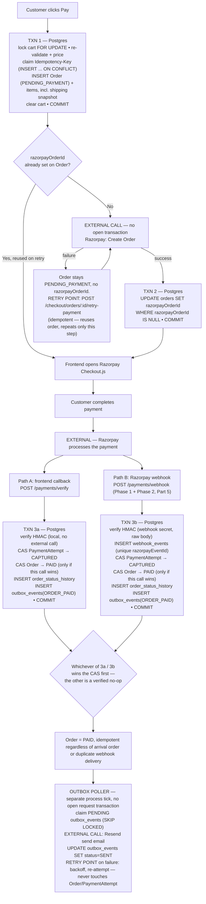

# PrintForge — Final Architecture-Hardening Pass → Blueprint v1.2

Scope discipline restated: no product-scope expansion, no Redis/Kafka/microservices/queues/Kubernetes/new framework. Every mechanism below is built from Postgres tables, unique constraints, row locks, and `@nestjs/schedule` polling — nothing else. This document eliminates the remaining ambiguity in payment consistency, transaction boundaries, notifications, authentication, and production operations that v1.1 still left implicit.

---

# PART 1 — Payment Model, Finalized

**Decision: `payments` is replaced by `payment_attempts`. One order has 1 → N payment attempts. This is Option B, chosen explicitly, not left ambiguous.**

Reasoning: a customer can fail once (declined card) and succeed on retry; the system needs a durable record of every attempt for support/dispute purposes, not just the winning one. "One row per order" (Option A) would force either overwriting history on retry (losing the failed attempt's record) or bolting attempt-tracking on some other way — `Order 1 → N PaymentAttempt` is the honest shape of what actually happens.

**`payment_attempts` schema:**

| Column | Type | Notes |
|---|---|---|
| `id` | uuid, PK | |
| `orderId` | uuid, FK → orders, `RESTRICT` | |
| `razorpayOrderId` | string, not null | Denormalized copy of `orders.razorpayOrderId` at the moment this attempt was initiated. The source of truth for "what Razorpay order to use for the *next* attempt" is always `orders.razorpayOrderId` — this column exists for audit/debugging self-containment of the attempt row, not as a second source of truth. |
| `razorpayPaymentId` | string, nullable | Populated once Razorpay assigns a payment id to this specific attempt (via frontend callback or webhook). Null while `status='INITIATED'`. |
| `amountPaise` | bigint, not null | Stored in **paise** (Razorpay's native integer unit), deliberately distinct from `orders.total` (decimal, major units) — this table exists to mirror Razorpay's own ledger precisely, so it uses Razorpay's own unit, not our display unit. |
| `currency` | char(3), default `'INR'` | |
| `status` | enum: `INITIATED`, `CAPTURED`, `FAILED`, `ABANDONED` | See below. |
| `failureCode` | string, nullable | Razorpay's error code (e.g. `BAD_REQUEST_ERROR`, `GATEWAY_ERROR`). |
| `failureReason` | string, nullable | Human-readable failure detail, for support/admin viewing. |
| `method` | string, nullable | `upi`/`card`/`netbanking`, populated on capture. |
| `rawPayload` | jsonb, nullable | Last known raw Razorpay payload for this attempt, for support debugging. |
| `createdAt` | timestamp | |
| `capturedAt` | timestamp, nullable | Set only when `status` becomes `CAPTURED`. |
| `updatedAt` | timestamp | |

**Status values, deliberately minimal (4, not the 5 the prompt sketched):**
- `INITIATED` — attempt row created when the customer opens the Razorpay Checkout modal for this order's `razorpayOrderId`; no outcome known yet.
- `CAPTURED` — this attempt succeeded (terminal).
- `FAILED` — Razorpay reported this specific attempt failed (terminal).
- `ABANDONED` — customer closed/dismissed the checkout modal without completing (best-effort, frontend-reported, non-critical — optional to implement at all; see Part 16).

**Why not the 5-state `CREATING_RAZORPAY_ORDER → RAZORPAY_ORDER_CREATED → PAYMENT_PENDING → FAILED → CAPTURED` sketch:** `CREATING_RAZORPAY_ORDER`/`RAZORPAY_ORDER_CREATED` describe the Razorpay **order**, which is shared across every attempt against it (created once, reused on retry per v1.1) — modeling it per-attempt would duplicate the same fact on every retry row instead of stating it once, on `Order` (Part 4 below). `PAYMENT_PENDING` isn't independently actionable: we only ever learn a final outcome (captured/failed) via a signed callback or webhook — there's no observable intermediate state we'd do anything different for, so collapsing it into `INITIATED` (which already means "no outcome yet") avoids a distinction without a behavioral difference.

**Unique constraints:**
- `razorpayPaymentId` — globally unique (nullable-unique: Postgres allows multiple `NULL`s, enforces uniqueness only among non-null values). A given Razorpay payment id can never belong to more than one attempt/order.
- **Partial unique index:** `CREATE UNIQUE INDEX ON payment_attempts (orderId) WHERE status = 'CAPTURED'`. This is the DB-level guarantee that **an order can never have more than one captured payment attempt** — enforced by Postgres itself, not just by application logic. Even a pathological race between two "successful" webhook deliveries for two different attempts on the same order cannot produce two `CAPTURED` rows; the second write fails at the constraint level.

**Exactly what causes `PaymentAttempt → CAPTURED`:** a signature-verified event (frontend-callback HMAC check, or webhook HMAC check) reporting success for a specific `razorpayPaymentId`, applied via `UPDATE payment_attempts SET status='CAPTURED', capturedAt=now() WHERE razorpayPaymentId=$id AND status != 'CAPTURED'` (upserting the row first if this is the first record of that payment id — i.e., the webhook arrived before any local `INITIATED` row existed, which is possible and handled, not assumed away).

**Exactly what causes `Order → PAID`:** the transition happens **only** as a same-transaction side effect of the call above, and **only** when that call's conditional update actually affected a row (i.e., this specific call is the one that flipped the attempt to `CAPTURED` for the first time) **and** it is the order's first `CAPTURED` attempt (guaranteed by the partial unique index above). In other words: the first payment attempt belonging to an order to be verified-captured, by whichever path (frontend or webhook) gets there first, transitions the order — full mechanism in Part 2/5.

---

# PART 2 — Transactional Outbox

**Why an outbox is required, precisely:** payment confirmation must durably change business state (Order → PAID) and must also, eventually, cause an email to be sent — but these two things cannot be one atomic operation, because the email provider is an external HTTP API that cannot participate in a Postgres transaction. If we sent the email *inside* the transaction, a slow/failing provider call would either hold the transaction open (blocking the row locks other requests need) or force us to choose between "roll back a successful payment confirmation because the email failed" (unacceptable — explicitly forbidden by this pass) or "catch the email error and ignore it" (which loses the notification silently, with no retry, if the process crashes at the wrong moment). If we sent the email *after* the transaction with no durable record, a crash between "transaction committed" and "email API called" loses the notification permanently with nothing to retry. The outbox pattern resolves this with only Postgres: the fact "this event needs to be published" is written as a normal row in the **same transaction** as the state change, so it's exactly as durable and atomic as the state change itself; a separate, independent process (a poller) later reads unprocessed rows and performs the actual external call, retrying on failure, without ever touching `orders`/`payment_attempts`.

**`outbox_events` schema:**

| Column | Type | Notes |
|---|---|---|
| `id` | uuid, PK | |
| `eventType` | enum: `ORDER_PAID`, `ORDER_STATUS_CHANGED`, `PASSWORD_RESET_REQUESTED` | Exactly the three MVP notification triggers — no scope expansion. |
| `aggregateType` | string: `Order` \| `User` | |
| `aggregateId` | uuid | The `orderId` or `userId` this event is about. |
| `eventKey` | string, **UNIQUE** | Deterministic dedup key — see below. |
| `payload` | jsonb | A denormalized snapshot of everything the eventual email needs (recipient address, order number, status, etc.) captured at insert time, so the processor never re-queries business tables — keeps the processor simple and fully decoupled from the rest of the schema. |
| `status` | enum: `PENDING`, `PROCESSING`, `SENT`, `FAILED` | |
| `attempts` | int, default 0 | |
| `availableAt` | timestamp | When this row is next eligible to be claimed; supports backoff. |
| `lastError` | string, nullable | |
| `processedAt` | timestamp, nullable | Set on `SENT`. |
| `createdAt` | timestamp | |

**`eventKey` values (the dedup mechanism):**
- `ORDER_PAID:{orderId}` — one order confirmation email per order, ever.
- `ORDER_STATUS_CHANGED:{orderId}:{toStatus}` — one status-update email per order per target status (an order can legitimately pass through several statuses, each earning its own email, but the *same* transition can never double-send).
- `PASSWORD_RESET_REQUESTED:{userId}:{resetTokenId}` — one email per distinct reset request (a user requesting multiple resets correctly gets multiple emails, one per token).

**Statuses and retry behavior:**
- `PENDING` — not yet attempted, or waiting for its next backoff window.
- `PROCESSING` — claimed by a poller tick (claim uses `UPDATE outbox_events SET status='PROCESSING' WHERE id=$id AND status='PENDING' AND availableAt <= now() RETURNING *`, with `FOR UPDATE SKIP LOCKED` on the selecting query — cheap insurance against double-claiming if the app ever runs more than one instance, at zero added infrastructure cost).
- On send success → `status='SENT'`, `processedAt=now()`.
- On send failure → `attempts += 1`, `status='PENDING'`, `availableAt = now() + backoff(attempts)` (exponential: ~1min, 5min, 30min, 2h, capped), `lastError` recorded.
- After 5 failed attempts → `status='FAILED'` (terminal) — surfaced via the existing Sentry integration / an admin-visible "failed notifications" list for manual follow-up. Never retried indefinitely, never escalated into touching order/payment state.

**Duplicate prevention, two layers:** primarily, the outbox row is only ever inserted on the branch of a CAS update that actually performed the transition (Part 1/5) — a call that loses the CAS race never reaches the insert at all, so duplicate inserts for the same logical event are not the normal path. The `eventKey` unique constraint (`INSERT ... ON CONFLICT (eventKey) DO NOTHING`) is the backstop for the abnormal path (a bug, or an admin manually re-triggering a transition check).

**Poller:** a `@nestjs/schedule` cron tick (e.g., every 10–30 seconds, same in-process mechanism as v1.1's reconciliation/cleanup jobs — no new infrastructure) claims a small batch of due `PENDING` rows, calls the email provider for each, updates status per the outcome above. This is the entire "worker" — no queue, no broker.

**Applied uniformly to:** order confirmation (`ORDER_PAID`), every order status-change email (`ORDER_STATUS_CHANGED`), and password reset (`PASSWORD_RESET_REQUESTED`) — the same table, the same poller, three event types, no per-feature bespoke notification code.

---

# PART 3 — Database Transaction Boundaries

Implementation-ready, per operation. "Lock" means `SELECT ... FOR UPDATE` unless noted. All external API calls are explicitly called out as occurring **outside** any Postgres transaction — nothing here pretends otherwise.

**A. Register** — TXN: `INSERT users` (normalized-lowercase email; DB unique constraint is the real race guard, a pre-check is only for a friendlier error message) + `INSERT refresh_tokens` (initial session), one transaction, no external calls. Idempotency: natural, via the unique-email constraint — a raced duplicate register attempt gets `409` on whichever insert loses.

**B. Login** — TXN: `SELECT users FOR UPDATE` → verify password (bcrypt, in-process) → success: reset `failedLoginAttempts=0`, `INSERT refresh_tokens` → COMMIT; failure: `failedLoginAttempts += 1` (drives the progressive-delay curve, Part 7 — no hard lockout) → COMMIT. No external calls.

**C. Refresh-token rotation** — TXN: `SELECT refresh_tokens FOR UPDATE` by token hash → if `revokedAt IS NOT NULL` (reuse of an already-rotated-away token): `UPDATE refresh_tokens SET revokedAt=now() WHERE userId=$id AND revokedAt IS NULL` (revoke the whole chain) → COMMIT → return `401`, force full logout. Else: `INSERT` new `refresh_tokens` row, `UPDATE` old row `SET revokedAt=now(), replacedByTokenId=<new id>` → COMMIT → issue new access token (JWT signing, no DB write). Deliberately **not** idempotent — a duplicate concurrent rotation call is exactly the pattern reuse-detection exists to catch; the frontend's single-in-flight-refresh-promise guard (v1.1 Part 11) is what prevents this from happening under normal operation.

**D. Logout** — TXN: `UPDATE refresh_tokens SET revokedAt=now() WHERE id=$id AND revokedAt IS NULL` → COMMIT. Idempotent (revoking an already-revoked row is a harmless no-op). Logout-all: `UPDATE users SET tokenVersion = tokenVersion + 1` + `UPDATE refresh_tokens SET revokedAt=now() WHERE userId=$id AND revokedAt IS NULL`, one transaction. Idempotent.

**E. Password reset** — Request: TXN → `UPDATE users SET passwordResetTokenHash=$h, passwordResetExpiresAt=now()+30min` + `INSERT outbox_events(PASSWORD_RESET_REQUESTED, ...)` → COMMIT. Always returns a generic success response regardless of whether the email matched (skip the write entirely if no match; no enumeration signal either way). No external call inside the transaction — the email send is entirely the outbox poller's job. Confirm: TXN → `SELECT users FOR UPDATE WHERE passwordResetTokenHash=$h AND passwordResetExpiresAt > now()` → if found: update password hash, clear reset-token fields, `tokenVersion += 1`, revoke all `refresh_tokens` → COMMIT. Token is single-use by construction (cleared on success); a replay fails to match.

**F. Cart mutation** — TXN: `SELECT carts FOR UPDATE` → re-validate the target product/variant/customization + `uploadedFileId` ownership (Rule 13) → write the `cart_item`(+customizations) → COMMIT. Totals are computed on read, never stored. No external calls. No idempotency key needed — the row lock serializes concurrent mutations from the same user, and duplicate-line double-clicks are a UX nuisance (frontend should disable the button), not a correctness bug, since price is always recomputed correctly regardless of line count.

**G. Checkout order creation** — TXN 1: `SELECT carts FOR UPDATE` → `INSERT idempotency_keys (key) ON CONFLICT (key) DO NOTHING RETURNING *` (race-safe claim, not a check-then-insert) → if no row returned (key already existed): read the existing `resultOrderId` and return that order, no further writes. If claimed: re-validate every line item, recompute price (canonical algorithm), `INSERT orders (PENDING_PAYMENT)` + `order_items` + `order_item_customizations` (snapshotted, including the shipping-address snapshot, Part 10), `UPDATE idempotency_keys SET resultOrderId=$id`, clear `cart_items` → COMMIT. Razorpay order creation is a **separate, external call, made after this commits** — see H.

**H. Razorpay order association** — external call (Razorpay Create Order API) happens with no open transaction. On success: TXN 2 → `UPDATE orders SET razorpayOrderId=$x WHERE id=$id AND razorpayOrderId IS NULL` → COMMIT. The `WHERE razorpayOrderId IS NULL` guard makes this safe against a concurrent double-association attempt (e.g., two racing retry-payment calls) — only one wins; the loser's freshly-created Razorpay order simply goes unused (harmless orphan, v1.1 Part 9 scenario B). On failure: order remains valid, `razorpayOrderId` stays `NULL`; the dedicated retry-payment endpoint repeats this step.

**I. Payment verification (frontend-callback)** — TXN: verify HMAC signature (local computation, no external call) → `SELECT orders FOR UPDATE WHERE razorpayOrderId=$x` → upsert the `payment_attempts` row for this `razorpayPaymentId`, `SET status='CAPTURED' WHERE status != 'CAPTURED'` (CAS) → if this call won the CAS **and** it's the order's first captured attempt: CAS `orders` `PENDING_PAYMENT → PAID`, `INSERT order_status_history`, `INSERT outbox_events(ORDER_PAID)` → COMMIT. If the attempt was already `CAPTURED` (this call lost the race): COMMIT as a no-op, return the same success response to the customer regardless.

**J. Webhook processing** — two phases, detailed fully in Part 5.

**K. Admin order status transition** — TXN: CAS `UPDATE orders SET status=$to WHERE id=$id AND status IN ($allowed_from)` → rows-affected=1: `INSERT order_status_history` + `INSERT outbox_events(ORDER_STATUS_CHANGED)` → COMMIT. rows-affected=0: re-read; already `$to` → `200` idempotent no-op (no new history/outbox row); otherwise → `409 INVALID_TRANSITION`. No external calls.

**L. Refund recording** — TXN: CAS `UPDATE orders SET status='REFUNDED' WHERE status IN (PAID,CONFIRMED,IN_PRODUCTION,SHIPPED,DELIVERED,CANCELLED)` → `INSERT order_status_history` (admin's refund reference/amount recorded as free text — no dedicated refunds table, since the actual refund is processed manually in the Razorpay dashboard, **not** called by our system) + `INSERT outbox_events(ORDER_STATUS_CHANGED)` → COMMIT. No external call — this operation only *records* a refund that already happened elsewhere.

**M. Coupon (Phase 2 placeholder, not built in MVP)** — reserved design: usage-limit check + `coupon_usages` insert happen **inside** the same locked transaction as order creation (G), never as a separate pre-check-then-write, to avoid the double-redemption race a naive implementation would have. Stated now so Phase 2 doesn't have to rediscover this.

**N. Address update** — TXN: `UPDATE users SET <address fields>` → COMMIT. Single row, no special locking beyond the implicit row-level lock of the `UPDATE` itself. Critically: this transaction **never** touches `orders` — historical shipping snapshots (Part 10) have no live reference to `users`, so this write cannot retroactively affect any past order by construction, not by convention.

---

# PART 4 — Razorpay Order Infrastructure State

**Business state and payment-infrastructure state are kept in two different places, deliberately, and nothing else is added beyond what's needed:**

- **`Order.status`** — pure business state, the unchanged 9-value graph from v1.1 Part 7 (`PENDING_PAYMENT`, `PAID`, `CONFIRMED`, ...). Customer- and admin-facing.
- **`Order.razorpayOrderId`** — not a status, an identifier. Its presence/absence (`NULL` vs. set) fully and unambiguously represents "has a Razorpay order been created for this order yet," because the Razorpay order is created exactly once per `Order` and reused across every retry attempt. A separate `razorpayOrderStatus` enum column would encode the same one-bit fact as a second representation of information already present in the nullability of an existing column — rejected explicitly as unnecessary.
- **`PaymentAttempt.status`** — the payment-infrastructure/technical state (`INITIATED`, `CAPTURED`, `FAILED`, `ABANDONED`, Part 1), which is correctly per-attempt (not per-order), since a single order can accumulate multiple attempts with different technical outcomes while the order itself only cares about the aggregate business fact "has any attempt succeeded."

This is a narrower state model than the prompt's own sketch (which put `CREATING_RAZORPAY_ORDER`/`RAZORPAY_ORDER_CREATED` on `PaymentAttempt`) — deliberately: those two facts belong to the **order's** Razorpay order (shared across attempts), not to any individual attempt, and modeling them per-attempt would restate the same fact redundantly on every retry row instead of once, on `Order`, where it actually lives.

---

# PART 5 — Webhook Processing, Precisely

**Two-phase design** — separates "did we durably record that we received this event" from "did we finish applying its effects," so a mid-processing failure never loses the fact that the event arrived:

```text
HTTP POST /payments/webhook
  → capture raw body (before any body-parsing middleware transforms it — required for signature verification)
  → verify X-Razorpay-Signature against RAZORPAY_WEBHOOK_SECRET over the raw body
  → invalid signature: respond 400 immediately. NO database write (an unauthenticated endpoint must not be
    able to cheaply fill a table with garbage rows); a structured application log line records the attempt
    for security monitoring (not a DB row).
  → valid signature:
       PHASE 1 (fast, always runs): TXN → INSERT webhook_events (razorpayEventId, payload, status='RECEIVED')
         ON CONFLICT (razorpayEventId) DO NOTHING → COMMIT → respond 200 to Razorpay immediately, regardless
         of whether Phase 2 has run yet. This satisfies Razorpay's expectation of a fast acknowledgement and
         makes "we durably know we received this" atomic and independent of "we finished acting on it."
       PHASE 2 (processing, attempted synchronously right after Phase 1 within the same request when possible,
         and independently retried by the SAME poller mechanism as the outbox otherwise):
         TXN → SELECT the webhook_events row FOR UPDATE WHERE status IN ('RECEIVED','PROCESSING_FAILED')
           → upsert payment_attempts, CAS orders, INSERT order_status_history, INSERT outbox_events(ORDER_PAID)
           → UPDATE webhook_events SET status='PROCESSED', processedAt=now() → COMMIT.
         → if this throws (DB hiccup, etc.): row is left at status='PROCESSING_FAILED' (or stays 'RECEIVED'),
           picked up and retried by the poller's next tick — Razorpay's own retry schedule is NOT relied upon
           to recover a Phase 2 failure, since Razorpay already received its 200 in Phase 1.
```

`webhook_events.status` values: `RECEIVED` (Phase 1 done, Phase 2 not yet successful), `PROCESSED` (terminal success), `PROCESSING_FAILED` (Phase 2 threw, will retry), `IGNORED` (a valid, signature-verified event of a type/payload we don't act on — persisted and marked, never treated as an error).

**Precise answers to the specified edge cases — no blanket claims of "impossible":**

- **Same event arrives twice:** Phase 1's `ON CONFLICT DO NOTHING` means only one row ever exists for that `razorpayEventId`; every delivery after the first gets a 200 without re-running Phase 2 against a second row (there isn't one).
- **Processing fails after event persistence:** the `webhook_events` row survives (Phase 1 already committed independently of Phase 2); the poller retries Phase 2 later. This is a real, named recovery path, not an assumption that it "can't happen."
- **DB temporarily fails:** if during Phase 1 — Razorpay gets a 5xx and retries per its own schedule later; nothing was recorded, so that later retry is a genuine first attempt, not a duplicate. If during Phase 2 — identical to "processing fails after persistence," recovered by our own poller independent of Razorpay's retry behavior.
- **Event valid but irrelevant:** persisted with `status='IGNORED'` after a type check, `200` returned, never retried, never treated as an error.
- **Event arrives after frontend verification / frontend arrives after webhook:** whichever arrives second finds the CAS already applied (Part 1), records its own `webhook_events`/verification outcome for audit completeness, performs no further state change and no duplicate side effect.
- **Webhook events arrive out of order:** stated precisely, not overclaimed — our system does not depend on ordered delivery, because every event asserts the same idempotent fact ("this `razorpayPaymentId` is `CAPTURED`") rather than advancing a sequence that assumes strict ordering; asserting that fact twice, in either order, converges to the same end state. The one **genuine, named limitation**: this design has no explicit mechanism for a hypothetical event that should *reverse* an earlier one arriving out of order — this does not occur in Razorpay's normal capture flow (capture is a one-way fact for a given payment id) and MVP refunds are handled manually/out-of-band rather than via a reversing webhook, so the limitation is real but not currently reachable given how refund handling is scoped. This is stated honestly rather than asserting blanket replay-immunity.

---

# PART 6 — Email Delivery, Finalized

**Provider: Resend**, adopted as recommended, no concrete reason found to deviate.

**Sender identity:** `PrintForge <orders@printforge.in>` (single sender identity for all three MVP templates — no per-template sender addresses, unnecessary complexity for this volume).

**Domain verification requirement — a client/ops action item, not purely engineering:** Resend (like any reputable transactional provider) requires DNS-level verification of the sending domain (SPF, DKIM, ideally DMARC) before mail reliably reaches inboxes instead of spam. This needs the client's DNS access and can take hours to propagate/verify — it must be a named pre-launch checklist item (Section 43/Section 12 of this pass's checklist below), not something discovered the week of launch.

**Templates (three, exactly matching the three `outbox_events.eventType` values):** `ORDER_PAID` → order confirmation; `ORDER_STATUS_CHANGED` → one shared template with a status-specific headline/body block (not six separate templates) for `CONFIRMED`/`IN_PRODUCTION`/`SHIPPED`/`DELIVERED`/`CANCELLED`/`REFUNDED`; `PASSWORD_RESET_REQUESTED` → reset-link email. No other triggers exist — no marketing, no abandoned-cart email, explicitly out of scope.

**Retry policy / failure handling / idempotency:** exactly the outbox poller's mechanism from Part 2 — exponential backoff, 5 attempts, terminal `FAILED` surfaced via Sentry/an admin-visible list after exhaustion, `eventKey` uniqueness as the dedup guarantee (with the acknowledged, industry-standard caveat that a crash between "Resend accepted the send" and "we marked the row `SENT`" could in a rare worst case produce one duplicate email — a stated, accepted, low-severity trade-off, not a data-integrity problem, and unavoidable without two-phase commit with a vendor that doesn't offer it).

**Can email failure ever roll back an order? Explicitly: NO — architecturally enforced, not just intended.** The outbox row commits in the same transaction as the state change; sending happens entirely afterward, out-of-process, by a poller whose only writes are to `outbox_events` itself. There is no code path in which email success or failure feeds back into `orders`/`payment_attempts` state. `PAID`, `CONFIRMED`, `SHIPPED`, `DELIVERED`, `REFUNDED` and every other transition are permanent the instant their owning transaction commits, regardless of what happens to the notification afterward.

---

# PART 7 — Authentication Hardening

**Challenge accepted: v1.1's "5 failures = 15-minute hard lockout," keyed purely on the account, is a real account-lockout DoS.** An attacker who knows or guesses a victim's email can lock the legitimate owner out indefinitely by repeatedly submitting wrong passwords — no need to ever guess correctly. This is corrected in v1.2, not carried forward.

**Replacement — three independent, appropriately-scoped controls, no new infrastructure:**

1. **IP-based throttling** (unchanged from v1.1, via `@nestjs/throttler`) — limits request volume per source IP regardless of target account; stops high-volume brute-forcing of many accounts or one account from a single source.
2. **Progressive per-account response delay, not a hard lock.** `users.failedLoginAttempts` (retained) drives an increasing artificial delay before the login handler responds to each subsequent failure for that account: ~0s for attempts 1–3, ~1s for attempt 4, ~4s for attempt 5, ~10s beyond that (capped) — resets to 0 on any successful login. This makes brute-forcing a specific account's password expensive in wall-clock time for an attacker **without ever fully denying the legitimate owner** — they can still succeed on the very next correctly-typed attempt at any time, just after the delay if prior attempts failed. `users.lockedUntil` is **dropped** — there is no longer a hard-block state to represent.
3. **CAPTCHA/bot-friction: explicitly NOT adopted for MVP.** Introducing a CAPTCHA vendor would be a new dependency the client didn't ask for and this pass was explicitly told not to expand scope for; IP throttling + progressive delay is judged sufficient at MVP traffic levels. Named as a Phase 2 option only if real credential-stuffing traffic is actually observed in production (Sentry/log-driven trigger, not a default).

**Reuse detection, unchanged from v1.1, reaffirmed correct:** a replayed, already-revoked refresh token triggers full-chain revocation for that user (Part 3.C) — no changes needed here, this part of the design was already sound.

---

# PART 8 — Cookie + Deployment Topology

**Explicit production topology (concrete, not hand-waved):**

```text
Frontend:  https://www.printforge.in     (Vercel/Netlify, custom domain)
Backend:   https://api.printforge.in     (Railway/Render, custom domain)
```

Both hostnames share the registrable root domain `printforge.in`. **This is the load-bearing requirement, and here is precisely why:** browsers decide whether two hostnames are "same-site" (for `SameSite` cookie policy) using the eTLD+1 (effective top-level domain + one label) — `www.printforge.in` and `api.printforge.in` share the eTLD+1 `printforge.in`, so they are same-site even though they are different origins (different hostnames, which still makes them cross-**origin** for CORS purposes — a separate mechanism, see below). A `SameSite=Strict` cookie set by `api.printforge.in` is therefore still attached by the browser when `www.printforge.in`'s JavaScript calls `api.printforge.in`. If the backend were instead left on its hosting platform's default domain (e.g., `printforge-api.onrender.com`) while the frontend used a custom domain, the two hostnames would **not** share an eTLD+1 — they'd be genuinely cross-site, and `SameSite=Strict` (or even `Lax`) would prevent the browser from ever attaching the cookie to that cross-site request, silently breaking token refresh the first time a customer's access token expired. A shared custom root domain is therefore a hard launch prerequisite, not a nicety — carried into the pre-launch checklist explicitly.

**Cookie configuration:**
- `Domain`: **omitted** (not set to `.printforge.in`) — this scopes the cookie to exactly the host that set it (`api.printforge.in`). Only the backend ever needs to receive this cookie; the frontend never reads it directly (it's `httpOnly`). Setting a broader `Domain` would needlessly widen exposure to every subdomain for no benefit.
- `Path=/api/v1/auth/refresh` — sent only on the refresh call itself.
- `SameSite=Strict` — works precisely because of the shared-eTLD+1 topology above.
- `Secure` — HTTPS only, both hostnames are HTTPS in production.
- `HttpOnly` — inaccessible to frontend JavaScript, mitigating XSS theft of the refresh token specifically (the access token, held in memory, remains the accepted residual XSS exposure, capped at its 15-minute lifetime — unchanged, documented trade-off from v1.1).

**CORS — a genuinely separate mechanism from SameSite, stated explicitly rather than conflated:** `www.printforge.in` calling `api.printforge.in` **is** cross-origin (different hostnames), so standard CORS rules apply regardless of the SameSite/same-site relationship above. Backend config: `origin: 'https://www.printforge.in'` (exact match — never a wildcard, and the CORS spec disallows `*` together with credentialed requests anyway), `credentials: true`. Frontend: every Axios call that needs the cookie sets `withCredentials: true`. **The two mechanisms solve different problems** — CORS governs whether the browser lets frontend JS read the response of a cross-origin request at all; SameSite governs whether the browser attaches the cookie to the request in the first place. Both must be correctly configured; neither substitutes for the other.

---

# PART 9 — File Upload Security, Corrected

**The 10MB size limit does not solve decompression bombs, and this pass does not claim it does.** A decompression bomb's defining trait is a *small* compressed input that expands enormously when decompressed — the danger is what our server *does* with the bytes, not how many bytes arrived. The size limit protects against a completely different threat (plain oversized-file resource exhaustion). Corrected, per-control threat table:

| Control | Threat it actually mitigates |
|---|---|
| Format allowlist: PNG, JPEG, PDF only for customer uploads; **no archive formats accepted, ever** (ZIP/RAR/7z/TAR) | **This is the primary decompression-bomb mitigation** — a ZIP bomb requires being accepted and decompressed as a ZIP; since our system never accepts or parses any archive format at all, the threat class doesn't apply regardless of size limits. |
| Magic-byte/file-signature validation (actual content sniffed, not the declared `Content-Type`) | A file disguised with a misleading extension/MIME type getting past the format allowlist. |
| Hard size limit (10MB), enforced by aborting the upload **stream** once exceeded (never fully buffered first) | Plain oversized-file resource exhaustion (memory/bandwidth/storage abuse from an honestly-large file). **Not** decompression bombs — a bomb's compressed form is small enough to sail under this limit by design. |
| **No server-side parsing or decompression of uploaded content, ever** — raw bytes stream straight through to Cloudinary; we never run our own PDF-parsing, image-decode/re-encode, or archive-extraction code against an untrusted buffer | **This is the actual, correct decompression-bomb and parser-exploit mitigation** — the danger only materializes if *our* infrastructure executes the vulnerable operation (parsing/decompressing) against untrusted input, and it never does. |
| Cloudinary processing (their infrastructure decodes/transforms/rasterizes, not ours) | Shifts the same residual risk to Cloudinary's isolated, hardened media pipeline — a successful exploit against a media parser is contained there, not on our API server. |
| Signed delivery, authenticated Cloudinary resource type | Confidentiality/unauthorized-access risk — a different threat class, listed here for completeness of the control set. |
| Upload rate limits (per-user, per-IP) | Volumetric abuse — many uploads in a short time — independent of whether any individual file is malicious. |
| Orphan cleanup (48h) | Storage-cost creep from uploads never actually used — a cost control, not a security control. |

---

# PART 10 — Order Shipping Snapshot

**Decision: shipping fields live directly on `orders` as denormalized columns — no separate `order_address_snapshots` table.** Reasoning: the relationship is 1:1, fixed permanently at order-creation time, and never updated afterward — a separate table would only be justified by a one-to-many relationship (an order can't have multiple shipping destinations) or a need for independent versioning (there is none; it's write-once). A flat set of columns is simpler to query (every order-detail view needs these fields every time, with no join) and exactly as immutable, since nothing ever writes to them after the initial `INSERT`. This resolves the "ASSUMPTION" v1.0/v1.1 left open — it is now a firm decision.

**Columns added to `orders`, replacing any `shippingAddressId` FK entirely:** `shippingRecipientName`, `shippingPhone`, `shippingAddressLine1`, `shippingAddressLine2` (nullable), `shippingCity`, `shippingState`, `shippingPostalCode`, `shippingCountry` — populated once, inside the same transaction as order creation (Part 3.G), by copying the values from the customer's current (single, per v1.1's MVP simplification) address on `users` at that exact moment. **No FK to `users`/address data for shipping purposes after creation** — an order's shipping fields are fully self-contained. A later address edit (Part 3.N) cannot affect them, provably, because the address-update transaction never writes to `orders` at all — verified by construction, not by convention (Part 15, Scenario L).

---

# PART 11 — Tax / GST Decision, Classified

| Question | Classification |
|---|---|
| Whether GST applies, at what rate(s), and how it must legally be itemized | **Legal/client decision** — Indian tax law applied to this business's specific registration status and product categories; engineering cannot determine or assume this. |
| Whether formal GST-compliant invoices are required *at MVP launch* vs. deferrable | **Business decision**, informed by the legal answer above — the client weighs the launch-timeline trade-off once the legal requirement is known. |
| Whether/how the pricing engine displays a tax line | **Engineering decision, gated on both of the above** — buildable once told the rate/rules, not before. |

**Production launch blocker: conditional, stated precisely, not left as a vague "open item."** If the client is GST-registered and legally required to issue GST-compliant tax invoices for these specific sales — plausible for a registered Indian business selling B2C goods, but not asserted as fact here — this **blocks** a compliant production launch and must be resolved before Section 44/freeze sign-off. If instead the client already has a separate invoicing/accounting process outside this platform (an accountant or separate GST software issuing invoices from exported order data), this does **not** block this platform's launch — the platform simply isn't the system of record for tax compliance, a common and acceptable small-business pattern.

**What engineering can implement today with zero GST-rule knowledge:** the entire pricing engine as designed (v1.1 Part 8) — `total` is tax-inclusive, display-only, with no assumption about how tax is broken out, so it needs no changes regardless of how the GST question resolves. Order data export (CSV/API) for feeding an external accounting/GST process can also be built now.

**What must be confirmed before production launch (not before development starts):** whether the client needs GST-compliant tax invoices generated *by this platform* — which would require GSTIN capture, HSN/SAC codes per product, tax-rate configuration, and a compliant invoice-numbering scheme (real, non-trivial added scope if required) — or whether an existing external process covers it. This is a client-answer-needed item that does not block any other MVP engineering work in the meantime.

---

# PART 12 — Checkout Consistency Model (Final Diagram)



---

# PART 13 — Final Schema Delta (Complete Table List, Post-v1.2)

`payments` is fully replaced by `payment_attempts` (Part 1). The standalone `addresses` table is **removed** — single-address MVP (v1.1 Part 16) folds directly onto `users` as flat columns, since a separate one-row-per-user table added a join for no benefit. `coupons`/`coupon_usages`/`reviews` remain reserved-schema-only, out of the MVP table set, unchanged from v1.1.

| Table | Purpose | Key columns (beyond id/timestamps) | FKs | Unique constraints | Key indexes | Invariants |
|---|---|---|---|---|---|---|
| **users** | Accounts (customer + admin), single MVP address folded in | `email` (normalized lowercase), `passwordHash`, `role`, `tokenVersion`, `failedLoginAttempts`, `passwordResetTokenHash`, `passwordResetExpiresAt`, `addressLine1/2`, `city`, `state`, `postalCode`, `country`, `phone`, `isActive` | — | `email` (on normalized value) | `email` | Never hard-deleted while it owns any order (`orders.userId RESTRICT`); `tokenVersion` only ever increments. |
| **refresh_tokens** | Session/refresh persistence, rotation, revocation | `userId`, `tokenHash`, `expiresAt`, `revokedAt`, `replacedByTokenId` | `userId → users` | — | `userId`, `tokenHash` | A row is never updated after `revokedAt` is set except by the reuse-detection chain-revocation sweep. |
| **categories** | Product categories, one nesting level | `name`, `slug`, `parentCategoryId` | self-FK | `slug` | `parentCategoryId` | — |
| **products** | Sellable products | `categoryId`, `name`, `slug`, `basePrice`, `minQuantity`, `maxQuantity`, `isActive` | `categoryId → categories (RESTRICT)` | `slug` | `categoryId`, `slug` | Never hard-deleted once ordered (`isActive=false` instead). |
| **product_images** | Gallery images | `productId`, `cloudinaryPublicId`, `sortOrder`, `isPrimary` | `productId → products` | — | `productId` | — |
| **product_variants** | Purchasable combinations | `productId`, `label`, `priceDelta`, `isAvailable` | `productId → products` | (`productId`,`label`) | `productId` | — |
| **customization_fields** | Per-product field definitions | `productId`, `label`, `type`, `isRequired`, `surchargeType`, `surchargeAmount`, `constraints` (jsonb, descriptive only) | `productId → products` | — | `productId` | Pricing-critical fields (`surchargeType`/`surchargeAmount`) are typed columns, never buried in JSONB. |
| **uploaded_files** | Cloudinary file metadata, customization uploads | `cloudinaryPublicId`, `uploadedByUserId` (**non-nullable** — login precedes upload, no guest path), `format`, `bytes`, `resourceType`/`deliveryType` | `uploadedByUserId → users` | `cloudinaryPublicId` | `uploadedByUserId` | Ownership (`uploadedByUserId`) verified server-side on every write that references this file's id (Rule 13). Customer-file URLs are computed as short-lived signed URLs on read, never stored as a permanent value. |
| **carts** | One open cart per user | `userId` | `userId → users` | `userId` | — | Always authenticated; no guest cart exists. |
| **cart_items** | Cart line items | `cartId`, `productId`, `variantId`, `quantity` | `cartId → carts`, `productId → products (RESTRICT)`, `variantId → product_variants (RESTRICT)` | — | `cartId` | Duplicate lines for the same product/variant/customization are allowed by design (no merge) — price is always correct regardless. |
| **cart_item_customizations** | Customization values on a cart line | `cartItemId`, `customizationFieldId`, `textValue`, `uploadedFileId` | `cartItemId → cart_items`, `uploadedFileId → uploaded_files` | — | — | `uploadedFileId` ownership re-verified at write time. |
| **orders** | Placed orders | `orderNumber`, `userId`, `status`, `subtotal`, `total`, `currency`, `razorpayOrderId`, `shippingRecipientName/Phone/AddressLine1/2/City/State/PostalCode/Country` | `userId → users (RESTRICT)` | `orderNumber`, `razorpayOrderId` | `userId`, `status`, `razorpayOrderId` | Never hard-deleted. Status changes only via CAS. Shipping fields immutable after creation (Part 10). |
| **order_items** | Snapshotted line items | `orderId`, `productId` (`SET NULL`), `productNameSnapshot`, `unitPriceSnapshot`, `quantity`, `lineTotal` | `orderId → orders`, `productId → products (SET NULL)` | — | `orderId` | Snapshot values never recomputed retroactively. |
| **order_item_customizations** | Snapshotted customization values | `orderItemId`, `fieldLabelSnapshot`, `textValue`, `uploadedFileId` | `orderItemId → order_items`, `uploadedFileId → uploaded_files (RESTRICT)` | — | — | Referenced `uploaded_files` rows never purged by the orphan-cleanup job. |
| **payment_attempts** | Every payment attempt against an order | `orderId`, `razorpayOrderId`, `razorpayPaymentId`, `amountPaise`, `status`, `failureCode`, `failureReason`, `capturedAt` | `orderId → orders (RESTRICT)` | `razorpayPaymentId` (nullable-unique); **partial unique on `orderId` WHERE `status='CAPTURED'`** | `orderId` | An order can never have more than one `CAPTURED` attempt — DB-enforced. **Replaces `payments` from v1.0/v1.1.** |
| **order_status_history** | Append-only status audit trail | `orderId`, `fromStatus`, `toStatus`, `changedByUserId`, `note` | `orderId → orders`, `changedByUserId → users` | — | `orderId` | Append-only; no update/delete in application logic. |
| **webhook_events** | Razorpay webhook idempotency + processing ledger | `razorpayEventId`, `payload`, `status` (`RECEIVED`/`PROCESSED`/`PROCESSING_FAILED`/`IGNORED`) | — | `razorpayEventId` | `status` (for the retry poller's scan) | Only ever inserted after signature verification passes. |
| **idempotency_keys** | Checkout request dedup | `key`, `userId`, `endpoint`, `resultOrderId`, `expiresAt` | `userId → users`, `resultOrderId → orders` | `key` | — | Claimed via `INSERT ... ON CONFLICT DO NOTHING`, never check-then-insert. |
| **outbox_events** | Transactional outbox for all notifications | `eventType`, `aggregateType`, `aggregateId`, `eventKey`, `payload`, `status`, `attempts`, `availableAt` | — | `eventKey` | `status`+`availableAt` (poller scan) | Only inserted in the same transaction as the state change it announces; email sending never feeds back into business-state tables. |
| **app_settings** | Small admin-editable config (flat shipping fee, etc.) | `key`, `value` | — | `key` | — | No shipping-rules engine; a single configurable value. |

**Reserved, not in MVP:** `coupons`, `coupon_usages`, `reviews` — schema-reserved, unchanged from v1.1, not built.

---

# PART 14 — Final API Delta

Beyond v1.1's canonical table (Section 21/Part 10 of the prior review), driven by this pass's changes:

- **`payment_attempts` is never exposed as a standalone REST resource.** No `GET /payment-attempts`, no per-attempt endpoints. It is surfaced only as a nested `paymentAttempts[]` array inside `GET /orders/:id` (customer, own orders only) and `GET /admin/orders/:id` (admin) — read-only, contextual, never independently addressable. Deliberate non-exposure, per the instruction not to expose internal infrastructure unnecessarily.
- **`outbox_events` and `webhook_events` have no API surface at all.** No endpoints, ever — they are internal-only tables processed by the in-process poller and the webhook handler respectively. Not even an admin read endpoint in MVP (an admin can inspect them directly via the database if needed for support; not worth a dedicated UI).
- **`POST /checkout/orders`** — request/response unchanged from v1.1, but the `Idempotency-Key` header is now specified as claimed via the race-safe `INSERT ... ON CONFLICT` pattern (Part 3.G) rather than a check-then-insert — an implementation note, not a contract change.
- **`POST /payments/verify`** — response semantics clarified: a call that loses the CAS race (order/attempt already `CAPTURED`) returns the **same success shape** as the call that won it — the customer-facing outcome is identical regardless of which path (frontend or webhook) actually performed the transition.
- **`POST /auth/login`** — the `423 ACCOUNT_LOCKED` error code from v1.1 is **removed** (hard lockout eliminated, Part 7). Login now only ever returns `401` (bad credentials) or `200`; repeated failures are expressed as added response latency (progressive delay), not a distinct error state.
- **`PATCH /admin/orders/:id/status`** — response semantics clarified: an already-applied transition (admin double-click) returns `200` with the current (unchanged) order state, not an error — distinguished from a genuinely illegal transition, which returns `409 INVALID_TRANSITION`.
- **No new customer-facing endpoints** are introduced by the outbox/webhook/payment-attempt redesign — these are entirely internal mechanisms; the external contract customers and the frontend interact with is unchanged in shape from v1.1's Section 21/23, only firmer in its stated guarantees.

---

# PART 15 — Final Red-Team Check

| # | Scenario | Resulting DB state | HTTP behavior | Duplicate data? | Duplicate side effects? | Recovery mechanism |
|---|---|---|---|---|---|---|
| A | Double-click checkout | 1 `Order` | Both requests return the same `orderId` | No | No | `Idempotency-Key` claimed race-safely (Part 3.G) |
| B | Two tabs checkout simultaneously | 1 `Order` | First request succeeds; second gets `409` (cart already converted) | No | No | Cart row lock (`FOR UPDATE`) serializes; loser refetches/redirects |
| C | Razorpay order API fails | `Order` exists, `PENDING_PAYMENT`, `razorpayOrderId` NULL | Checkout call still returns the created order; a "payment setup pending" state is shown | No | No | `retry-payment` endpoint (idempotent, `WHERE razorpayOrderId IS NULL`) |
| D | Razorpay order succeeds, frontend crashes | `Order` exists, `razorpayOrderId` set, no `PaymentAttempt` rows yet | N/A (client crashed) | No | No | Customer returns later; "resume payment" reopens Checkout.js against the existing `razorpayOrderId` — no new order or Razorpay order created |
| E | Payment succeeds, webhook arrives first | 1 `PaymentAttempt` (CAPTURED), 1 `order_status_history` row, 1 `outbox_events` row | Webhook: 200. Later frontend-verify: 200, same shape, no-op | No | No (one email) | CAS — webhook wins, frontend call finds it already done |
| F | Payment succeeds, frontend callback arrives first | Same end state as E | Frontend-verify: 200. Later webhook: 200, no-op | No | No | CAS — frontend wins, webhook finds it already done |
| G | Webhook arrives 5 times | 1 `webhook_events` row | All 5 deliveries get 200 | No | No | `razorpayEventId` unique constraint, `ON CONFLICT DO NOTHING` |
| H | Webhook processing fails halfway | `webhook_events` row at `RECEIVED`/`PROCESSING_FAILED`; `orders`/`payment_attempts` unchanged (transaction rolled back cleanly) | Razorpay already got 200 in Phase 1 | No | No | Poller retries Phase 2 on next tick; safe to re-run (CAS-based) |
| I | Confirmation email provider down | `outbox_events` row cycles `PENDING` with backoff, eventually `FAILED`; `orders` totally unaffected throughout | N/A (async) | No | No — order state was never at risk | Backoff retries, then Sentry/admin-visible manual follow-up |
| J | Refresh token stolen and replayed | All `refresh_tokens` for that user set `revokedAt` | Attacker's replay: 401. Legitimate user's next call: 401 (forced re-login) | No | No | Reuse-detection chain revocation (Part 3.C); named residual timing nuance: detection fires on whichever party's token turns out to be already-rotated-away-from, within one rotation cycle of either party using it |
| K | Attacker submits another user's `uploadedFileId` | Unchanged — write rejected | `403`/`404` (no existence disclosure) | No | No | Ownership check (Rule 13) at every write |
| L | Customer changes address after ordering | `users` address updated; existing `Order`'s shipping snapshot columns untouched | 200 | No | No | No shared write path between address-update (N) and any `orders` row — verified by construction (Part 10) |
| M | Admin double-clicks "Confirm" | 1 `order_status_history` row, 1 `outbox_events` row | Both requests: 200, same resulting state | No | No | CAS — second call is an idempotent no-op |
| N | Admin attempts `PAID → SHIPPED` | Unchanged | `409 INVALID_TRANSITION` | No | No | CAS `WHERE status IN (allowed_from)` — `PAID` isn't in `SHIPPED`'s allowed-from set |
| O | Customer retries payment after a failed attempt | 2 `PaymentAttempt` rows (1 `FAILED`, 1 `CAPTURED`), 1 `Order` | New attempt's checkout reuses existing `razorpayOrderId`; success → 200 | No | No | Partial unique index (`orderId` WHERE `CAPTURED`) is the DB-level backstop even under a pathological near-simultaneous double-success race |

---

# PART 16 — Final Freeze Verdict

### 🔴 MUST RESOLVE BEFORE FREEZE
None remaining. Every item this pass was asked to close — payment-attempt model, transaction boundaries, outbox, webhook idempotency, refresh-token lifecycle, file ownership, checkout idempotency, CAS-safe state transitions, immutable shipping snapshot, cookie topology, email/business-state isolation, GST dependency classification — is now concretely specified above, with named mechanisms, not intentions.

### 🟡 MUST RESOLVE BEFORE IMPLEMENTING THAT MODULE (parameter-level/confirmation-level, not architecture-level)
- Exact progressive-login-delay curve constants (Part 7) — pick specific numbers when building `auth`.
- Exact outbox/webhook-retry backoff constants (Part 2/5) — pick specific numbers when building the poller.
- Client's sending domain confirmed and SPF/DKIM/DMARC configured (Part 6/8) before the `notifications` module goes live — a DNS/ops task with lead time, not a design gap.
- Client confirmation on GST invoice generation scope (Part 11) before finalizing the admin order-export feature surface — does not block starting any other module.

### 🟢 SAFE TO DEFER
- CAPTCHA/bot-friction beyond IP throttling + progressive delay (Part 7) — add only if real abuse is observed in production.
- Admin 2FA — reasonable Phase 2 hardening once there's more than one admin operator; not requested, not added.
- `PaymentAttempt.ABANDONED` tracking (Part 1) — nice-to-have analytics on dropped checkouts, not correctness-critical.
- Coupon Phase 2 implementation itself (placeholder transaction design only, Part 3.M).
- Staging environment (carried from v1.1, still a client-budget conversation, not an engineering blocker).

# FINAL VERDICT

**A — READY FOR FREEZE.**

Every condition this pass was told would be required for an "A" is now met with a concrete, named mechanism rather than a stated intention: payment attempts are unambiguous (`payment_attempts`, Part 1, with a DB-enforced one-capture-per-order invariant); transaction boundaries are explicit for all fourteen operations (Part 3); the outbox is fully defined and proven to isolate notification failure from business state (Part 2/6/15-I); webhook processing is idempotent and its remaining honest limitation is named rather than hidden (Part 5); the refresh-token lifecycle is complete and its lockout-DoS flaw is fixed, not just carried forward (Part 7); file ownership is enforced at every write (Rule 13, reaffirmed); checkout idempotency is race-safe end-to-end, including the claim step itself (Part 3.G, Part 15 A/B); order-state transitions are CAS-safe with idempotent-on-repeat semantics proven against admin double-clicks (Part 15 M/N); historical order addresses are immutable by construction, not convention (Part 10, Part 15 L); the production cookie/CORS topology is fully specified with the reasoning that makes it correct, not just asserted (Part 8); email failure is architecturally incapable of corrupting business state (Part 2/6); and the tax/GST dependency is classified precisely into engineering/business/legal buckets with an explicit, conditional launch-blocker determination rather than left as an undifferentiated "open item" (Part 11).

The remaining 🟡 items are implementation-start prerequisites (pick specific constants, confirm DNS access, get one client answer) — none of them require further architectural design work, and none of them block Phase 0/1 from beginning. Section 44's freeze checklist can be signed off on the basis of this document plus v1.1's unchanged sections.
