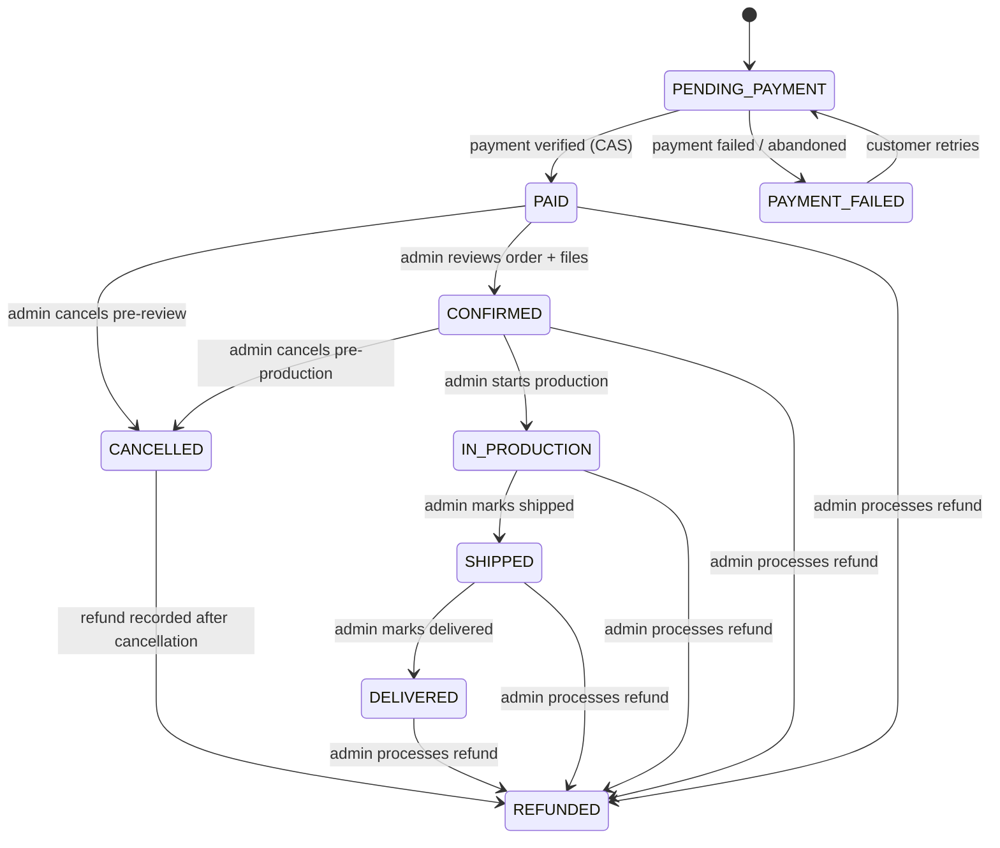

# PrintForge — Pre-Freeze Architecture Review → Blueprint v1.1

Role for this document: red-team reviewer of the v1.0 blueprint just produced, not its defender. Nothing in v1.0 is treated as correct by default. No implementation code below. Stack remains frozen (React/Vite/TS frontend, NestJS/Prisma/PostgreSQL backend, Razorpay, Cloudinary) — one new addition is proposed (a transactional email vendor) and justified explicitly, not silently assumed.

---

# PART 1 — Architecture Red-Team Findings

| ID | Severity | Section | Problem | Why it matters | Recommendation | Blocks freeze? |
|---|---|---|---|---|---|---|
| F-01 | CRITICAL | 14 | Order status transitions ("mark PAID", etc.) were specified as "idempotent" with no actual mechanism defined. Two racing writers (frontend-verify call and webhook) can both read `status=PENDING_PAYMENT`, both decide to transition, both send a confirmation email. | Duplicate emails are the visible symptom; the same missing mechanism is what would let a race corrupt state under real concurrency. | Every status transition is a single conditional `UPDATE ... SET status=$to WHERE id=$id AND status=$from` (compare-and-swap). Rows-affected=1 → this call performed the transition, run side effects (email, history row). Rows-affected=0 → re-read current status: if it already equals `$to`, return success no-op (no side effects); otherwise it's a real conflict, return 409. | YES |
| F-02 | CRITICAL | 12 | Guest cart + guest-session JWT + guest uploads + login-merge is four new subsystems (client-side cart engine, scoped auth token, ownership-transfer-on-merge, dual cart code paths) to support letting an unauthenticated visitor upload a file before creating an account. | This is the single most complex subsystem in v1.0 relative to the business value it buys, and it's the one place a 2-person team is most likely to ship a subtle ownership bug (see F-04). It duplicates cart logic on both ends of the stack. | Eliminate guest cart, guest-session tokens, and guest uploads entirely. Move the login wall from "checkout" to "add to cart" (browsing/search/product-detail stays fully public; the moment a customer wants to configure and add an item, they register/login). Cart becomes a single, always-authenticated, always-server-side concept — one code path, not two. See Part 4 and the Section 12 rewrite. | YES |
| F-03 | HIGH | 11, 24 | Customer-uploaded design files were specified as stored at a public, permanently-accessible Cloudinary URL, "acceptable" because the URL is unguessable. | For a paid production client whose customers upload proprietary artwork/logos, "security by unguessable URL" is not a defensible control — URLs leak via referrer headers, browser history, screenshots, shared links, and server logs. This was flagged as a Scope Warning and deferred in v1.0; it should not have been deferred. | Customer-uploaded customization files use Cloudinary's authenticated delivery type with short-lived signed URLs generated server-side per request. Product images (admin-curated, meant to be public) are unaffected. See Part 5. | YES |
| F-04 | CRITICAL | 11 | v1.0 said the backend "checks against Cloudinary asset metadata" before accepting an `uploadedFileId` reference — it never said the backend checks that the file belongs to the requesting user/guest-session. | Without an ownership check, any authenticated (or, worse, any guest-session-holding) client can submit another customer's `uploadedFileId` and have it attached to their own cart/order — a horizontal data-exposure bug, and it would let a stranger see or reuse another customer's uploaded artwork. | Every write that attaches an `uploadedFileId` to a cart item (and again at order creation) must verify `uploadedFiles.uploadedByUserId === requestingUserId` server-side, unconditionally. This is the same "never trust client-supplied identity linkage" principle Section 26 already applies to price — it was written for price but not extended to file references. Fixed in Part 4/Section 26 rewrite. | YES |
| F-05 | HIGH | 25 | No refresh-token persistence, no revocation mechanism, no reuse detection. A stolen refresh token is valid for its full 7–30 day lifetime with no way to cut it off short of a global secret rotation (which logs out every user). | This fails "genuinely production-safe" for session security — no logout-everywhere, no response to detected token theft, no way to force-invalidate a compromised or just-deactivated account's sessions. | Add a `refresh_tokens` table (rotation chain, revocation, reuse detection) and a `users.tokenVersion` counter (checked as a JWT claim, bumped on password change / role change / deactivation / "log out everywhere" to instantly invalidate all outstanding access **and** refresh tokens). See Part 3 and Section 16/25 rewrites. | YES |
| F-06 | HIGH | 13, 14 | "The backend is the sole price authority" was stated as a rule, but the actual sequence for creating an Order + Razorpay Order was never made atomic-safe against: DB commit succeeding while the Razorpay API call fails (or vice versa), concurrent double-submission of checkout, or a stale cart being re-read mid-transaction. | Razorpay's API cannot participate in a Postgres transaction — pretending otherwise (or just not addressing it) is exactly the kind of gap that produces "paid payment, no matching order" or duplicate orders in production. | Two-phase, non-transactional-safe design: create the local `Order` (transactional, cart re-validated and locked within the same transaction) first; create the Razorpay order as a separate, retryable second step; support a dedicated retry-payment path that reuses the existing order instead of creating a new one. Full design in Part 2/9. | YES |
| F-07 | HIGH | 15 | The order state machine didn't allow `REFUNDED` from `IN_PRODUCTION`/`SHIPPED`/`DELIVERED`, and didn't allow `CANCELLED` directly from `PAID`. Real print businesses refund after delivery (quality complaints) and cancel immediately after payment (before any review step). | The state machine as specified would make the admin panel unable to represent two routine, foreseeable business situations — the kind of gap that gets discovered mid-implementation and forces a rushed migration. | Widen `REFUNDED` to be reachable from any state `PAID` or later; add `PAID → CANCELLED`; add `CANCELLED → REFUNDED` (cancel now, refund recorded once processed). Full table in Part 7. | YES |
| F-08 | HIGH | 16 | `customization_fields.constraints` (JSONB) was the only place a per-field price surcharge could live, but "customization surcharge" was referenced in the pricing formula without ever being defined as a field, a type, or a computation rule. | Pricing is the one area of this system where ambiguity is a business-integrity bug, not a UX rough edge. An undefined surcharge model means Atharva would have to invent pricing semantics mid-implementation, unreviewed. | Add typed columns (`surchargeType`, `surchargeAmount`) to `customization_fields`, out of the untyped JSONB, and define a canonical, order-of-operations-explicit pricing algorithm. See Part 8. | YES |
| F-09 | MEDIUM | 12 | Coupon admin CRUD was placed in MVP while customer-facing coupon *application* was deferred to Phase 2 — meaning an admin could create coupons that no customer could ever use. | Half-shipping a feature so it produces zero customer value is wasted engineering time on a budget-constrained project — worse than shipping neither half. | Remove coupons entirely from MVP (both CRUD and application); reserve schema, defer both halves together to Phase 2. See Part 16. | NO (scope correction, not a defect) |
| F-10 | MEDIUM | 21 | No `/health` endpoint; no retry-payment endpoint (Section 13 describes retry conceptually, Section 21's table never lists it); `GET /cart` had ambiguous "auth or omitted" behavior that doesn't survive the guest-cart removal in F-02. | Missing endpoints get invented ad hoc mid-implementation by whichever developer hits the gap first, without cross-review — exactly what this document exists to prevent. | Canonical, corrected endpoint table in Part 10. | YES |
| F-11 | MEDIUM | 25 | No brute-force protection beyond generic IP-based rate limiting; no account lockout; no password-reset flow in MVP despite it being an inevitable support burden from day one. | A customer-facing auth system with no self-service password reset means every forgotten password becomes a manual admin support ticket — an operational cost the client will feel immediately at real usage, not a Phase 2 nicety. | Promote password reset (email-based) to MVP; add per-account failed-login lockout alongside IP-based throttling. See Part 3/16. | YES (password reset only) |
| F-12 | MEDIUM | 24 | File-upload validation was MIME-type-based only (client-declared `Content-Type`), with no magic-byte verification, and unrestricted SVG upload for customer files (stored-XSS risk if a raw SVG with embedded `<script>` is ever opened directly from its URL). | A spoofed `Content-Type` header defeats MIME-only validation trivially; SVG-borne script execution is a known, common attack against exactly this kind of "let customers upload design files" feature. | Server-side file-signature (magic-byte) validation regardless of declared MIME type; drop `image/svg+xml` from the customer-facing allowed formats (keep PNG/JPEG/PDF only for MVP). See Part 5. | YES |
| F-13 | MEDIUM | 8, 16 | `users.email` uniqueness relies on a plain unique constraint, which is case-sensitive in Postgres by default — `User@x.com` and `user@x.com` could both register as distinct accounts. | A real, common bug class (duplicate accounts, login confusion, and a customer "can't" reset a password because they registered with different casing than they're typing). | Normalize email to lowercase at the service layer before every write/lookup; unique index on the normalized value. See Part 6. | YES |
| F-14 | LOW | 16 | No `product.maxQuantity`; only a minimum was defined. | An unbounded quantity field is a nuisance/abuse vector (accidental fat-finger orders, or a deliberately huge order that breaks downstream production planning) with a trivial fix. | Add `maxQuantity` (nullable, admin-configurable, sensible default), validated identically to `minQuantity`. See Part 8. | NO |
| F-15 | LOW | 30/31 | SEO strategy (meta tags, Open Graph, structured data) was specified as if it would simply work on a pure client-rendered SPA, without addressing that most non-Google crawlers (and every link-preview bot — WhatsApp, Facebook, Twitter/X) do not execute JavaScript and will not see client-injected `<title>`/OG tags. | For a custom-print business where product links are plausibly shared over WhatsApp, a broken link preview is a real, visible, recurring embarrassment — this isn't a hypothetical edge case for this specific business. | Server-inject `<title>`/OG meta tags into the initial HTML response per product/category (lightweight shell-templating at the NestJS static-serving layer), without adopting Next.js/full SSR. See Part 12. | NO (real, but not implementation-blocking — can land early Phase 2 if not done in MVP) |
| F-16 | LOW | 35 | No error tracking/monitoring, no health check, no restore-from-backup drill was specified anywhere. | "Production-ready" without any visibility into production errors means the first the team hears about a bug is a customer complaint. | Add Sentry (or equivalent) for both apps, a `/health` endpoint, and a one-time pre-launch backup-restore drill. See Part 13/17. | NO (cheap, should still be done pre-launch) |
| F-17 | LOW | 34 | Phase 6 (Razorpay) and Phase 9 (Admin) were both marked "both in parallel," but the actual task sizes are lopsided — Harshad's Razorpay Checkout.js integration is small; Atharva's webhook/idempotency/verification work is large. Admin UI is arguably Harshad's single biggest phase, stacked at the end after the entire storefront. | A roadmap that doesn't account for asymmetric task size produces exactly the kind of blocking the two-developer ownership model was supposed to avoid. | Resequenced roadmap in Part 15. | NO |
| F-18 | LOW | 16 | No audit trail for admin catalog edits (only order status changes are logged via `order_status_history`). | Not launch-blocking at this order volume/team size, but worth stating as a deliberate deferral rather than an oversight. | Explicitly deferred to Phase 2, reasoning recorded in Part 6/17. | NO |

---

# PART 2 — Payment System Deep Audit

**Reconstructed lifecycle (corrected):**

```text
1. Customer clicks "Pay" on /checkout
2. Frontend sends POST /checkout/orders  { shippingAddressId }
                                          header: Idempotency-Key: <uuid, generated once per checkout page load>
3. Backend, in ONE DB transaction:
   a. SELECT the user's cart FOR UPDATE (locks it against concurrent checkout attempts)
   b. Re-validate every line item (product active, variant available, qty within min/max)
   c. Re-validate/recompute price per the canonical algorithm (Part 8) — never trust any cached total
   d. Check idempotency_keys for this key: if already present, return the previously-created order (no-op)
   e. Create Order (status=PENDING_PAYMENT) + OrderItems + OrderItemCustomizations, snapshotted
   f. Record the idempotency key → orderId
   g. Mark the cart "converted" (clear cart_items) so a concurrent second request sees an empty cart, not the same one
   h. COMMIT
4. Backend calls Razorpay's Create Order API (OUTSIDE the DB transaction — this is a network call to a
   third party and cannot be part of a Postgres transaction)
   - success → UPDATE orders SET razorpayOrderId = $x WHERE id = $orderId (separate, small write)
   - failure → Order already exists and is valid (PENDING_PAYMENT, no razorpayOrderId yet); return an error
     to the frontend; a dedicated POST /checkout/orders/:id/retry-payment endpoint re-attempts step 4
     against the SAME order — never creates a second Order row.
5. Backend returns { orderId, orderNumber, razorpay: { orderId, amount, currency, keyId } }
6. Frontend opens Razorpay Checkout.js with that data
7. Customer completes payment
8. TWO independent, racing confirmation paths — both converge on the CAS pattern from F-01:
   8a. Razorpay's browser callback → frontend → POST /payments/verify { razorpayOrderId, paymentId, signature }
       → backend verifies HMAC signature → CAS-transitions PENDING_PAYMENT → PAID → side effects (email, history)
   8b. Razorpay → backend webhook → verify HMAC (raw body, X-Razorpay-Signature, webhook secret)
       → check webhook_events.razorpayEventId unique constraint (idempotency) → CAS-transitions the same order
       → side effects only fire if this call actually performed the transition
9. Whichever of 8a/8b arrives first performs the transition and the side effects; the other is a verified no-op.
```

**Can the current (corrected) architecture produce:**

| Failure mode | Possible? | Why / mitigation |
|---|---|---|
| Paid payment + unpaid order | No, transiently possible but self-healing | If the frontend tab closes before 8a, 8b (webhook) still arrives independently and transitions the order — this is precisely what the webhook path exists for. The automated reconciliation job (Part 13) catches the residual case where a webhook delivery itself fails after Razorpay retries are exhausted. |
| Unpaid payment + PAID order | No | The order can only reach `PAID` through a signature-verified call (8a or 8b) — there is no code path that sets `PAID` from an unverified source. |
| Duplicate orders | No | Cart is row-locked (`FOR UPDATE`) during checkout, cleared on order creation, and the `Idempotency-Key` header collapses retried identical requests to the same order. |
| Duplicate payment records | No | One `Payment` row per Razorpay `payment_id`, unique-constrained; retries create new attempt rows (correctly, since they're genuinely new attempts) but only one can ever be `CAPTURED` against a given order in the normal flow. |
| Duplicate confirmation emails | No | Emails fire only inside the branch of the CAS update that actually changed rows (rows-affected=1), never on the no-op branch. |
| Incorrect order totals | No | Total is computed and snapshotted once, inside the same transaction as order creation, from server-side data only — never recomputed from anything client-supplied. |
| Payment retry against the wrong Razorpay order | No | Retry reuses `order.razorpayOrderId` if already set; only creates a new Razorpay order if none exists yet for this (still-`PENDING_PAYMENT`) order. |
| Webhook race conditions | No | CAS pattern + `webhook_events` uniqueness make both order of arrival and duplicate delivery safe. |
| Webhook replay vulnerabilities | No | Signature verification (per-request) + `webhook_events.razorpayEventId` uniqueness (per-event) together prevent both forged and replayed webhook processing. |
| Stale payment status | Mitigated, not impossible | If Razorpay never sends a webhook AND the browser never returns (rare, e.g., customer's network dies mid-redirect and Razorpay's webhook delivery also fails all retries) an order can sit `PENDING_PAYMENT` indefinitely despite money having moved. This is exactly what the promoted-to-MVP reconciliation cron (Part 13) exists to catch — it is a real residual risk inherent to any webhook-based system, mitigated, not eliminated by design, and the reconciliation job is the explicit safety net rather than a silently-assumed non-issue. |
| Inconsistent Payment vs Order state | No | `Payment.status` and `Order.status` are independent fields updated in the same transaction on every transition; nothing updates one without the other. |

**Refund/reconciliation:** unchanged in spirit from v1.0 (manual Razorpay-dashboard refund, admin marks the order `REFUNDED`/`CANCELLED→REFUNDED` in-app), but reconciliation itself is upgraded from "manual button" to a scheduled job — see Part 13.

---

# PART 3 — Authentication & Session Security Audit

| Area | v1.0 gap | v1.1 fix |
|---|---|---|
| Refresh token persistence | None — stateless, unrevocable | New `refresh_tokens` table: `id`, `userId` (FK), `tokenHash` (never store the raw token), `createdAt`, `expiresAt`, `revokedAt` (nullable), `replacedByTokenId` (nullable, self-FK) |
| Rotation | Implied, not specified | Every refresh call issues a new token, marks the old row `revokedAt=now()`, `replacedByTokenId=<new row>`. The old token is now provably single-use. |
| Reuse detection | None | If a refresh token is presented whose row already has `revokedAt` set, that's proof of theft/replay (the legitimate client already rotated past it) — revoke the **entire chain** for that `userId` (all rows), force logout, optionally flag for admin review. |
| Logout | Unspecified | `POST /auth/logout` revokes the presented refresh token's row only. `POST /auth/logout-all` (new) bumps `users.tokenVersion`, invalidating every outstanding access token (on next validation) and refresh token (on next use) at once. |
| Instant revocation of a live access token | Not possible (stateless JWT, 15 min exposure window accepted implicitly, never stated) | `users.tokenVersion` (int) is embedded as a JWT claim; the auth guard rejects any token whose `tokenVersion` claim doesn't match the current DB value. Password change, role change, account deactivation, and "log out everywhere" all bump it — closing the "stolen access token" and "just-deactivated account" gaps in one cheap mechanism (no new infra, one column, one guard check). |
| Cookie configuration | `httpOnly, Secure, SameSite=Strict` — correct, but scope unspecified | Add `Path=/api/v1/auth/refresh` (cookie is not sent on unrelated requests) and `Max-Age` = refresh token lifetime. **Deployment note carried into Section 35/36:** `SameSite=Strict` requires the frontend and backend to share a registrable root domain (e.g., `app.printforge.com` + `api.printforge.com`); if they end up on unrelated default platform domains (e.g., a `*.vercel.app` and a `*.onrender.com`), the cookie will not be sent cross-site and refresh will silently fail — a custom domain covering both is a launch requirement, not a nicety. |
| CORS/CSRF | Reasonable as specified | Confirmed: `SameSite=Strict` blocks the cookie on cross-site requests (mitigating CSRF against the refresh endpoint); all other state-changing endpoints require the `Authorization` header, which a cross-site form/script cannot forge. No separate CSRF token scheme needed. |
| Brute-force protection | IP-based throttling only | Add per-account lockout: `users.failedLoginAttempts` (int), `users.lockedUntil` (nullable timestamp) — increment on failed login, reset on success, lock for a short window (e.g., 15 min) after 5 consecutive failures. Works alongside, not instead of, IP-based throttling (defends against distributed attempts). |
| Login enumeration | Login already generic; registration inherently reveals email-exists (normal, accepted) | Confirmed correct as-is: login and password-reset responses never reveal whether an email is registered; registration's "email already in use" is normal, unavoidable UX and an accepted trade-off. |
| Password policy | Unspecified | Minimum 8 characters, rejected if purely numeric or found on a small common-password blocklist (a static list is enough — no external API call). bcrypt cost factor 12 (unchanged from v1.0). |
| Password reset | Phase 2 in v1.0 | **Promoted to MVP.** `POST /auth/password-reset/request` (always returns success regardless of whether the email exists, to avoid enumeration) → emails a signed, short-lived (30 min), single-use reset token → `POST /auth/password-reset/confirm { token, newPassword }` → on success, bumps `tokenVersion` (invalidates any session an attacker may have already established). Requires the transactional email vendor addition (Part 17). |
| Guest-session tokens | Eliminated per Part 4 | N/A — removed from the architecture entirely. |

**Verdict:** v1.0's auth design was directionally reasonable (JWT + short-lived access + httpOnly refresh cookie) but was not production-safe as specified — it had no revocation story at all. With the `refresh_tokens` table, `tokenVersion` claim, and lockout added, it is.

---

# PART 4 — Guest Session + Cart + Upload Audit

Answering the 13 questions directly, against v1.0's design:

1. **Can a guest upload a file and later safely associate it with the correct customer?** — Achievable (transfer files tagged with a `guestSessionId` to the new `userId` on login), but only "safely" if the ownership-check gap (F-04) is also fixed — and once that's fixed, most of the complexity below still remains.
2. **Can another person steal the guest-session token?** — Yes, same as any client-held bearer token (XSS-class risk); blast radius is small (uploads + an anonymous, pre-purchase cart) but non-zero.
3. **Can uploaded files be attached to another user's cart?** — Yes, as built (F-04) — this is the most serious individual finding in this document.
4. **What happens if the guest session expires?** — New uploads are blocked until a fresh guest session is issued; previously uploaded files remain valid for merge since ownership is tracked on the file row itself, not the currently-active token — no data loss, just an awkward mid-flow re-auth.
5. **What happens when login happens on another device?** — The guest cart is local to one browser; it does not appear on a different device at login. This isn't a bug, but it does mean the feature only helps the single-session case, which weakens its value relative to its cost.
6. **What happens if the user abandons the cart?** — Guest: nothing persists except orphaned uploads (cleanup needed, see Part 5). Authenticated: cart rows persist indefinitely, harmless at this scale.
7. **What happens if the uploaded file already exists (re-upload)?** — No dedup; a new asset + row every time. Acceptable, not worth solving for MVP.
8. **Can a malicious user submit someone else's `uploadedFileId`?** — Yes (same root cause as #3), until the ownership check is added everywhere a file reference is accepted.
9. **Can a guest upload unlimited files?** — Yes as specified — no rate limit was defined on `/uploads`.
10. **Can guest uploads be abused for storage exhaustion?** — Yes, compounding #9 — an anonymous, unauthenticated-in-practice endpoint with no volume cap is a cheap target.
11. **Can orphaned files be safely cleaned?** — Yes in principle, but v1.0 deferred the cleanup job to Phase 2 "housekeeping" while simultaneously leaving the upload endpoint unrated-limited — i.e., it deferred the mitigation for a risk it was actively creating.
12. **Is the guest-session JWT actually necessary?** — Only if customization/upload must be possible before account creation. That's a real UX preference, but not a hard requirement — nothing about the business model *requires* pre-login customization.
13. **Is there a simpler architecture for a two-person MVP?** — **Yes, decisively.** Move the login wall from "checkout" to "add to cart." Browsing, search, and full product detail (including *previewing* what customization options exist) remain fully public. The moment a customer wants to actually configure and add an item — which is also the moment file upload becomes relevant — they are prompted to register/login. This single change deletes: the guest-session token type and its guard, the guest-upload ownership-transfer flow, the cart-merge endpoint and its partial-failure handling, and an entire parallel client-side cart implementation in the frontend. Cart becomes one thing: always server-side, always owned by an authenticated user, always the same code path on both ends of the stack.

**Decision (adopted in v1.1):** eliminate guest cart, guest-session tokens, and guest uploads. Login/registration is required starting at "Add to Cart," not at "Checkout." This is a deliberate, stated trade-off — a small amount of top-of-funnel friction (an account is created one step earlier than v1.0 intended) in exchange for removing the single most audit-flagged subsystem in the entire blueprint, for a team of exactly two developers. If the client has strong evidence this friction meaningfully hurts conversion after launch, reintroducing a scoped guest-cart (not guest-upload) flow is a contained Phase 2 addition — but it is not the safer default for a first production launch.

---

# PART 5 — File Upload Security Audit

| Control | v1.0 | v1.1 |
|---|---|---|
| MIME validation | Client-declared `Content-Type`, trusted | Declared type is a hint only. Server-side **magic-byte/file-signature sniffing** (e.g., a signature-detection library reading the first bytes of the actual buffer) determines the real file type; mismatch between declared and actual type is a hard rejection. |
| Allowed types (customer uploads) | PNG, JPEG, SVG, PDF | PNG, JPEG, PDF only. **SVG removed** from customer-facing allowed formats — raw SVG can embed `<script>`/event-handler attributes that execute if the file is ever opened directly in a browser tab (a real, well-known stored-XSS vector for "upload your design" features), and sanitizing SVG safely is real engineering effort not justified by the format's marginal value here (PNG/PDF cover the same practical use cases). Admin-side product imagery may still use SVG (admin is a trusted uploader). |
| Size limit | 10 MB, enforced (timing unspecified) | 10 MB, enforced by aborting the upload **stream** once the limit is crossed — never buffer the full file first, which is what actually protects against a decompression-bomb-style attack (the bomb never fully arrives). |
| PDF handling | Streamed to Cloudinary | Unchanged, reinforced explicitly: the backend never runs its own PDF parsing/rendering library against an uploaded buffer (that's where PDF exploits typically land) — Cloudinary's own infrastructure handles PDF processing, isolated from our servers. |
| Filename handling | Unspecified | Cloudinary `public_id` is always server-generated (UUID-based); the customer's original filename is stored only as a display label, never used to construct any storage path or identifier. |
| Metadata leakage | Unspecified | Cloudinary's metadata-stripping option enabled on upload for customer images (removes embedded EXIF/GPS data from photos customers upload). |
| Public/private delivery | Public, "unguessable URL" (flagged in F-03) | Customer-uploaded customization files: Cloudinary **authenticated delivery type**, **server-generated signed URLs**, short expiry (1 hour), issued only to the file's owner or an admin via the normal `orders`/`cart` API responses — never a durable public link. Product images: unchanged, public (they're meant to be). |
| Upload quotas | None | Rate-limited per user (`@nestjs/throttler`, e.g., N uploads/hour) and count-capped per cart/order lifecycle (e.g., a sane per-line-item file count) — bounds worst-case storage abuse without new infrastructure. |
| Orphan cleanup | Deferred to Phase 2 | **Promoted to MVP** — a scheduled job (`@nestjs/schedule`, same mechanism as payment reconciliation, no new infra) deletes `uploaded_files` rows (and their Cloudinary assets) older than 48 hours with no `cart_item_customization` or `order_item_customization` reference. |

---

# PART 6 — Database Deep Review

Changes to Section 16, table by table (only tables with changes are listed; everything else from v1.0 is confirmed correct as specified):

- **users** — add `tokenVersion` (int, default 0), `failedLoginAttempts` (int, default 0), `lockedUntil` (timestamp, nullable). Email normalized to lowercase at the service layer before every write/read; unique index on the normalized column (closes F-13).
- **addresses** — add a partial unique index on `(userId) WHERE isDefault`, so "only one default address per user" is DB-enforced, not just application-convention. **Address book scope reduced** per Part 16's MVP cut: MVP ships one editable address on the profile, not a multi-address CRUD book (schema still supports multiple rows — the cut is a UI/API-surface reduction, not a schema change).
- **product_variants** — unchanged.
- **customization_fields** — add `surchargeType` (enum: `NONE`\|`FLAT`\|`PER_CHARACTER`), `surchargeAmount` (decimal(10,2), nullable) as first-class typed columns, out of the `constraints` JSONB (which remains for genuinely descriptive/validation-only metadata: `maxLength`, `allowedFormats`, `maxFileSizeMb`, `options[]`). Pricing-critical values do not live in an untyped JSON blob.
- **products** — add `maxQuantity` (int, nullable, admin-configurable; a sane platform default applies when unset).
- **uploaded_files** — remove `guestSessionId` (guest uploads eliminated); `uploadedByUserId` becomes non-nullable (every upload now has an owner at creation time, since login is required before upload per Part 4). Add `resourceType`/`deliveryType` (reflecting Cloudinary's authenticated-delivery config) in place of a single static `url` column — customer-file URLs are computed as short-lived signed URLs on read, not stored as a permanent value.
- **carts** — unchanged in shape; simplified in meaning (always authenticated, one path).
- **orders** — add `currency` (char(3), default `'INR'`) instead of an implicit convention; add `orderNumber` generation note (below); status transitions use the CAS pattern (Part 2/7), so no `version`/optimistic-lock column is needed in addition — the conditional `UPDATE ... WHERE status=$from` already provides the correctness guarantee, and a separate version column would be redundant complexity for this specific state machine.
- **payments** — add a unique index on `razorpayPaymentId` (nullable-unique — Postgres allows multiple `NULL`s under a unique index, enforcing uniqueness only among non-null values), defense-in-depth alongside `webhook_events` uniqueness.
- **webhook_events** — unchanged in shape; application layer additionally logs (structured log, not a new table) any signature-verification failure as a security-relevant event.
- **coupons / coupon_usages** — **removed from MVP schema**, per Part 16 (coupons cut entirely, not half-shipped). Reserved for Phase 2 alongside `reviews`, same treatment.
- **New: `refresh_tokens`** — see Part 3.
- **New: `idempotency_keys`** — `key` (unique, client-supplied UUID), `userId` (FK), `endpoint` (string), `resultOrderId` (nullable FK), `createdAt`, `expiresAt` (e.g., 24h TTL, cleaned up alongside the orphan-file job).
- **New: `app_settings`** — a single-row (or small key/value) table for the MVP's flat, admin-editable shipping fee (`shippingFeeFlat`) — avoids hardcoding a business-changeable number into an environment variable, without building a shipping-rules engine.

**Confirmed NOT needed** (explicitly evaluated and rejected, per Part 6's instruction not to over-engineer): a generic `version`/optimistic-locking column beyond the CAS pattern already used for order status; a dedicated admin-activity-audit table (order_status_history already covers the highest-stakes admin actions; a fuller audit log is a reasonable Phase 2 addition once there's more than one admin operator, not before); content-hash-based upload deduplication.

---

# PART 7 — Order State Machine Review (Authoritative)



| State | Meaning | Allowed transitions out | Actor | Conditions | Side effects | Notification |
|---|---|---|---|---|---|---|
| `PENDING_PAYMENT` | Order created, payment not yet confirmed | → `PAID`, → `PAYMENT_FAILED` | System | Verified payment event (CAS) / Razorpay failure or admin timeout-cancel | Order becomes visible in customer's order list | None yet |
| `PAYMENT_FAILED` | Payment attempt did not succeed | → `PENDING_PAYMENT` | System (customer-triggered) | Customer initiates a new payment attempt | New `Payment` attempt row | "Payment didn't go through" (frontend only, no email needed) |
| `PAID` | Payment verified, awaiting admin review | → `CONFIRMED`, → `CANCELLED`, → `REFUNDED` | Admin (or system for the inbound transition) | Signature-verified payment event | `order_status_history` row, order fully counts toward revenue | Order confirmation email |
| `CONFIRMED` | Admin has reviewed the order/files and accepted it for production | → `IN_PRODUCTION`, → `CANCELLED`, → `REFUNDED` | Admin | Admin manually checks uploaded files are print-ready | `order_status_history` row | Status-update email |
| `IN_PRODUCTION` | Being manufactured | → `SHIPPED`, → `REFUNDED` | Admin | — | `order_status_history` row | Status-update email |
| `SHIPPED` | Dispatched | → `DELIVERED`, → `REFUNDED` | Admin | — | `order_status_history` row | Status-update email |
| `DELIVERED` | Fulfilled | → `REFUNDED` | Admin | — | `order_status_history` row; eligible for review (Phase 2) | Status-update email |
| `CANCELLED` | Will not be fulfilled | → `REFUNDED` | Admin | Only reachable from `PAID`/`CONFIRMED` (not once in production) | `order_status_history` row | Cancellation email |
| `REFUNDED` | Money returned | (terminal) | Admin | Refund actually processed in Razorpay dashboard first (manual, MVP) | `order_status_history` row | Refund confirmation email |

**Concurrency/idempotency, restated precisely:** every transition is `UPDATE orders SET status=$to WHERE id=$id AND status IN ($allowed_from_set)`. Rows-affected=1 → apply side effects. Rows-affected=0 → re-read: current status already `$to` → idempotent success, no duplicate side effects; current status is something else entirely → `409 INVALID_TRANSITION`. This single pattern answers illegal transitions, duplicate transitions, and concurrent status updates with one mechanism, and is the same mechanism used for the payment-driven `PAID` transition in Part 2.

---

# PART 8 — Pricing Engine (Canonical Algorithm)

All monetary arithmetic is performed server-side, using a decimal-safe library (never native JS floating point), against `decimal` database columns, rounded to 2 decimal places (standard half-up) at every intermediate step — not just at the final total, to prevent cumulative drift.

```text
1. unitBasePrice   = product.basePrice + (variant?.priceDelta ?? 0)

2. customizationSurcharge = Σ over each submitted customization field value:
     field.surchargeType == NONE           → 0
     field.surchargeType == FLAT           → field.surchargeAmount                          (once per unit)
     field.surchargeType == PER_CHARACTER  → field.surchargeAmount × length(textValue)       (TEXT-type fields only;
                                                                                                validation rejects this
                                                                                                surcharge type on non-text
                                                                                                field types)

3. unitPrice       = round2(unitBasePrice + customizationSurcharge)

4. lineTotal       = unitPrice × quantity
   — the customization surcharge is embedded in unitPrice, so multiplying by quantity here correctly scales it
     per unit. It is never added a second time at the line or cart level.

5. subtotal        = Σ lineTotal across all cart/order items

6. discountAmount   = 0 for MVP — coupons are out of MVP scope (Part 16). The computation slot is reserved here
     so Phase 2 coupon logic has an unambiguous place to plug in: PERCENT → round2(subtotal × value/100), capped
     at subtotal; FLAT → min(value, subtotal); applied to subtotal BEFORE shipping (shipping is never discountable).

7. shippingFee      = a single flat, admin-configurable value (app_settings.shippingFeeFlat) — no per-item/weight
     calculation in MVP (explicit, stated simplification; carrier-rate integration is Phase 3, Section 38).

8. taxAmount        = not computed or itemized in MVP. total is presented as tax-inclusive. Formal GST-compliant
     invoicing/tax line items remain the open client-decision item already flagged in Section 5.2/44 — the pricing
     engine deliberately does not attempt to solve tax law on its own.

9. total            = round2(subtotal − discountAmount + shippingFee)
```

**Quantity bounds:** `product.minQuantity ≤ quantity ≤ (product.maxQuantity ?? PLATFORM_DEFAULT_MAX)` — both ends validated server-side on every cart mutation and again at checkout (closes F-14).

**Frontend's role, restated precisely:** the frontend MAY compute a purely cosmetic, instant estimate for UI responsiveness (e.g., updating a displayed price the moment a customer changes quantity, before the debounced server round-trip resolves) but must always treat the next server response as authoritative, must never submit its own computed amount anywhere, and must visually replace its estimate with the server's real number as soon as it arrives (no silent divergence left on screen).

---

# PART 9 — Checkout / Order Creation Atomicity

| Scenario | Design |
|---|---|
| A. DB order succeeds, Razorpay API call fails | Order exists, valid, `PENDING_PAYMENT`, no `razorpayOrderId`. Frontend shows a retry action; `POST /checkout/orders/:id/retry-payment` attempts the Razorpay call again against the same order. No duplicate order. |
| B. Razorpay order succeeds, DB write fails | Cannot happen in that order — the design deliberately creates the **local Order first** (cheap, transactional, no external dependency), and only calls Razorpay **after** the local transaction commits. An orphaned Razorpay order (created, then never linked because a later DB write failed) is harmless — nothing was charged against it, and it simply goes unused. |
| C. Client retries the request | `Idempotency-Key` header (frontend generates one UUID per checkout-page load, not per click) — a repeated request with the same key returns the already-created order rather than creating a new one. |
| D. Two checkout requests arrive simultaneously | The cart row is locked (`SELECT ... FOR UPDATE`) for the duration of the checkout transaction; the second request either waits and then sees the cart already converted/emptied (returns a 409 "cart already checked out, refresh" rather than creating a second order) or is naturally serialized by the row lock. |
| E. Cart changes while checkout is executing | Checkout re-reads and re-validates the cart **inside** the same transaction that creates the order — never relies on an earlier `/checkout/validate` response's staleness. |
| F. Coupon usage consumed twice | N/A for MVP (coupons removed, Part 16). Reserved design for Phase 2: usage-limit check and `coupon_usages` insert happen inside the same locked transaction as order creation, not as a separate pre-check-then-write. |
| G. Product becomes unavailable during checkout | Re-validated inside the same transaction as order creation; on failure, the transaction aborts, no order is created, and the API returns which line item(s) failed so the frontend can show the Section 27 cart-error state. |

**Explicit consistency model:** the local database is the system of record for "does this order exist and what does it cost"; Razorpay is the system of record for "was it paid." These two facts are reconciled by the CAS-guarded transition (Part 2/7), not by pretending a single cross-system transaction exists. Nothing in this design assumes the Razorpay API call and the Postgres write happen atomically together — they explicitly do not, and the retry/idempotency mechanisms exist because of that, not despite it.

---

# PART 10 — Canonical API Contract Audit

Corrections applied to Sections 21–23: `GET /cart` and all `/cart/*` routes are now unconditionally Auth-required (guest cart removed, F-02); `/auth/guest-session` is removed; `POST /checkout/orders` gains an `Idempotency-Key` requirement; a retry-payment endpoint is added (was missing, F-10); password-reset endpoints are added (promoted to MVP, F-11); `/health` is added; coupon customer-facing endpoints are removed (Part 16); logout-all is added (Part 3).

| Method + Path | Purpose | Auth | Role | Idempotency | Key errors |
|---|---|---|---|---|---|
| `POST /auth/register` | Create account | Public | — | Natural (unique email) | `409 EMAIL_IN_USE` |
| `POST /auth/login` | Login | Public | — | N/A | `401`, `423 ACCOUNT_LOCKED` |
| `POST /auth/refresh` | Rotate tokens | Refresh cookie | — | N/A (rotation is the mechanism) | `401` (triggers logout + reuse-detection if the token was already revoked) |
| `POST /auth/logout` | Revoke current session | Auth | — | Idempotent by nature | — |
| `POST /auth/logout-all` | Revoke all sessions | Auth | — | Idempotent | — |
| `POST /auth/password-reset/request` | Request reset email | Public | — | Always 200 (no enumeration) | — |
| `POST /auth/password-reset/confirm` | Complete reset | Public (token-bearing) | — | Token single-use | `400 INVALID_OR_EXPIRED_TOKEN` |
| `GET/PATCH /users/me` | Profile (incl. single address) | Auth | Customer/Admin | N/A | — |
| `GET /categories` | Public listing | Public | — | N/A | — |
| `POST /categories`, `PATCH/DELETE /categories/:id` | Admin CRUD | Auth | Admin | Natural | `409` if products attached (delete) |
| `GET /products` | List/search/filter | Public | — | N/A | — |
| `GET /products/:slug` | Detail incl. variants + fields (with `surchargeType`/`surchargeAmount` on each field) | Public | — | N/A | `404` |
| `POST /products`, `PATCH/DELETE /products/:id` | Admin CRUD | Auth | Admin | Natural | — |
| `POST/PATCH/DELETE /products/:id/variants[/:id]` | Variant mgmt | Auth | Admin | Natural | — |
| `POST/PATCH/DELETE /products/:id/customization-fields[/:id]` | Field mgmt | Auth | Admin | Natural | — |
| `POST /uploads` | Upload (auth required — no guest path) | Auth | Customer/Admin | Not idempotent (each call creates a new asset by design) | `422` (validation), `429` (rate limit) |
| `GET /cart` | Current cart, server-computed | Auth | Customer | N/A | — |
| `POST /cart/items`, `PATCH/DELETE /cart/items/:id` | Mutate cart | Auth | Customer | Natural (ownership-scoped) | `409` on stale line item |
| `POST /checkout/validate` | Authoritative summary | Auth | Customer | N/A (read-only) | — |
| `POST /checkout/orders` | Create order + Razorpay order | Auth | Customer | **Required** `Idempotency-Key` header | `409 CART_EMPTY_OR_LOCKED`, `422` |
| `POST /checkout/orders/:id/retry-payment` | Re-attempt Razorpay order creation for an existing `PENDING_PAYMENT` order | Auth | Customer (owner) | Natural (reuses existing `razorpayOrderId` if set) | `409` if order not `PENDING_PAYMENT` |
| `POST /payments/verify` | Frontend-callback verification | Auth | Customer (owner) | CAS-idempotent | `409` on signature mismatch |
| `POST /payments/webhook` | Razorpay webhook | Signed (not JWT) | — | `webhook_events` unique constraint | `400` on bad signature (logged) |
| `GET /orders`, `GET /orders/:id` | Own orders | Auth | Customer (owner) | N/A | `403`/`404` |
| `GET /admin/orders`, `GET /admin/orders/:id` | All orders | Auth | Admin | N/A | — |
| `PATCH /admin/orders/:id/status` | Status transition | Auth | Admin | CAS-idempotent (Part 7) | `409 INVALID_TRANSITION` |
| `GET /admin/dashboard` | Aggregate metrics | Auth | Admin | N/A | — |
| `GET /admin/customers`, `GET /admin/customers/:id` | Customer list/detail | Auth | Admin | N/A | — |
| `GET /health` | Liveness/readiness | Public | — | N/A | — |

Coupon and review endpoints are removed/deferred consistent with Part 16 — not part of the canonical MVP table above.

---

# PART 11 — Frontend Architecture Audit

| Risk | Root cause in v1.0 | Fix |
|---|---|---|
| Stale prices displayed | v1.0 said "cache longer for catalog, shorter for cart" without a concrete rule | Cart query: `staleTime: 0`, `refetchOnWindowFocus: true`, and explicit `invalidateQueries(['cart'])` after every cart/checkout mutation. Product catalog: longer `staleTime` is fine (price changes there are rare and always re-validated server-side at cart/checkout time regardless of what's cached). |
| Duplicate checkout submission | "Disable the button" was the only stated guard | Belt-and-suspenders: button disabled on click (`useMutation`'s `isPending`) **and** a single `Idempotency-Key` generated once per checkout-page mount, reused across any retried click/request in that session — the real backstop is server-side (Part 9), the frontend guard is just the fast UX path. |
| Infinite refresh loop / thundering herd on 401 | Not addressed at all | The Axios response interceptor must: (a) never attempt to refresh in response to a 401 **from the refresh endpoint itself** — that case triggers logout directly; (b) share a single in-flight refresh promise across all concurrently-failing requests, queuing them behind it, rather than firing N parallel refresh calls when N requests 401 at once. Both are common, easy-to-miss bugs worth calling out explicitly rather than assuming "an interceptor handles it." |
| Guest/authenticated cart divergence | Two data sources (Context + TanStack Query) with a merge step | Eliminated — cart is now always the TanStack Query-backed server cart (Part 4). One code path, one source of truth, no merge logic to get wrong. |
| Optimistic updates showing an unverified price | Not addressed | Optimistic updates are restricted to quantity/presence changes only (instant felt-responsiveness); price is never optimistically rendered — it always waits for the server response, so nothing client-computed is ever shown as if authoritative, even transiently. |
| Admin route access | Client-side guard only, correctly noted as "UX only" | Confirmed correct as specified — restated here because it's exactly the kind of check that's easy to accidentally treat as sufficient; every underlying admin API call independently enforces the role check server-side regardless of what the client-side router shows. |

---

# PART 12 — SEO / SPA Reality Check

**The honest trade-off:** a pure Vite + React client-rendered SPA means the *initial* HTML response contains no product-specific `<title>`, description, or Open Graph tags — only a generic app shell. Googlebot renders JavaScript before indexing, so Google-driven search discovery of product pages is degraded but not broken. Every other consumer that matters here is worse off: Bing's crawler has much weaker JS rendering, and — the concrete, business-relevant case — **link-preview bots (WhatsApp, Facebook, Twitter/X, iMessage) never execute JavaScript at all.** For a custom-print business where a customer sharing a product link over WhatsApp is a completely ordinary, expected behavior, a broken/generic link preview on every shared product URL is a real, visible, recurring cost — not a hypothetical one.

**What this review does NOT recommend:** adopting Next.js or another SSR framework "because SEO was mentioned." That would violate the frozen-stack constraint for a problem that has a smaller, bounded fix.

**What this review recommends instead — meta-tag injection at the serving layer, not full SSR:** the NestJS backend (or the static-file host in front of it) intercepts requests for `/products/:slug` and `/categories/:slug` HTML document requests, does a fast DB lookup for that product/category's name/description/primary image, and string-injects the correct `<title>`/`<meta name="description">`/Open Graph tags into the served `index.html` shell before handing off to the client-rendered SPA for everything else. This is a small, well-understood, bounded piece of work (templating a handful of tags into a static HTML response based on a URL parameter) — not a rendering-architecture change, not a new framework, and not something that touches the frozen React/Vite stack at all. Structured data (`Product` JSON-LD) is injected the same way.

**Scope boundary, stated explicitly:** this fixes metadata/link-preview correctness. It does not make the *content* of product pages server-rendered for crawlers that don't execute JS at all (a genuinely non-JS crawler still sees an empty app shell body, just with correct `<head>` tags). That residual gap is accepted for MVP. **Trigger for revisiting:** if organic search becomes a primary acquisition channel and product-page indexing depth/ranking is measurably suffering (verifiable via Search Console), a fuller prerendering or SSR migration is a legitimate, data-justified Phase 2+ conversation — not a default.

---

# PART 13 — Deployment & DevOps Review

Minimum operational stack for a paid production client, confirmed against over/under-engineering in both directions:

| Concern | Decision | Reasoning |
|---|---|---|
| Frontend/backend/DB hosting | Unchanged from Section 35 (Vercel/Netlify + Railway/Render + managed Postgres) | Confirmed sufficient; no orchestration platform needed at this scale. |
| Error tracking | **Added: Sentry** (or equivalent), free/low tier, both apps | Genuinely load-bearing for "production-ready" — without it, the team's only signal of a production bug is a customer complaint. SaaS, no new infra class, cheap. |
| Health check | **Added:** `GET /health` | Needed for the hosting platform's own uptime/restart checks and as a liveness signal for the reconciliation/cleanup cron jobs. Trivial to build. |
| Uptime monitoring | **Added:** a free-tier external pinger against `/health` | One line of setup, catches "the whole backend is down" independent of Sentry (which only reports errors from requests that actually reach the app). |
| Payment reconciliation | **Promoted from "manual button" to a scheduled job** (`@nestjs/schedule`, same in-process mechanism, no new infra) — queries Razorpay for any `PENDING_PAYMENT` order older than ~1 hour and flags/attempts to reconcile mismatches for admin review | This closes the one residual "stale payment status" risk identified in Part 2, at effectively zero infrastructure cost — it's a cron function in the existing NestJS process, not a queue or worker fleet. |
| Backups | Automated, provider-managed (unchanged) | Confirmed sufficient. **Added:** one manual restore-from-backup drill before launch, documented — cheap, and the only way to know backups actually work before you need them. |
| Redis / Kafka / Kubernetes / Docker orchestration | **Confirmed not needed** | Re-evaluated against every finding in this review (idempotency, reconciliation, rate limiting, scheduled jobs) — every one of them is satisfiable with a Postgres table, a unique constraint, or `@nestjs/schedule`. Nothing in this review's fixes requires new infrastructure classes. |
| API versioning | `/api/v1` prefix (unchanged) | Confirmed sufficient; no gap. |
| Migrations | `prisma migrate deploy` as a release step (unchanged) | Confirmed sufficient. |

---

# PART 14 — Testing Gap Analysis — Must-Pass Release Suite

Prioritized by business risk (payment/security first), not by coverage percentage:

1. A tampered client-supplied price/total/discount field on any cart or checkout request is silently ignored, never applied.
2. Every customer-scoped endpoint (`orders`, `addresses`, `cart`, `uploads`) rejects access to a resource owned by a different `userId`, even with a structurally valid JWT.
3. Two concurrent `POST /checkout/orders` requests carrying the same `Idempotency-Key` produce exactly one `Order` row.
4. A webhook event delivered twice (same `razorpayEventId`) results in exactly one `PAID` transition and exactly one confirmation email.
5. Webhook-arrives-before-frontend-callback and frontend-callback-arrives-before-webhook both converge to the same single `PAID` state and exactly one email (order of arrival does not matter).
6. A revoked/already-rotated refresh token, if replayed, triggers full session revocation for that user (reuse detection).
7. An admin route (`/admin/*`) rejects a structurally-valid JWT whose `role` claim is `CUSTOMER`.
8. An illegal order-status jump (e.g., `PENDING_PAYMENT → SHIPPED` directly) is rejected with `409`; a duplicate call to an already-applied transition returns success with no duplicate side effects (Part 7's CAS semantics, both branches tested).
9. A file upload whose actual content (magic bytes) doesn't match its declared MIME type is rejected.
10. `minQuantity`/`maxQuantity` boundaries are enforced on both cart-add and checkout.
11. A product/variant deactivated *between* a customer viewing their cart and submitting checkout is caught at checkout (order is not created for that line item, cart re-validation runs inside the same transaction as order creation).
12. An `uploadedFileId` belonging to a different user, submitted on a cart-item write, is rejected (closes F-04 with a regression test, not just a design fix).

---

# PART 15 — Two-Developer Feasibility Review

**Bottlenecks identified:**

- **Phase 6 (Razorpay), "both in parallel"** — task sizes are lopsided. Harshad's Checkout.js integration is a day or two; Atharva's webhook/CAS/idempotency/reconciliation work is the single largest backend body of work in the whole project. If both are literally scheduled as one phase, Harshad finishes and idles waiting for a stable backend to integration-test against.
  **Fix:** once Harshad's Checkout.js integration is done and smoke-tested against a stubbed/mocked backend response, he pulls forward into Phase 7/8 UI work (order history, account pages) that only needs *seeded* order data, not a fully-hardened payment backend, while Atharva finishes hardening Part 2's design. They re-sync for the full end-to-end payment integration test once both sides are ready.
- **Phase 3 (Customization), contract risk** — Harshad's dynamic form generator depends on the exact shape of `customizationFields[]` (now including `surchargeType`/`surchargeAmount` from Part 8). If Atharva builds the full CRUD backend before that shape is nailed down in Section 23, Harshad is guessing.
  **Fix:** Atharva ships the `GET /products/:slug` response shape (a stub/fixture is enough, real backend logic can follow) before or alongside starting the real CRUD implementation, so Harshad starts the dynamic form UI against a stable contract from day one of the phase, not after Atharva finishes.
- **Phase 9 (Admin), scope risk** — Admin UI (dashboard, catalog management with sub-forms, order management, customer list) is arguably Harshad's single largest phase, and it's scheduled last, after the entire storefront.
  **Fix:** the business literally cannot operate without at minimum an admin order list + status-transition UI — build that sliver right after Phase 7 (Orders backend) exists, in parallel with the rest of the storefront phases, rather than bundling all of admin into one late phase. Full catalog-management UI polish can land later; for early catalog entry, direct Prisma Studio/database access is an acceptable stopgap for the admin operator pre-launch.

**What can genuinely run independently vs. what blocks both:** Phases 0–3 are correctly sequenced (each phase's backend must exist in at least stub form before its frontend can build against it). From Phase 4 onward, the real constraint isn't the phase boundary, it's the **API contract** — as long as Section 23's shapes are settled before either side starts, both developers can work against the contract independently and integration-test only at the checkpoints. The contract, not the roadmap phase, is the actual synchronization mechanism.

---

# PART 16 — MVP Cut (Ruthless)

| Feature | Classification | Reasoning |
|---|---|---|
| Coupons (CRUD + application) | **C — remove entirely from MVP** | v1.0 split CRUD (in) from application (out), which delivers zero customer value (admins create codes nobody can redeem) for real engineering cost. Ship both together in Phase 2, or not at all for MVP. |
| Dashboard analytics | **A**, minimal only | Order count/revenue/recent orders — the business needs this to know it's operating; no charts/cohorts. |
| Customer list | **A** | Needed the first time a customer emails/calls about their order. |
| Guest uploads | **N/A — eliminated** | Part 4. |
| Search | **A** | Cheap once listing/filtering exists (one query); ruthless-cut logic doesn't apply to something this close to free. |
| Address book (multiple, labeled) | **B — reduce to single address for MVP** | A full multi-address CRUD UI is more surface than needed; one editable address on the profile, used at checkout, is enough to operate. Schema still supports multiple rows for a cheap Phase 2 upgrade. |
| Transactional email | **A** | Order confirmation is non-negotiable; status-change and password-reset ride along on the same infrastructure once it exists. |
| Staging environment | **B** | Valuable, not blocking — flagged consistently since v1.0. |
| Payment reconciliation | **A** (upgraded from B/manual) | Promoted per Part 13 — cheap (a cron function, no new infra) and closes a real integrity gap. |
| SEO meta-tag injection | **B** | Real (Part 12), cheap, but the store functions and sells without it on day one. |
| Admin: catalog + orders + customers | **A** | Core operational necessity. |
| Admin: reviews/content | **C** | Unchanged from v1.0 — no products have reviews yet at launch; content is a marketing investment, not transactional. |
| Password reset | **A** (upgraded from B) | Part 3/11 — a customer-facing auth system without it is an immediate, ongoing support burden. |

**Net effect on scope:** coupons removed, address book simplified, reconciliation and password-reset promoted. This is a net *reduction* in build surface once the removed/simplified items are weighed against the two promoted items — both promotions are small (a cron job; one more email template + two endpoints) relative to what they replace or what they prevent.

---

# PART 17 — Missing Requirements

| Requirement | Resolution |
|---|---|
| Email provider | **Added to the stack, justified, not silently assumed:** a transactional email API (recommended: Resend; Postmark or AWS SES are acceptable substitutes) — required once order-confirmation and password-reset are both MVP. This is the one net-new vendor this review introduces; it is not optional once those two features are load-bearing. |
| Email templates | Minimum three: order confirmation, order status change, password reset. |
| Order number generation | Not specified in v1.0 beyond an example format. **Defined:** `PF-{YEAR}-{sequence}`, sequence generated via a Postgres sequence (or an atomically-locked counter row) — must be collision-safe under concurrent order creation, which a naive `COUNT(*)+1` is not. |
| Currency configuration | Single-currency INR; now an explicit `orders.currency` column (Part 6) rather than an implicit convention only. |
| Tax handling | Explicitly out of scope for the pricing engine (Part 8); total is tax-inclusive; formal GST invoicing remains the open client-decision item from Section 5.2/44. |
| Shipping fee | Flat, admin-configurable via the new `app_settings` table (Part 6); no rules engine. |
| Payment expiry/retry policy | Razorpay orders are not given an explicit expiry; a `PENDING_PAYMENT` order remains retryable indefinitely unless an admin cancels it. Simple, stated policy — not left ambiguous. |
| File retention | Referenced files retained indefinitely; unreferenced uploads purged after 48h (Part 5). |
| Upload quota | Per-user rate + count limits (Part 5). |
| Account deletion | **Deactivation, not deletion** — `users.isActive=false` blocks login; true deletion is never offered self-service because `orders.userId` is `RESTRICT`-constrained (deleting a user with order history would break immutable order records, Section 26 Rule 6). A legally-required erasure request is handled manually by an admin redacting PII fields directly, not as a self-service feature — stated as a deliberate MVP policy, not an oversight. |
| Privacy policy / Terms / Refund policy | v1.0's "Policies" was vague; **specified concretely:** three static content pages — Privacy Policy, Terms of Service, Refund/Cancellation Policy — required at launch (content itself is the client's/legal responsibility, not an engineering deliverable). |
| Consent | A required checkbox at registration/checkout agreeing to Terms — small addition to MVP. |
| Admin activity logging (beyond order status) | Considered and explicitly deferred to Phase 2 — `order_status_history` already covers the highest-stakes actions; a fuller catalog-edit audit log is reasonable once there's more than one admin operator, not before (Part 6). |
| Error monitoring | Sentry, added (Part 13). |
| Health endpoint | Added (Part 10/13). |
| API versioning | Already present (`/api/v1`) — confirmed, no gap. |
| Data retention / recovery testing | No auto-purge policy needed at MVP data volume (explicit decision, not an oversight); one manual backup-restore drill required before launch (Part 13). |


---

# PART 18 — Final Corrected Blueprint (v1.0 → v1.1 Delta)

Sections not listed below are unchanged and remain as specified in v1.0.

### CHANGE — Section 2 (Technology Stack)
**OLD:** Frontend/backend/DB/Razorpay/Cloudinary only; no email vendor.
**NEW:** Add a transactional email API (Resend recommended; Postmark/AWS SES acceptable substitutes) as a required MVP dependency.
**REASON:** Order confirmation and password reset are both MVP-required (Part 3/16/17); neither is possible without a transactional email vendor. This is a net-new addition to the stack, made explicitly rather than silently — flagged as a justified, necessary exception to "frozen," not a scope-creep technology choice.

### CHANGE — Section 11 (Product Customization System)
**OLD:** Upload ownership checked only against "Cloudinary asset metadata"; SVG allowed for customer uploads; files stored at public URLs; surcharge model undefined.
**NEW:** Ownership of every `uploadedFileId` reference verified against `uploadedByUserId` at every write (cart-add and order-creation); SVG removed from customer-facing allowed formats; customer files use Cloudinary authenticated delivery + signed URLs; customization fields carry typed `surchargeType`/`surchargeAmount`.
**REASON:** F-03, F-04, F-08, F-12.

### CHANGE — Section 12 (Cart Architecture) — full rewrite below
**REASON:** F-02 — guest cart/session/upload subsystem eliminated; see rewritten section.

### CHANGE — Section 13 (Checkout Architecture)
**OLD:** Checkout described conceptually; atomicity, idempotency, and concurrent-request handling unspecified.
**NEW:** Order creation is a locked, transactional, re-validated-in-place operation with a mandatory `Idempotency-Key`; Razorpay order creation is an explicit second, non-transactional, retryable phase.
**REASON:** F-06; full design in Part 2/9.

### CHANGE — Section 14 (Razorpay Architecture) — full rewrite below
**REASON:** F-01, F-06; full design in Part 2.

### CHANGE — Section 15 (Order Management) — full rewrite below
**REASON:** F-07; authoritative table in Part 7.

### CHANGE — Section 16 (Database Architecture)
**OLD:** No `refresh_tokens`, `idempotency_keys`, `app_settings`; `users`/`addresses`/`customization_fields`/`products`/`uploaded_files`/`orders`/`payments` missing several fields; `coupons`/`coupon_usages` in MVP scope.
**NEW:** Fields and tables added/removed per Part 6 in full.
**REASON:** F-05, F-08, F-09, F-13, F-14; details in Part 6.

### CHANGE — Section 18 (Backend Architecture)
**OLD:** No explicit `email` or `scheduling` responsibility named in any module.
**NEW:** Add a lightweight `notifications` module (email sending, templates) consumed by `orders`/`auth`; add a `scheduling` concern inside `payments` (reconciliation cron) and `uploads` (orphan cleanup cron) via `@nestjs/schedule` — not a new standalone module, just a documented responsibility of the existing owning modules.
**REASON:** F-16/Part 13/17 (email, reconciliation, cleanup all need a home).

### CHANGE — Section 19 (Frontend Architecture)
**OLD:** Guest `CartContext` + authenticated cart + merge logic as the cart architecture; refresh-loop/concurrent-401 handling unspecified.
**NEW:** Single TanStack Query-backed cart (no Context, no merge); Axios interceptor explicitly specified to avoid infinite refresh loops and duplicate concurrent refresh calls; optimistic updates restricted to quantity/presence, never price.
**REASON:** F-02, Part 11.

### CHANGE — Section 20 (Admin System)
**OLD:** Coupon admin CRUD listed as an MVP admin capability.
**NEW:** Removed — coupons out of MVP entirely (Part 16).
**REASON:** F-09.

### CHANGE — Section 21 (REST API Contract) — full rewrite, see Part 10.
**REASON:** F-10 and the cumulative effect of every other change above.

### CHANGE — Section 24 (Cloudinary Architecture)
**OLD:** Customer files public with "unguessable URL" as the stated control.
**NEW:** Customer files use authenticated delivery + short-lived signed URLs; EXIF stripping on upload; server-generated `public_id`.
**REASON:** F-03, Part 5.

### CHANGE — Section 25 (Security Architecture) — full rewrite below.
**REASON:** F-05, F-11, F-13; full design in Part 3.

### CHANGE — Section 26 (Business Rules)
**OLD:** Rule set didn't extend the "never trust client-supplied truth" principle to file-reference ownership, and didn't state the CAS/idempotent-transition pattern as a binding rule.
**NEW:** Two rules added: (13) every client-supplied reference to a resource the requester doesn't inherently own (an `uploadedFileId`, a `variantId`, a `couponCode` if reintroduced) must be re-validated for ownership/validity server-side at every write, not just checked for existence; (14) every state transition (order status, payment status) is applied via a compare-and-swap conditional update, never a blind write, so that concurrent/duplicate transition attempts are provably safe rather than assumed safe.
**REASON:** F-04, F-01.

### CHANGE — Section 27 (Error/Edge Case Matrix)
**OLD:** No row for "duplicate/illegal order-status transition," "file with mismatched magic bytes," or the removed coupon rows.
**NEW:** Add: illegal transition → `409`, admin sees inline error, no state change; already-applied transition (double-click) → `200`, idempotent, no duplicate side effects, no error shown to admin; file magic-byte mismatch → `422`, "This file doesn't match its extension — please re-export and try again." Remove coupon-specific rows (Part 16).
**REASON:** F-01, F-12, F-09.

### CHANGE — Section 32 (Testing Strategy)
**OLD:** General guidance, no concrete must-pass list.
**NEW:** Adopt the 12-item must-pass release suite from Part 14 verbatim as the minimum bar before any production release.
**REASON:** Part 14.

### CHANGE — Section 34 (Development Roadmap)
**OLD:** Phase 6 and Phase 9 both "both in parallel" without acknowledging task-size asymmetry; Phase 3 didn't specify contract-first sequencing.
**NEW:** Resequenced per Part 15 — Harshad pulls forward into Phase 7/8 UI once Checkout.js integration is done rather than idling during Phase 6; a minimal admin order-list/status UI moves earlier, right after Orders backend exists, instead of waiting for all of Phase 9; Phase 3 explicitly requires the `GET /products/:slug` contract (stub-acceptable) before Harshad starts the dynamic form UI.
**REASON:** F-17, Part 15.

### CHANGE — Section 35/36 (Deployment/Environment)
**OLD:** No error tracking, no health check, no uptime monitoring, no `EMAIL_*` env vars.
**NEW:** Add Sentry (both apps), `GET /health`, an external uptime pinger, `EMAIL_PROVIDER_API_KEY`/`EMAIL_FROM_ADDRESS` env vars, and the `SameSite=Strict` shared-root-domain deployment requirement (Part 3) stated explicitly as a launch prerequisite.
**REASON:** F-16, Part 13, Part 3.

### CHANGE — Section 37 (MVP Scope Freeze) — full rewrite below.
**REASON:** Part 16 in full.

### CHANGE — Section 40 (ADRs)
**NEW:** Add ADR-010 (guest-cart elimination), ADR-011 (refresh-token/session model), ADR-012 (transactional email vendor) — consolidated into the Part 19 decision register below rather than duplicated here.

### CHANGE — Section 44 (Blueprint Freeze Checklist) — updated open items, see Part 20.

---

## Rewritten Section 12 — Cart Architecture (v1.1)

**Decision: login is required starting at "Add to Cart," not at "Checkout."** Browsing, search, and full product detail (including viewing what customization options a product offers) remain entirely public. The moment a customer adds an item to their cart, they are prompted to register/login. There is no client-side/guest cart, no guest-session token, and no cart-merge logic anywhere in the system — cart is a single, always-authenticated, always-server-side concept (`Cart`/`CartItem`/`CartItemCustomization`, one open cart per user).

**Reasoning (supersedes v1.0's checkout-only login wall):** the original design's value proposition — letting a visitor customize and upload a design before committing to an account — required four coordinated subsystems (a scoped guest JWT, guest-owned uploads, an ownership-transfer-on-merge flow, and a second client-side cart implementation) to support a single UX nicety, and it was the most-flagged area of this entire review (F-02, F-03, F-04, and most of Part 4/5's findings trace back to it). Moving the wall one step earlier removes all of that surface area while leaving the actual browsing/discovery experience — which is what SEO and top-of-funnel traffic depend on — completely untouched.

**Price calculation, validation, and coupon handling:** unchanged in principle from v1.0 — the backend recomputes price on every cart read/mutation (Part 8's canonical algorithm), quantity is validated against `minQuantity`/`maxQuantity`, and every cart mutation re-validates product/variant/customization-field state. Coupons are out of MVP scope (Part 16); the cart total computation reserves the discount step for a clean Phase 2 addition.

**File uploads within the customization flow:** since login now precedes add-to-cart, every `POST /uploads` call is authenticated and every `uploaded_files` row has a non-nullable `uploadedByUserId` from creation — the ownership-check rule (Section 26, new Rule 13) applies uniformly with no guest-identity special case.

---

## Rewritten Section 14 — Razorpay Architecture (v1.1)

See Part 2 for the full reconstructed lifecycle, the failure-mode table, and the CAS-based idempotency mechanism — that content is the authoritative Section 14 as of v1.1. Two points restated here because they are binding rules, not just narrative: (1) every order-status transition driven by a payment event goes through the compare-and-swap update pattern, never a blind write; side effects (email, history) fire only on the branch that actually performed the transition. (2) Razorpay order creation is a separate, non-transactional, retryable step **after** the local `Order` is committed — the two systems are never assumed to be atomic with each other, and the retry-payment endpoint (Part 10) exists specifically to reconcile the case where they diverge.

---

## Rewritten Section 15 — Order Management (v1.1)

See Part 7 for the authoritative state diagram and per-state transition table (meaning, allowed transitions, actor, conditions, side effects, notification). Binding addition to v1.0: `REFUNDED` is reachable from any state `PAID` or later (not just `PAID`/`CONFIRMED`); `CANCELLED` is reachable directly from `PAID`; `CANCELLED → REFUNDED` is a valid edge. Every transition uses the CAS pattern from Section 26's new Rule 14.

---

## Rewritten Section 25 — Security Architecture (v1.1)

All of v1.0's Section 25 content stands, with the following additions (full reasoning in Part 3):

- **Session/token model:** access token (15 min, stateless) + refresh token (7–30 days, rotated on every use, persisted in a new `refresh_tokens` table with `tokenHash`, `revokedAt`, `replacedByTokenId`). Reuse of an already-revoked refresh token triggers full-chain revocation for that user. `users.tokenVersion` is embedded as a JWT claim and checked on every request; it is bumped on password change, role change, deactivation, and explicit "log out everywhere," giving effectively instant revocation of both token types despite the access token's statelessness.
- **Cookie scope:** refresh cookie is scoped `Path=/api/v1/auth/refresh`, `httpOnly`, `Secure`, `SameSite=Strict`, `Max-Age` matching refresh token lifetime. **Deployment prerequisite:** frontend and backend must share a registrable root domain for `SameSite=Strict` to work cross-subdomain — carried into Section 35/36 as a launch requirement, not an afterthought.
- **Brute-force protection:** per-account lockout (`failedLoginAttempts`, `lockedUntil` — lock after 5 consecutive failures, ~15 min) in addition to existing IP-based throttling.
- **Password policy:** minimum 8 characters, rejected if purely numeric or on a small common-password blocklist.
- **Password reset:** email-based, token single-use and short-lived (30 min), always returns a generic success response regardless of whether the email is registered (no enumeration), bumps `tokenVersion` on completion.
- **File-reference ownership:** every write accepting a client-supplied `uploadedFileId` verifies it belongs to the requesting user before attaching it to any cart/order (Section 26, new Rule 13) — closes F-04.
- **File-upload hardening:** server-side magic-byte validation regardless of declared MIME type; SVG excluded from customer-facing allowed formats; stream-level size limiting (reject before fully buffering, not after); per-user upload rate/count limits; Cloudinary EXIF stripping on customer image uploads; customer-uploaded customization files served exclusively via short-lived signed URLs (Cloudinary authenticated delivery), never a permanent public link.

---

## Rewritten Section 37 — MVP Scope Freeze (v1.1)

Supersedes v1.0's table entirely for the rows below; all other v1.0 rows unchanged.

| Feature | v1.0 | v1.1 | Change |
|---|---|---|---|
| Guest browsing/cart, login-required checkout | MVP | **Superseded** — login required at add-to-cart, not checkout; no client-side/guest cart at all | Part 4/F-02 |
| Guest checkout (no account) | Phase 2 | Unchanged (still out) | — |
| Coupons (admin CRUD) | MVP | **Removed from MVP** | Part 16/F-09 |
| Coupons (customer-facing application) | Phase 2 | **Removed from MVP, stays Phase 2** (now shipped together, not split) | Part 16/F-09 |
| Password reset via email | Phase 2 | **Promoted to MVP** | Part 3/16/F-11 |
| Address book (multiple, labeled addresses) | MVP | **Reduced to a single editable address for MVP**; multi-address book deferred | Part 16 |
| Payment reconciliation | MVP, manual admin button | **MVP, automated scheduled job** | Part 13/16 |
| Error tracking (Sentry) | Not mentioned | **Added, MVP** | Part 13/F-16 |
| Health check endpoint | Not mentioned | **Added, MVP** | Part 10/13 |
| Transactional email vendor | Not mentioned (assumed to exist implicitly) | **Explicit MVP dependency** (Resend recommended) | Part 17 |
| SEO meta-tag injection (product/category pages) | Assumed to "just work" on the SPA | **Explicit Phase 2 item**, real gap acknowledged (not blocking MVP launch) | Part 12/F-15 |

Core commercial workflow, restated and confirmed unchanged in shape: **Browse (public) → Login at Add-to-Cart → Customize → Cart → Checkout → Razorpay → Order → Admin manages order.**


---

# PART 19 — Final Decision Register

| ID | Decision | Final Choice | Alternatives Rejected | Reason | Freeze? |
|---|---|---|---|---|---|
| ADR-001 | Frontend framework | React + TypeScript + Vite | Vue, Svelte, Next.js (rejected specifically for Part 12 — not adopted just because SEO was raised) | Ecosystem, existing team familiarity, contract-safety with TS; SEO gap handled by targeted meta-injection instead of a framework change | YES |
| ADR-002 | Backend framework | NestJS | Express/Fastify raw, Spring Boot (excluded by constraint) | Built-in modular/DI/guard structure matches domain-oriented modules and RBAC needs directly | YES |
| ADR-003 | Database | PostgreSQL + Prisma | MongoDB (excluded), raw SQL/knex, TypeORM | Domain is fundamentally relational with strict integrity needs (orders, payments) | YES |
| ADR-004 | Architecture style | Modular monolith | Microservices (excluded) | Two developers cannot productively operate distributed-systems overhead | YES |
| ADR-005 | API style | REST/JSON | GraphQL (excluded) | Matches CRUD-heavy domain, simpler contract-testing between two developers | YES |
| ADR-006 | Authentication | JWT access + rotated, persisted refresh tokens | Pure stateless JWT (rejected — F-05), server-side sessions only | Stateless access token for API simplicity, persisted refresh token for revocation/reuse-detection — best of both, no new infra class | YES |
| ADR-007 | Authorization | Two fixed roles (`CUSTOMER`/`ADMIN`) via enum + ownership checks | Full roles/permissions join-table RBAC engine | No second internal role exists yet; enum + ownership check is sufficient and cheaply migratable later | YES |
| ADR-008 | Payment architecture | CAS-guarded dual-path (frontend-verify + webhook), webhook authoritative, two-phase non-transactional order/Razorpay-order creation | Single-path (webhook-only, worse UX), synchronous-only (fragile against disconnects) | Only design proven (Part 2) not to produce duplicate orders/payments/emails or stuck states under the failure modes examined | YES |
| ADR-009 | Media storage | Cloudinary, authenticated delivery for customer files, public for product images | Raw S3/CloudFront, self-hosted | Built-in transformation pipeline; authenticated delivery closes F-03 at no new infra cost | YES |
| ADR-010 | Guest cart/upload | **Eliminated** — login required at add-to-cart | Guest cart + guest-session token + merge-on-login (v1.0's original design) | F-02/F-03/F-04 — disproportionate complexity and the single largest audit surface in v1.0, for a two-developer team | YES |
| ADR-011 | Refresh-token/session strategy | Persisted, rotated, revocable (`refresh_tokens` table + `tokenVersion` claim) | Stateless-only refresh (v1.0's original, silently unrevocable) | F-05 — "production-safe" requires revocation; the fix is one table and one column, not new infra | YES |
| ADR-012 | Transactional email vendor | Resend (Postmark/SES acceptable substitutes) | No vendor (v1.0 silently assumed email "just happens") | Order confirmation and password reset are both MVP-required and impossible without one; named explicitly rather than left implicit | YES |
| ADR-013 | Pricing engine | Canonical server-side algorithm, typed surcharge columns, decimal-safe rounding at every step | Leaving surcharge computation to be invented ad hoc during implementation (v1.0's gap, F-08) | Pricing ambiguity is a business-integrity risk, not a UX rough edge | YES |
| ADR-014 | Order state machine | Widened `REFUNDED`/`CANCELLED` reachability (Part 7) + CAS-guarded transitions | v1.0's original narrower graph with unspecified concurrency handling | F-07/F-01 — the narrower graph couldn't represent two routine real business situations, and transitions had no defined concurrency-safety mechanism | YES |
| ADR-015 | Checkout idempotency | Mandatory client `Idempotency-Key` + row-locked, in-transaction re-validation + two-phase Razorpay-order creation | Relying on "disable the pay button" alone (v1.0's implicit approach) | F-06 — UI-only guards don't survive network retries, double tabs, or partial failures | YES |
| ADR-016 | Customer file privacy | Cloudinary authenticated delivery, short-lived signed URLs | Public "unguessable URL" (v1.0's original stance) | F-03 — not a defensible control for proprietary customer artwork on a paid production system | YES |
| ADR-017 | SEO strategy | Targeted server-side meta-tag injection at the serving layer for product/category pages; full content remains client-rendered | Adopting Next.js/SSR (rejected — not justified by this specific gap); doing nothing (rejected — real, business-relevant link-preview breakage) | Bounded fix within the frozen stack; framework migration is a data-justified Phase 2+ decision, not a default | YES |
| ADR-018 | Deployment | Vercel/Netlify + Railway/Render + managed Postgres, + Sentry + health check + uptime monitor | No monitoring (v1.0's original gap, F-16) | Cheap, no new infra class, closes the "first bug report is a customer complaint" gap | YES |
| ADR-019 | Staging environment | Recommended, not mandated, for MVP | Mandating it as a hard MVP requirement | Genuinely valuable (especially for webhook testing) but not launch-blocking; remains a client-budget conversation, consistent with v1.0 | NO — open, client-budget decision |
| ADR-020 | MVP scope (net) | Coupons removed; address book simplified to one address; password reset, reconciliation, error tracking, health check promoted in | v1.0's original split (half-shipped coupons; deferred password reset/reconciliation) | Part 16 — ruthless cut logic applied consistently in both directions (remove low-value-as-shipped features, promote cheap-but-load-bearing ones) | YES |

---

# PART 20 — Final Freeze Blockers

### 🔴 CRITICAL — MUST FIX BEFORE FREEZE
- F-01 — Order/payment status transitions must use the compare-and-swap pattern (Part 2/7); nothing else in the payment design is trustworthy until this is adopted.
- F-02 — Guest cart/guest-session/guest-upload subsystem must be eliminated in favor of login-at-add-to-cart (Part 4, Section 12 rewrite).
- F-04 — Uploaded-file ownership must be verified server-side on every write that references an `uploadedFileId` (Part 4/5, Section 26 new Rule 13).
- F-06 — Checkout/order creation must adopt the two-phase, idempotency-keyed, row-locked design (Part 2/9).

### 🟡 IMPORTANT — SHOULD FIX BEFORE DEVELOPMENT (does not block starting Phase 0/1, but must land before the phase that touches it)
- F-03 — Customer-uploaded files on authenticated/signed delivery, not public URLs (before Phase 3).
- F-05 — `refresh_tokens` table + `tokenVersion` claim (before Phase 1).
- F-07 — Widened order state machine (before Phase 7).
- F-08 — Typed pricing-surcharge columns + canonical algorithm (before Phase 3/4).
- F-11 (password reset) — before Phase 1, since it shares infrastructure with registration/login.
- F-12 — Magic-byte validation, SVG removal (before Phase 3).
- F-13 — Email normalization (before Phase 1, cheap, avoids a later data-cleanup migration).

### 🟢 SAFE TO DEFER
- F-09 (coupon scope correction) — a scope decision, not a defect; just don't half-build it.
- F-10 (minor endpoint gaps) — fold into the canonical Section 21 table as normal implementation work.
- F-14 (`maxQuantity`) — cheap, low-severity, fine to add during Phase 2/3 implementation of Section 10.
- F-15 (SEO meta-injection) — real but explicitly Phase 2-acceptable (Part 12).
- F-16 (Sentry/health/uptime) — should happen before launch (Phase 12), not before Phase 1.
- F-17 (roadmap resequencing) — a planning adjustment, apply when scheduling Phase 6/9, not a pre-freeze blocker itself.
- F-18 (admin activity log) — Phase 2, reasoning already recorded.

# FINAL VERDICT

**B — READY AFTER SPECIFIC FIXES.**

The core technology stack, ownership model, and overall shape of the system (modular monolith, REST contract, RBAC via two roles, Razorpay + Cloudinary as the two external dependencies) are sound and should not be re-litigated. But v1.0 was not safe to freeze as written: four CRITICAL findings (F-01, F-02, F-04, F-06) sit directly in the payment-integrity and data-ownership paths — exactly the areas where "the client says it's simple" is the most dangerous kind of confidence for a two-person team to build on. None of the fixes required to close them introduce new infrastructure classes (no Redis, no queue, no orchestration) — they're schema additions, a locking pattern, and a scope simplification (guest-cart removal actually **reduces** total implementation surface).

**Sections that must be corrected before Section 44 can be signed off:** 11, 12, 13, 14, 15, 16, 18 (module responsibility note), 19, 20, 21, 24, 25, 26, 27, 32, 34 (resequencing), 35/36 (ops additions), 37. All corrected versions/deltas are provided above in Part 18 — no further open-ended design work is required, only incorporating this document's Part 18 rewrites into a clean v1.1 pass of the full blueprint file.

**Genuinely open, client-facing decisions (unchanged from v1.0, restated for completeness — not engineering blockers):** GST/tax-invoicing scope (Section 5.2/44), staging-environment budget (ADR-019), and confirmation that a one-editable-address MVP (rather than a full address book) is acceptable to the client's support expectations.
